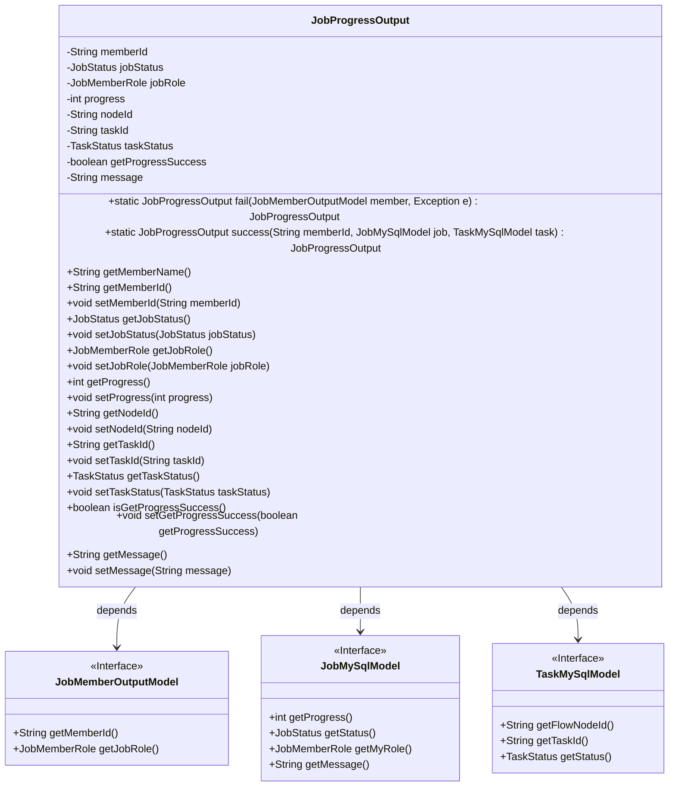
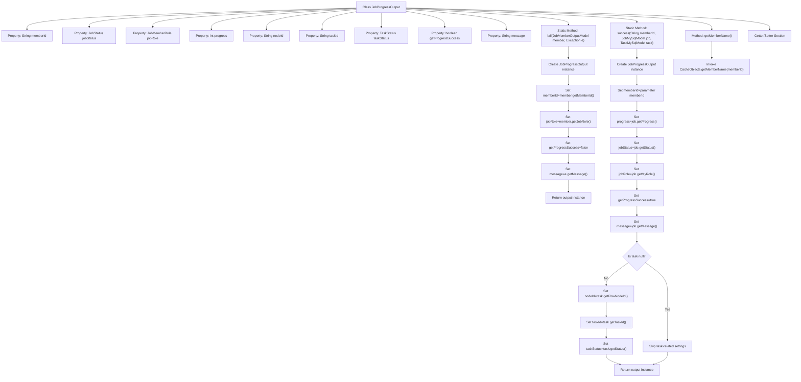

# Basic Information

|      |      |
|------|------|
| Name | JobProgressOutput |
| Language | .java |
| Code Path | WeFe/board/board-service/src/main/java/com/welab/wefe/board/service/dto/vo/JobProgressOutput.java |
| Package Name | com.welab.wefe.board.service.dto.vo |
| Dependencies | ['com.welab.wefe.board.service.database.entity.job.JobMySqlModel', 'com.welab.wefe.board.service.database.entity.job.TaskMySqlModel', 'com.welab.wefe.board.service.dto.entity.job.JobMemberOutputModel', 'com.welab.wefe.board.service.service.CacheObjects', 'com.welab.wefe.common.wefe.enums.JobMemberRole', 'com.welab.wefe.common.wefe.enums.JobStatus', 'com.welab.wefe.common.wefe.enums.TaskStatus'] |
| Brief Description | The JobProgressOutput class is used to track job progress, containing fields such as member ID, job status, and progress. It provides static factory methods for success/failure scenarios and getter/setter methods. |

# Description

The JobProgressOutput class is used to encapsulate task progress information, including member ID, task status, member role, progress value, node ID, task ID, task status, operation success flag, and message fields. It provides two static factory methods: the fail method is used to construct a failure response, accepting a member model and an exception object; the success method is used to construct a success response, accepting a member ID, task model, and subtask model. The class includes getter/setter methods for each field, as well as a helper method to retrieve the member name based on the member ID.

# Class Summary

| Name   | Type  | Description |
|-------|------|-------------|
| JobProgressOutput | class | The JobProgressOutput class is used to track job progress, containing member ID, task status, progress, and other information, providing both success and failure constructors along with corresponding getter/setter methods. |

## Class JobProgressOutput

|      |      |
|------|------|
| Access Modifier | public |
| Type | class |
| Name | JobProgressOutput |
| Description | The JobProgressOutput class is used to track job progress, containing member ID, task status, progress, and other information, providing both success and failure constructors along with corresponding getter/setter methods. |

### UML Class Diagram

Class diagram description: The JobProgressOutput class encapsulates task progress output information, containing private fields such as member ID, job status, role, and progress. It provides static factory methods fail() and success() to handle failure and success scenarios respectively. This class depends on three interfaces: JobMemberOutputModel for basic member information, JobMySqlModel for job data, and TaskMySqlModel for subtask data. Field access is managed through getter/setter methods, with the getMemberName() method retrieving member names via cache.

### Internal Method Call Graph

This flowchart illustrates the complete structure of the JobProgressOutput class, including 9 private properties, 2 core static factory methods, and 1 business method. The fail() method handles exception cases by constructing failure responses using member objects and exception objects; the success() method handles normal cases, determining whether to set task-related fields based on the existence of task objects. All properties are managed through standard Getters/Setters, and the getMemberName() method relies on external cache services to retrieve member names. The flowchart particularly highlights the conditional logic in the success() method, clearly demonstrating the branch processing flow based on the presence or absence of task data.

### Field List

| Name  | Type  | Description |
|-------|-------|------|
| taskStatus | TaskStatus | Private task status variable `taskStatus`. |
| jobStatus | JobStatus | The private variable jobStatus, of type JobStatus. |
| getProgressSuccess | boolean | Get progress success status boolean value |
| nodeId | String | Private string type variable nodeId. |
| taskId | String | The private string variable taskId is used to store the task identifier. |
| progress | int | Private integer variable progress, used to record progress. |
| jobRole | JobMemberRole | The private variable jobRole, of type JobMemberRole. |
| memberId | String | Declare a private string-type variable memberId. |
| message | String | Private string variable message |

### Method List

| Name  | Type  | Description |
|-------|-------|------|
| setNodeId | void | This is a Java method used to set the nodeId property value of an object. The method takes a string parameter nodeId and assigns it to the member variable of the same name in the current object. |
| setTaskStatus | void | The method `setTaskStatus` is used to set the task status, with the parameter of type `TaskStatus`, which is directly assigned to the member variable `taskStatus`. |
| getNodeId | String | Methods to obtain the node ID, returning a string-type nodeId. |
| setJobStatus | void | Methods for setting task status, assigning the incoming jobStatus to the jobStatus property of the current object. |
| getMemberName | String | Methods for retrieving member names, returning the name from cache based on the member ID. |
| setMemberId | void | Define the public method setMemberId to set the value of the member variable memberId. |
| success | JobProgressOutput | The static method `success` creates and returns a `JobProgressOutput` object containing member ID, job progress, status, role, and success flag. If the task is not empty, it also includes node ID, task ID, and status. |
| setJobRole | void | The method `setJobRole` is used to set a member's job role, with the parameter being of type `JobMemberRole`. |
| getMemberId | String | This is a Java method that returns a member ID string. |
| setTaskId | void | Methods for setting the task ID: Assign the incoming taskId to the taskId property of the current object. |
| fail | JobProgressOutput | The static method `fail` creates and returns a `JobProgressOutput` object containing the member ID, role, failure status, and exception information. |
| getJobStatus | JobStatus | Methods to get the current task status, returns a JobStatus object. |
| setProgress | void | Method to set the progress value, assigning the parameter progress to the member variable progress. |
| getProgress | int | Methods to obtain the current progress value, returns the integer-type progress variable value. |
| getJobRole | JobMemberRole | The method returns the value of jobRole, with the type being JobMemberRole. |
| isGetProgressSuccess | boolean | A boolean method to check if the progress retrieval is successful, returning the value of getProgressSuccess. |
| getTaskId | String | Methods to obtain the task ID, returns a string-type taskId. |
| getTaskStatus | TaskStatus | Methods to get the current task status, returns a TaskStatus object. |
| setMessage | void | This is a Java method used to set the message attribute value of a class. The method takes a string parameter named message and assigns it to the message member variable of the current object. |
| getMessage | String | Methods to obtain the message string. |
| setGetProgressSuccess | void | Method to set the success status of progress retrieval, with a boolean parameter. |

