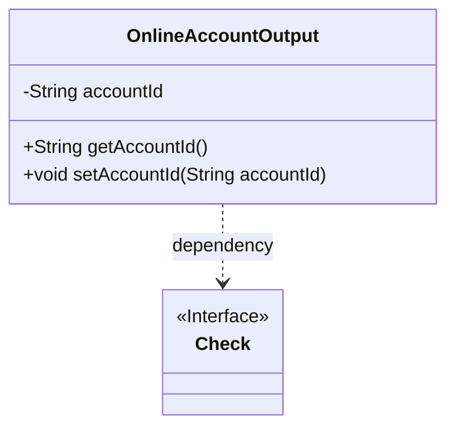
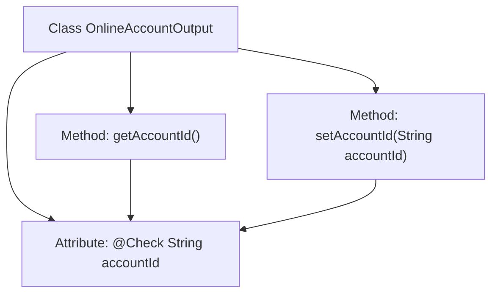

# Basic Information

|      |      |
|------|------|
| Name | OnlineAccountOutput |
| Language | .java |
| Code Path | WeFe/board/board-service/src/main/java/com/welab/wefe/board/service/dto/vo/OnlineAccountOutput.java |
| Package Name | com.welab.wefe.board.service.dto.vo |
| Dependencies | ['com.welab.wefe.common.fieldvalidate.annotation.Check'] |
| Brief Description | The OnlineAccountOutput class contains the account ID attribute along with its getter and setter methods. |

# Description

This is a public class named OnlineAccountOutput, used to represent the output information of an online account. The class contains a private string-type field accountId, which is annotated with the @Check annotation specifying the validation name as "Account ID." The class provides standard getter and setter methods for retrieving and modifying the value of the accountId field, respectively. This class is primarily used to encapsulate account ID data and offers access and modification capabilities for this data through its methods.

# Class Summary

| Name   | Type  | Description |
|-------|------|-------------|
| OnlineAccountOutput | class | The OnlineAccountOutput class includes the accountId attribute with account ID validation annotations, providing getter and setter methods. |

## Class OnlineAccountOutput

|      |      |
|------|------|
| Access Modifier | public |
| Type | class |
| Name | OnlineAccountOutput |
| Description | The OnlineAccountOutput class includes the accountId attribute with account ID validation annotations, providing getter and setter methods. |

### UML Class Diagram

This code demonstrates a simple OnlineAccountOutput class containing a private accountId attribute and corresponding getter/setter methods. The class validates the accountId field through the @Check annotation, establishing a dependency relationship with the Check interface. The class diagram clearly presents the class member structure, method signatures, and annotation dependencies, reflecting the fundamental design pattern of a Java Bean.

### Internal Method Call Graph

This code defines a class named OnlineAccountOutput, which includes an accountId attribute annotated with @Check, along with corresponding getter and setter methods. The flowchart illustrates the class structure and the relationships between attributes and methods, where both setAccountId and getAccountId operate on the accountId attribute, which is constrained by annotation validation. The class design complies with JavaBean specifications and is used to encapsulate output data for online accounts.

### Field List

| Name  | Type  | Description |
|-------|-------|------|
| accountId | String | The private variable of string type for the account ID field, marked with the Check annotation. |

### Method List

| Name  | Type  | Description |
|-------|-------|------|
| setAccountId | void | This is a Java method used to set the value of the class's accountId property. The method takes a string parameter accountId and assigns it to the class's member variable of the same name. |
| getAccountId | String | This is a Java method that returns the value of the string-type member variable accountId. |

