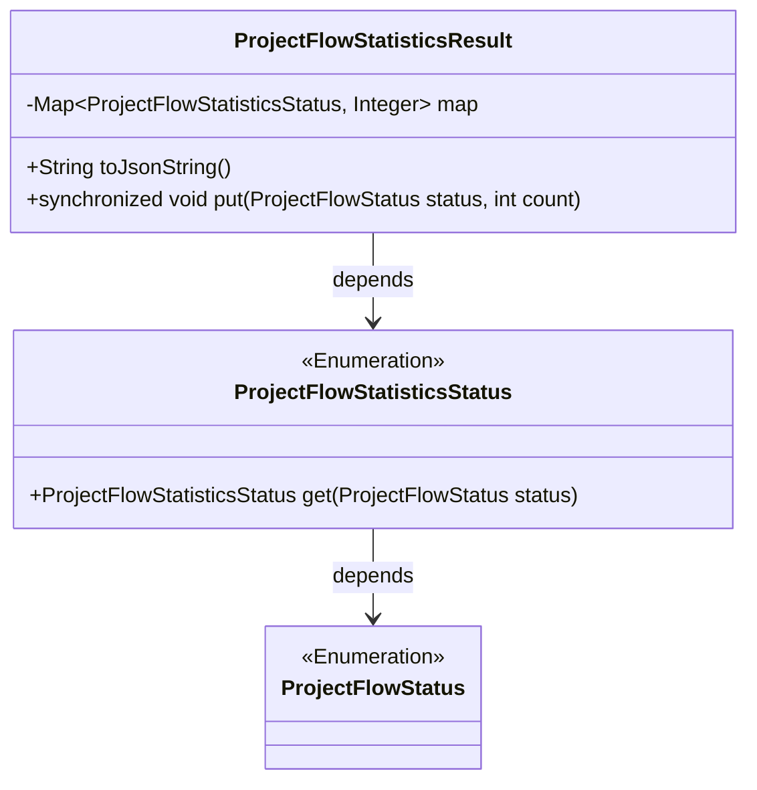
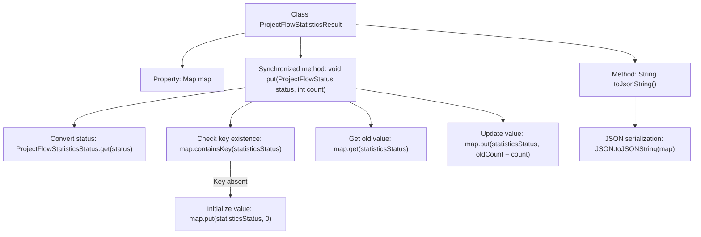

# Basic Information

|      |      |
|------|------|
| Name | ProjectFlowStatisticsResult |
| Language | .java |
| Code Path | WeFe/board/board-service/src/main/java/com/welab/wefe/board/service/dto/vo/ProjectFlowStatisticsResult.java |
| Package Name | com.welab.wefe.board.service.dto.vo |
| Dependencies | ['com.alibaba.fastjson.JSON', 'com.welab.wefe.common.wefe.enums.ProjectFlowStatisticsStatus', 'com.welab.wefe.common.wefe.enums.ProjectFlowStatus', 'java.util.HashMap', 'java.util.Map'] |
| Brief Description | The ProjectFlowStatisticsResult class is used to count project flow statuses. It stores the mapping between statuses and counts via a map, provides a thread-safe put method to update counts, and supports conversion to a JSON string. |

# Description

The code defines a class named `ProjectFlowStatisticsResult`, which is used to collect statistics on project flow status data. The class contains a private `HashMap` member variable `map` for storing key-value pairs of project flow status statistics and their corresponding counts. It provides a `toJsonString` method to convert the `map` into a JSON string. The thread-safe status count update is implemented via the synchronized `put` method, which first checks if the status exists, initializes it to 0 if absent, and then increments the new count to the original value.

# Class Summary

| Name   | Type  | Description |
|-------|------|-------------|
| ProjectFlowStatisticsResult | class | The ProjectFlowStatisticsResult class uses a HashMap to store project flow status statistics, provides a thread-safe put method for accumulating counts, and supports conversion to a JSON string. |

## Class ProjectFlowStatisticsResult

|      |      |
|------|------|
| Access Modifier | public |
| Type | class |
| Name | ProjectFlowStatisticsResult |
| Description | The ProjectFlowStatisticsResult class uses a HashMap to store project flow status statistics, provides a thread-safe put method for accumulating counts, and supports conversion to a JSON string. |

### UML Class Diagram

Class diagram description: The ProjectFlowStatisticsResult class stores a mapping between project flow statistics statuses and counts via HashMap, provides a thread-safe put method to update counts, and can convert to JSON strings. It depends on the ProjectFlowStatisticsStatus enum class for status conversion, which in turn relies on the ProjectFlowStatus enum class. The overall design enables thread-safe operations and serialization capabilities for status statistics.

### Internal Method Call Graph

This flowchart illustrates the core logic of the ProjectFlowStatisticsResult class. The class implements thread-safe statistical data accumulation through the synchronized put method, which first converts status enums, checks and initializes missing keys, and finally atomically updates count values. The toJsonString method serializes the map into a JSON string. The process highlights three key phases: status conversion, thread-safe checks, and value accumulation, with arrows clearly showing method calls and data flow paths.

### Field List

| Name  | Type  | Description |
|-------|-------|------|
| map = new HashMap<>() | Map<ProjectFlowStatisticsStatus, Integer> | Defined a private HashMap variable named map, with keys of type ProjectFlowStatisticsStatus enum and values of type Integer. |

### Method List

| Name  | Type  | Description |
|-------|-------|------|
| toJsonString | String | Methods to convert a map to a JSON string. |
| put | void | The synchronous method `put` receives the state and quantity, checks if the state exists, initializes it to 0 if it does not, and then accumulates the quantity to the corresponding state. |

