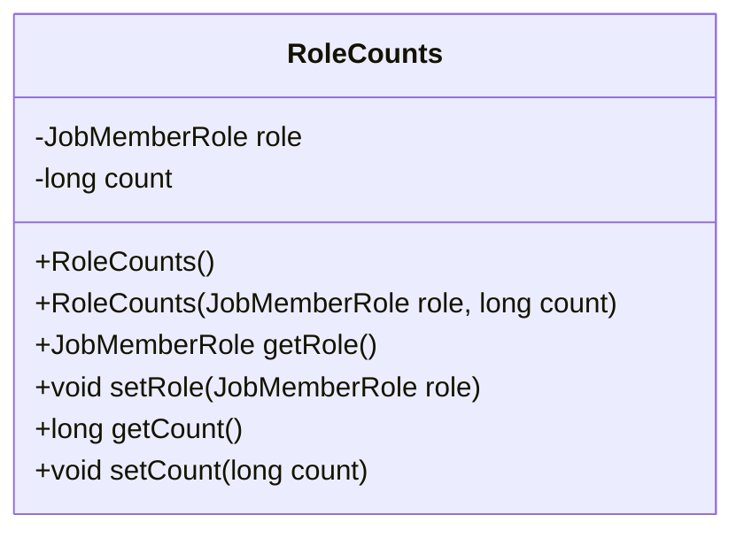
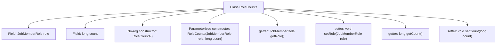

# Basic Information

|      |      |
|------|------|
| Name | RoleCounts |
| Language | .java |
| Code Path | WeFe/board/board-service/src/main/java/com/welab/wefe/board/service/dto/vo/RoleCounts.java |
| Package Name | com.welab.wefe.board.service.dto.vo |
| Dependencies | ['com.welab.wefe.common.wefe.enums.JobMemberRole'] |
| Brief Description | The RoleCounts class includes the JobMemberRole role and a long-type count, providing constructor methods and getter/setter. |

# Description

The RoleCounts class is used to count the number of specific roles, containing a role attribute of type JobMemberRole and a count attribute of type long. It provides a no-argument constructor and a parameterized constructor, supporting access and modification of these two attributes through getter and setter methods.

# Class Summary

| Name   | Type  | Description |
|-------|------|-------------|
| RoleCounts | class | The RoleCounts class is used to count the number of roles, including the JobMemberRole role and long-type count, and provides constructors and getter/setter methods. |

## Class RoleCounts

|      |      |
|------|------|
| Access Modifier | public |
| Type | class |
| Name | RoleCounts |
| Description | The RoleCounts class is used to count the number of roles, including the JobMemberRole role and long-type count, and provides constructors and getter/setter methods. |

### UML Class Diagram

This code defines a class named `RoleCounts`, which encapsulates a role (`JobMemberRole`) and its corresponding count (`count`). The class includes two private fields, two constructors (default and parameterized), and corresponding getter and setter methods. This class facilitates the management of role-count associations, making it suitable for statistics or recording quantity information of different roles.

### Internal Method Call Graph

This flowchart illustrates the complete structure of the RoleCounts class, containing two private fields (role and count), two constructors (no-argument and parameterized initialization), and corresponding getter/setter methods. By encapsulating fields of type JobMemberRole and long, the class provides secure access mechanisms for roles and counts. The parameterized constructor directly initializes fields, while the no-argument constructor allows subsequent assignment via setter methods, demonstrating flexible object creation. All methods revolve around core data, forming a standard data encapsulation pattern.

### Field List

| Name  | Type  | Description |
|-------|-------|------|
| count | long | Private long integer counter variable. |
| role | JobMemberRole | The class member variable `role`, of type `JobMemberRole`, represents the job member role. |

### Method List

| Name  | Type  | Description |
|-------|-------|------|
| getRole | JobMemberRole | The method getRole returns the value of the member variable role of type JobMemberRole. |
| setCount | void | This is a Java method used to set the value of the class member variable count. The method accepts a parameter of type long and assigns it to the count property of the current object. |
| setRole | void | The method `setRole` is used to set a member's role, with the parameter being of type `JobMemberRole`, which is directly assigned to the `role` property of the current object. |
| getCount | long | This is a Java method that returns the value of a long integer variable count. |

