# Basic Information

|      |      |
|------|------|
| Name | vo |
| Language | .java |
| Code Path | WeFe/board/board-service/src/main/java/com/welab/wefe/board/service/dto/vo |
| Package Name | docs.board.board-service.src.main.java.com.welab.wefe.board.service.dto.vo |
| Brief Description | The module uniformly manages CRUD operations for multi-type data resources (images/tables/Bloom filters) using a layered input model design. It supports functions such as data resource review, message content generation, and annotation information management, covering scenarios like tag statistics, format conversion, and status counting. Various types implement differentiated validation through inheritance, relying on XStream and JSON libraries to form a standardized management process. |

# Description

## Overview  
The core responsibility of this module is to uniformly manage the full lifecycle operations of multiple types of business entities (data resources/messages/labels/tasks), employing layered design and the template method pattern. The interface specification forms three major systems: 1) Data resource classes inherit `AbstractDataResourceUpdateInputModel` to implement differentiated validation; 2) Message classes follow the `AbstractMessageContent` template method; 3) Label classes adopt a dual-track approach for the table side (`LabelDistribution`) and the image side (`Annotation`). Key data structures exhibit domain characteristics: resource identifier fields (id/dataResourceId), message carriers (auditStatus/projectId), annotation coordinates (Bndbox), and task statistics (RoleCounts). External dependencies include the XStream serialization framework, JSON libraries, and CacheObjects caching. For example, `ImageDataSetAddInputModel` verifies file existence, similar to data source configuration in ETL tools.

## Core Business Scenarios  
The module supports four types of core processes: 1) Data resource management (CRUD for images/tables/Bloom filters); 2) Message notifications (template generation for audits/invitations); 3) Label processing (label statistics and format conversion); 4) Task statistics (role/status counting). Interaction modes all employ object encapsulation but vary in strategy: resource classes implement validation through `AddInputModel` inheritance (e.g., `BloomFilterAddInputModel` validates `fieldInfoList`), message classes rely on `getTitle` for dynamic content assembly (e.g., generating "Member A invites you to join Project B"), and label classes distinguish between table aggregation calculations and image structural composition. Typical applications include generating label quality reports, handling occluded annotations, and arbiter information management. APIs cover constructors, status checks, and thread-safe counting (e.g., synchronized `put` in `ProjectFlowStatisticsResult`). For example, `publicMemberList` controls resource visibility, similar to the RBAC permission model.

### Package Internal Structure View

```mermaid
graph TD
    vo --> data_resource
    vo --> message
    vo --> data_set
    vo --> RoleCounts.java
    vo --> AuditStatusCounts.java
    vo --> FeatureOutput.java
    vo --> JobMemberWithDataSetOutputModel.java
    vo --> OnlineAccountOutput.java
    vo --> AccountInputModel.java
    vo --> JobArbiterInfo.java
    vo --> JobProgressOutput.java
    vo --> ProjectFlowStatisticsResult.java
    vo --> FlowDataSetOutputModel.java
    
    data_resource --> image_data_set
    data_resource --> DataResourceAddOutputModel.java
    data_resource --> TableDataSetAddInputModel.java
    data_resource --> ImageDataSetAddInputModel.java
    data_resource --> AbstractDataResourceUpdateInputModel.java
    data_resource --> TableDataSetUpdateInputModel.java
    data_resource --> BloomFilterAddInputModel.java
    data_resource --> BloomFilterUpdateInputModel.java
    data_resource --> ImageDataSetUpdateInputModel.java
    
    image_data_set --> Bndbox.java
    image_data_set --> Size.java
    image_data_set --> Annotation.java
    image_data_set --> Source.java
    image_data_set --> LabelInfo.java
    image_data_set --> Object.java
    
    message --> AuditApplyDataResourceMessageContent.java
    message --> AuditJoinProjectMessageContent.java
    message --> AbstractMessageContent.java
    message --> ApplyJoinProjectMessageContent.java
    message --> TextMessageContent.java
    message --> AbstractMessageContentWithProject.java
    message --> ApplyDataResourceMessageContent.java
    
    data_set --> table_data_set
    data_set --> image_data_set
    
    table_data_set --> LabelDistributionItem.java
    table_data_set --> LabelDistribution.java
    
    image_data_set --> Bndbox.java
    image_data_set --> Size.java
    image_data_set --> Annotation.java
    image_data_set --> Source.java
    image_data_set --> LabelInfo.java
    image_data_set --> Object.java
```

This flowchart illustrates the hierarchical structure of DTO value objects in the board-service module of the WeFe project. The top-level vo directory contains three main subdirectories (data_resource, message, data_set) along with multiple standalone files. Both data_resource and data_set include the image_data_set subdirectory, the message directory contains various message content classes, and data_set also includes the table_data_set subdirectory. Each subdirectory contains corresponding implementation classes, forming a clear multi-level structure.

# File List

| Name   | Type  | Description |
|-------|------|-------------|
| [RoleCounts.java](RoleCounts.md) | file | The RoleCounts class includes the JobMemberRole role and a long-type count, providing constructor methods and getter/setter. |
| [AuditStatusCounts.java](AuditStatusCounts.md) | file | The AuditStatusCounts class contains audit status and count fields, providing constructor methods and getter/setter. |
| [FeatureOutput.java](FeatureOutput.md) | file | The FeatureOutput class includes the name and dataType fields, providing corresponding getter and setter methods. |
| [JobMemberWithDataSetOutputModel.java](JobMemberWithDataSetOutputModel.md) | file | JobMemberWithDataSetOutputModel extends JobMemberOutputModel, containing fields featureNameList and featureCount along with their respective getter/setter methods. |
| [OnlineAccountOutput.java](OnlineAccountOutput.md) | file | The OnlineAccountOutput class includes the account ID attribute along with its getter and setter methods. |
| [AccountInputModel.java](AccountInputModel.md) | file | The AccountInputModel class includes four required fields: phone number, nickname, password, and email, each with corresponding format validation rules. |
| [JobArbiterInfo.java](JobArbiterInfo.md) | file | The JobArbiterInfo class contains two attributes: hasArbiter indicates whether there is an arbiter, and arbiterMemberId stores the arbiter member ID, providing getter and setter methods. |
| [JobProgressOutput.java](JobProgressOutput.md) | file | The JobProgressOutput class is used to track job progress, containing fields such as member ID, task status, and progress percentage, providing static constructor methods for success/failure and getter/setter methods. |
| [ProjectFlowStatisticsResult.java](ProjectFlowStatisticsResult.md) | file | The ProjectFlowStatisticsResult class is used to count project flow statuses. It stores the mapping between statuses and counts via a map, provides a thread-safe put method to update counts, and supports conversion to a JSON string. |
| [FlowDataSetOutputModel.java](FlowDataSetOutputModel.md) | file | FlowDataSetOutputModel inherits from MemberModel, containing the dataset ID and feature list, and provides getter/setter methods. |
| [data_resource](data_resource/_module.md) | package | This module manages image dataset annotations, including bounding boxes, dimensions, and object attributes. It supports the entire annotation workflow and relies on XStream serialization. It contains multiple input/output model classes for handling data resource addition, updates, and validation, such as DataResourceAddOutputModel, TableDataSetAddInputModel, etc. |
| [data_set](data_set/_module.md) | package | The label management module encapsulates label data statistics and JSON serialization functions, supporting sorting and format conversion. The image annotation module handles bounding boxes, dimensions, and object attributes, supporting the Pascal VOC format annotation workflow. |
| [message](message/_module.md) | package | Message class structure: AbstractMessageContent serves as the base class, defining methods for title and associated ID. Its subclasses include AuditApplyDataResourceMessageContent for handling data review, AuditJoinProjectMessageContent for project member review, ApplyJoinProjectMessageContent for project invitations, and TextMessageContent for plain text. AbstractMessageContentWithProject extends the base class by adding project-related fields. ApplyDataResourceMessageContent handles data resource application messages. |

