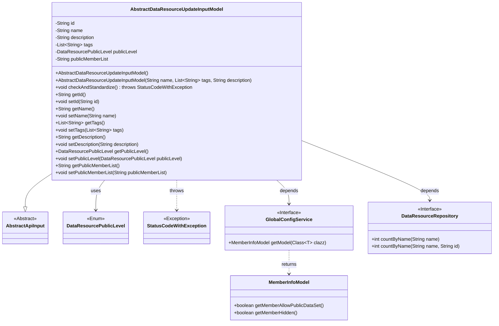
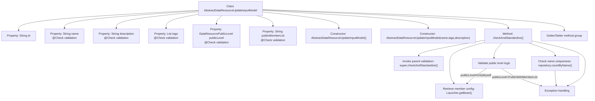

# Basic Information

|      |      |
|------|------|
| Name | AbstractDataResourceUpdateInputModel |
| Language | .java |
| Code Path | WeFe/board/board-service/src/main/java/com/welab/wefe/board/service/dto/vo/data_resource/AbstractDataResourceUpdateInputModel.java |
| Package Name | com.welab.wefe.board.service.dto.vo.data_resource |
| Dependencies | ['com.welab.wefe.board.service.database.repository.data_resource.DataResourceRepository', 'com.welab.wefe.board.service.service.globalconfig.GlobalConfigService', 'com.welab.wefe.common.StatusCode', 'com.welab.wefe.common.exception.StatusCodeWithException', 'com.welab.wefe.common.fieldvalidate.annotation.Check', 'com.welab.wefe.common.util.StringUtil', 'com.welab.wefe.common.web.Launcher', 'com.welab.wefe.common.web.dto.AbstractApiInput', 'com.welab.wefe.common.wefe.dto.global_config.MemberInfoModel', 'com.welab.wefe.common.wefe.enums.DataResourcePublicLevel', 'org.apache.commons.lang3.StringUtils', 'java.util.List'] |
| Brief Description | The dataset update input model includes fields such as name, description, labels, visibility level, and member list, and undergoes validation and standardization processing to ensure data legality and uniqueness. |

# Description

The `AbstractDataResourceUpdateInputModel` is an input model class designed for updating data resources, inheriting from `AbstractApiInput`. It includes the following key fields: `id` identifies the resource; `name` (required, length 4-30); `description` (optional, max 3072 characters); `tags` (required, max 128 characters); `publicLevel` (required, defines the resource visibility level); `publicMemberList` (specifies the list of visible members, max 3072 characters). The class implements the `checkAndStandardize` method for validation: checking whether members are permitted to make resources public, whether names are duplicated, and the legality of visibility levels and member lists. It provides getter and setter methods for all fields.

# Class Summary

| Name   | Type  | Description |
|-------|------|-------------|
| AbstractDataResourceUpdateInputModel | class | The AbstractDataResourceUpdateInputModel class is used for updating data resources, including validation of fields such as name, description, and tags, checking visibility levels and member lists, and ensuring name uniqueness. |

## Class AbstractDataResourceUpdateInputModel

|      |      |
|------|------|
| Access Modifier | public |
| Type | class |
| Name | AbstractDataResourceUpdateInputModel |
| Description | The AbstractDataResourceUpdateInputModel class is used for updating data resources, including validation of fields such as name, description, and tags, checking visibility levels and member lists, and ensuring name uniqueness. |

### UML Class Diagram

This class diagram illustrates how `AbstractDataResourceUpdateInputModel` inherits from `AbstractApiInput`, containing input parameters and validation logic for data resource updates. It depends on the `DataResourcePublicLevel` enum, `GlobalConfigService` interface to retrieve member configurations, and validates resource name uniqueness via `DataResourceRepository`. Fields are annotated with `@Check` for parameter validation, while the core method `checkAndStandardize()` performs multi-level business rule validation.

### Internal Method Call Graph

Flowchart description: This flowchart illustrates the complete structure of the AbstractDataResourceUpdateInputModel class, including 6 core properties (5 annotated with @Check validation), 2 constructors, 1 core validation method, and multiple getter/setter groups. The validation process involves three defensive check layers: parent class validation invocation, member configuration retrieval, public level verification (including stealth state detection), and name uniqueness verification. Any validation failure terminates the process via exceptions. Property validation rules are implemented through annotations, covering constraints such as string length, mandatory fields, and regular expressions.

### Field List

| Name  | Type  | Description |
|-------|-------|------|
| tags | List<String> | Java field annotation: Check keyword list, mandatory, length 1-128 characters, display "Too many keywords~" if exceeding limit. |
| description | String | The code defines a string field named "description" and uses the @Check annotation to validate that its content does not exceed 3072 characters, with an error message "Description too long" displayed when the limit is exceeded. |
| id | String | Private string type variable id. |
| publicLevel | DataResourcePublicLevel | Defined a private field publicLevel of type DataResourcePublicLevel, marked as a required field with the @Check annotation, with the check name being "Visibility Level". |
| publicMemberList | String | Check the visible member list, only federated members within the list can view dataset information. The maximum length is limited to 3072 characters, with an excess prompt of "Too many members". |
| name | String | Java field validation annotation: Dataset name is mandatory, with a length limit of 4-30 characters. If not met, prompt "Dataset name length cannot be less than 4 or greater than 30". |

### Method List

| Name  | Type  | Description |
|-------|-------|------|
| getDescription | String | String methods for obtaining descriptive information. |
| getName | String | Methods to get the name, returning the value of the name variable of string type. |
| getId | String | This is a Java method that returns a string-type id value. |
| setName | void | This is a Java method used to set the name property of an object. The method takes a string parameter name and assigns it to the name field of the current object. |
| setId | void | Methods for setting the object ID: Assign the parameter id to the id property of the current object. |
| setTags | void | This is a Java method used to set the label list of an object. The method accepts a string list parameter `tags` and assigns it to the `tags` property of the object. |
| checkAndStandardize | void | Method to check resource visibility settings: prohibit selecting exposed resources when global exposure is denied; throw an exception when a member is invisible or not allowed to be public; the visibility level must specify authorized members; report an error when resource names are duplicated. |
| getTags | List<String> | The method returns a list of strings, tags. |
| setDescription | void | The method for setting description information assigns the input parameters to the class's description variable. |
| getPublicLevel | DataResourcePublicLevel | Method to obtain the public level of a data resource, returns the value of the publicLevel attribute. |
| setPublicLevel | void | Set the public level of the data resource by assigning the parameter `publicLevel` directly to the member variable. |
| getPublicMemberList | String | Methods for obtaining the public member list, returning the value of the publicMemberList variable. |
| setPublicMemberList | void | Method for setting the public member list, which assigns the input string to the class member variable publicMemberList. |

