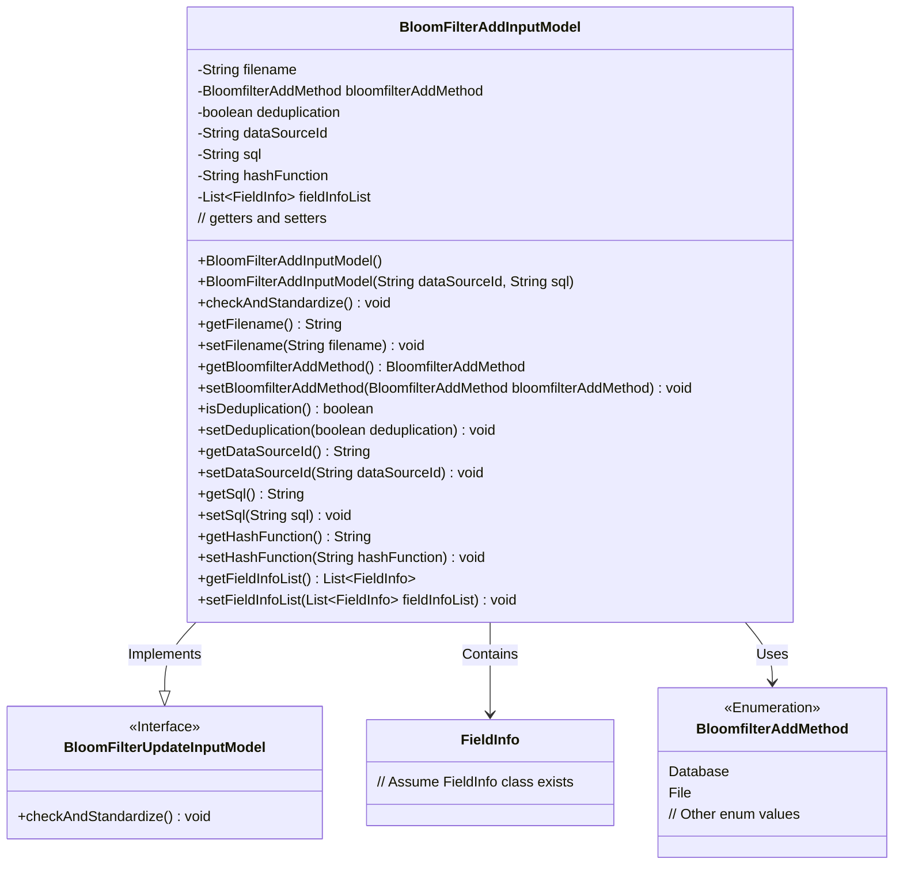
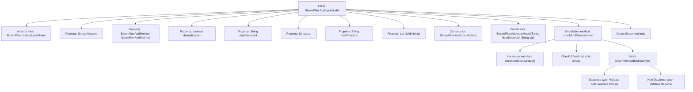

# Basic Information

|      |      |
|------|------|
| Name | BloomFilterAddInputModel |
| Language | .java |
| Code Path | WeFe/board/board-service/src/main/java/com/welab/wefe/board/service/dto/vo/data_resource/BloomFilterAddInputModel.java |
| Package Name | com.welab.wefe.board.service.dto.vo.data_resource |
| Dependencies | ['com.welab.wefe.board.service.constant.BloomfilterAddMethod', 'com.welab.wefe.board.service.util.primarykey.FieldInfo', 'com.welab.wefe.common.StatusCode', 'com.welab.wefe.common.exception.StatusCodeWithException', 'com.welab.wefe.common.fieldvalidate.annotation.Check', 'org.apache.commons.collections4.CollectionUtils', 'org.apache.commons.lang3.StringUtils', 'java.util.List'] |
| Brief Description | The `BloomFilterAddInputModel` class inherits from `BloomFilterUpdateInputModel` and includes attributes such as filename, addition method, deduplication flag, data source ID, SQL script, hash function, and primary key field list, while validating parameter validity. |

# Description

The BloomFilterAddInputModel, inheriting from BloomFilterUpdateInputModel, serves as the input parameter for Bloom filter addition operations. Key fields include the mandatory filename (filter file), bloomfilterAddMethod (addition method enum), deduplication (deduplication flag), as well as optional dataSourceId (data source ID), sql (query script), hashFunction (hash function), and fieldInfoList (primary key field list). The class incorporates parameter validation logic: if the addition method is database-based, dataSourceId and sql must be non-null; if file-based, filename must be non-null. Additionally, fieldInfoList is strictly required to be non-empty. Getter/setter methods are provided for all fields.

# Class Summary

| Name   | Type  | Description |
|-------|------|-------------|
| BloomFilterAddInputModel | class | The `BloomFilterAddInputModel` class inherits from `BloomFilterUpdateInputModel` and includes fields such as filename, addition method, deduplication flag, data source ID, SQL script, hash function, and primary key list, while implementing parameter validation logic. |

## Class BloomFilterAddInputModel

|      |      |
|------|------|
| Access Modifier | public |
| Type | class |
| Name | BloomFilterAddInputModel |
| Description | The `BloomFilterAddInputModel` class inherits from `BloomFilterUpdateInputModel` and includes fields such as filename, addition method, deduplication flag, data source ID, SQL script, hash function, and primary key list, while implementing parameter validation logic. |

### UML Class Diagram

Class diagram description: BloomFilterAddInputModel implements the BloomFilterUpdateInputModel interface, containing fields such as filename, data source ID, SQL query, and implements parameter validation logic. The class distinguishes data source methods (database or file) via the BloomfilterAddMethod enumeration and includes a FieldInfo list for primary key processing. The validation method checks field legality and verifies required fields based on different data source methods.

### Internal Method Call Graph

This flowchart illustrates the complete structure of the BloomFilterAddInputModel class, including inheritance relationships, property definitions, constructors, and core validation logic. It highlights the internal validation process of the checkAndStandardize() method, which first invokes parent class validation, then checks the primary key field list, and finally performs different parameter validations based on the data source type (database or file). The diagram clearly presents the hierarchical relationships between class members and the branching paths of validation logic, facilitating understanding of the complete validation mechanism for this Bloom filter parameter model.

### Field List

| Name  | Type  | Description |
|-------|-------|------|
| hashFunction | String | The code defines a private string variable hashFunction, which stores the selected ID feature column and is validated via the @Check annotation. |
| filename | String | The code snippet defines a private string variable named filename, annotated with @Check to ensure it is non-empty, with a prompt message "Please specify the filter file" displayed if it is empty. |
| fieldInfoList | List<FieldInfo> | The field fieldInfoList is used for primary key processing and is annotated with @Check. |
| bloomfilterAddMethod | BloomfilterAddMethod | Forced Check Bloom Filter Add Method Attribute. |
| sql | String | The private String variable `sql` is annotated with `@Check` to mark it as a SQL script requiring validation. |
| deduplication | boolean | Class member variable `deduplication`, boolean type, used to control whether deduplication is required, mandatory by default. |
| dataSourceId | String | Check the string variable of the data source ID. |

### Method List

| Name  | Type  | Description |
|-------|-------|------|
| isDeduplication | boolean | The method returns a boolean value `deduplication`, indicating whether deduplication is performed. |
| setHashFunction | void | This is a Java method used to set the hashFunction property value of an object. The method accepts a string parameter and assigns it to the hashFunction field of the current object. |
| getFieldInfoList | List<FieldInfo> | List of method return field information. |
| setFieldInfoList | void | Method for setting the field information list, which assigns the input list to the class member variable fieldInfoList. |
| getFilename | String | This method returns the value of the filename variable of type string. |
| setFilename | void | Methods for setting the filename, assigning the input parameter to the filename member variable of the class. |
| setSql | void | This is a Java method used to set the value of an SQL string. The method is named setSql, which takes a String parameter sql and assigns it to the sql property of the current object. |
| setBloomfilterAddMethod | void | Set the Bloom filter addition method. |
| setDataSourceId | void | The method to set the data source ID assigns the input parameter to the class's dataSourceId member variable. |
| getDataSourceId | String | This is a Java method that returns the value of the private member variable dataSourceId. |
| checkAndStandardize | void | Method checks parameter validity: primary key list must not be empty; if the data source is a database, provide dataSourceId and SQL; otherwise specify a filename. Throws an exception when parameters are missing. |
| setDeduplication | void | Method for Enabling/Disaing the Deduplication Feature. |
| getHashFunction | String | Methods to Obtain Hash Function Names. |
| getBloomfilterAddMethod | BloomfilterAddMethod | Retrieve the addition method of a Bloom filter. |
| getSql | String | The method returns the value of the SQL variable as a string type. |

