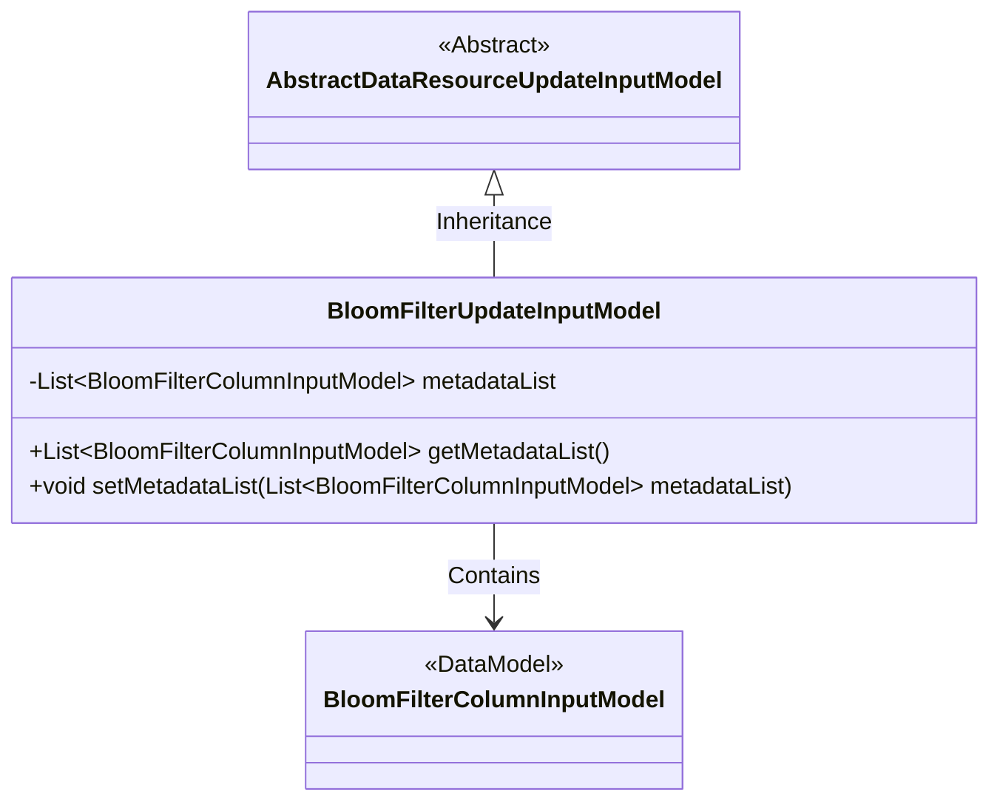
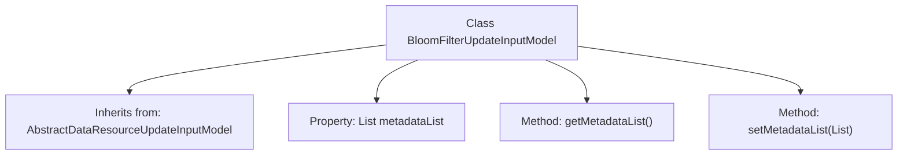

# Basic Information

|      |      |
|------|------|
| Name | BloomFilterUpdateInputModel |
| Language | .java |
| Code Path | WeFe/board/board-service/src/main/java/com/welab/wefe/board/service/dto/vo/data_resource/BloomFilterUpdateInputModel.java |
| Package Name | com.welab.wefe.board.service.dto.vo.data_resource |
| Dependencies | ['com.welab.wefe.board.service.dto.fusion.BloomFilterColumnInputModel', 'java.util.List'] |
| Brief Description | The BloomFilterUpdateInputModel class inherits from AbstractDataResourceUpdateInputModel and includes the metadataList property along with its getter/setter methods. |

# Description

The `BloomFilterUpdateInputModel` class inherits from `AbstractDataResourceUpdateInputModel` and includes a private member `metadataList`, which is a list of type `BloomFilterColumnInputModel`. This class provides getter and setter methods for `metadataList` to retrieve and modify the value of this list.

# Class Summary

| Name   | Type  | Description |
|-------|------|-------------|
| BloomFilterUpdateInputModel | class | The BloomFilterUpdateInputModel class extends AbstractDataResourceUpdateInputModel and includes the metadataList property along with its getter and setter methods. |

## Class BloomFilterUpdateInputModel

|      |      |
|------|------|
| Access Modifier | public |
| Type | class |
| Name | BloomFilterUpdateInputModel |
| Description | The BloomFilterUpdateInputModel class extends AbstractDataResourceUpdateInputModel and includes the metadataList property along with its getter and setter methods. |

### UML Class Diagram

This class diagram illustrates that BloomFilterUpdateInputModel inherits from the abstract class AbstractDataResourceUpdateInputModel and contains a list of BloomFilterColumnInputModel type. The BloomFilterUpdateInputModel provides getter and setter methods for metadataList to manage the collection of Bloom filter column metadata. This design implements a hierarchical structure for data resources, facilitating the extension and maintenance of Bloom filter configuration information.

### Internal Method Call Graph

This code illustrates a class named BloomFilterUpdateInputModel, which inherits from AbstractDataResourceUpdateInputModel. The class contains a metadataList property for storing a list of BloomFilterColumnInputModel objects, along with corresponding getter and setter methods. The flowchart clearly demonstrates the class's inheritance relationship, property definition, and method structure, reflecting the fundamental composition of this model class as a data resource update input model.

### Field List

| Name  | Type  | Description |
|-------|-------|------|
| metadataList | List<BloomFilterColumnInputModel> | The private member variable metadataList, which is a list of type BloomFilterColumnInputModel. |

### Method List

| Name  | Type  | Description |
|-------|-------|------|
| getMetadataList | List<BloomFilterColumnInputModel> | Methods to obtain the metadata list, returning a List collection of type BloomFilterColumnInputModel. |
| setMetadataList | void | Methods for setting the metadata list, assigning the input parameters to the class member variable metadataList. |

