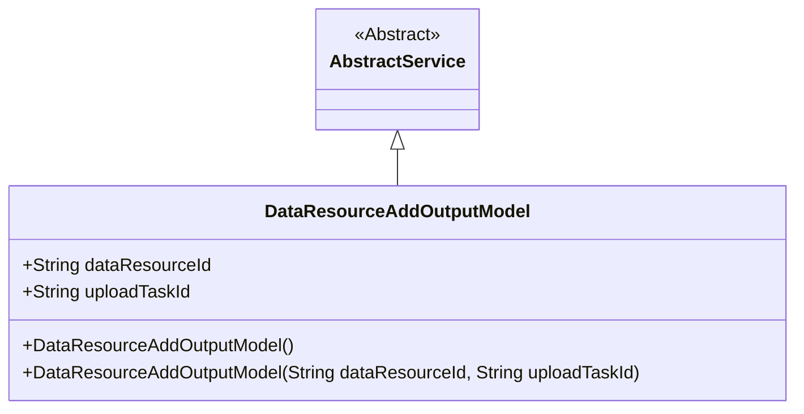
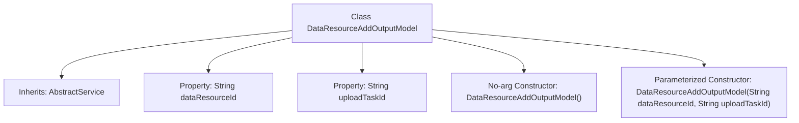

# Basic Information

|      |      |
|------|------|
| Name | DataResourceAddOutputModel |
| Language | .java |
| Code Path | WeFe/board/board-service/src/main/java/com/welab/wefe/board/service/dto/vo/data_resource/DataResourceAddOutputModel.java |
| Package Name | com.welab.wefe.board.service.dto.vo.data_resource |
| Dependencies | ['com.welab.wefe.board.service.service.AbstractService'] |
| Brief Description | The DataResourceAddOutputModel class extends AbstractService and includes two string attributes, dataResourceId and uploadTaskId, providing both a no-argument constructor and a parameterized constructor. |

# Description

This is a Java class named DataResourceAddOutputModel, which extends AbstractService. It contains two public string fields: dataResourceId and uploadTaskId. The class provides two constructors: a no-argument constructor and a parameterized constructor for initializing the values of these two fields. This class serves as the output model for data resource addition operations.

# Class Summary

| Name   | Type  | Description |
|-------|------|-------------|
| DataResourceAddOutputModel | class | The DataResourceAddOutputModel class extends AbstractService and includes two string properties, dataResourceId and uploadTaskId, providing both a no-argument constructor and a parameterized constructor. |

## Class DataResourceAddOutputModel

|      |      |
|------|------|
| Access Modifier | public |
| Type | class |
| Name | DataResourceAddOutputModel |
| Description | The DataResourceAddOutputModel class extends AbstractService and includes two string properties, dataResourceId and uploadTaskId, providing both a no-argument constructor and a parameterized constructor. |

### UML Class Diagram

This class diagram illustrates the hierarchical relationship where DataResourceAddOutputModel inherits from AbstractService. The DataResourceAddOutputModel contains two public string fields (dataResourceId and uploadTaskId) and two constructors, one being a no-argument constructor and the other accepting two string parameters. The AbstractService is marked as an abstract class, serving as a base class to provide fundamental service functionalities. This design reflects the output model structure for resource addition operations, leveraging inheritance to reuse the capabilities of the abstract service class.

### Internal Method Call Graph

This flowchart illustrates the structure of the DataResourceAddOutputModel class, which inherits from AbstractService and contains two String properties (dataResourceId and uploadTaskId), along with two constructors (no-arg and parameterized). The parameterized constructor initializes both property values. The class hierarchy clearly demonstrates the inheritance relationship and member composition, with the total node count kept within a reasonable range to facilitate understanding of the class's basic design.

### Field List

| Name  | Type  | Description |
|-------|-------|------|
| uploadTaskId | String | The unique identifier of the upload task. |
| dataResourceId | String | The public string variable dataResourceId. |

### Method List

| Name  | Type  | Description |
|-------|-------|------|

