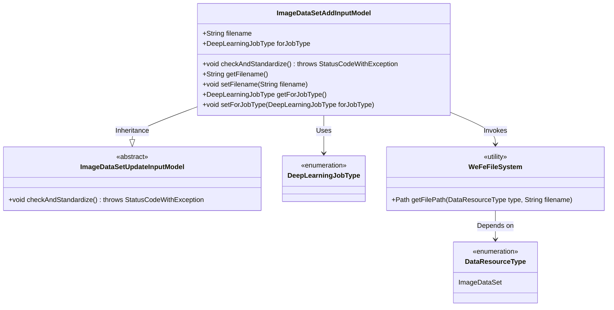
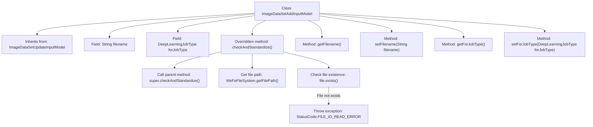

# Basic Information

|      |      |
|------|------|
| Name | ImageDataSetAddInputModel |
| Language | .java |
| Code Path | WeFe/board/board-service/src/main/java/com/welab/wefe/board/service/dto/vo/data_resource/ImageDataSetAddInputModel.java |
| Package Name | com.welab.wefe.board.service.dto.vo.data_resource |
| Dependencies | ['com.welab.wefe.board.service.base.file_system.WeFeFileSystem', 'com.welab.wefe.common.StatusCode', 'com.welab.wefe.common.exception.StatusCodeWithException', 'com.welab.wefe.common.fieldvalidate.annotation.Check', 'com.welab.wefe.common.wefe.enums.DataResourceType', 'com.welab.wefe.common.wefe.enums.DeepLearningJobType', 'java.io.File'] |
| Brief Description | Add an input model class for the image dataset, inheriting from the update model, containing filename and task type fields, checking file existence, and providing getter/setter methods. |

# Description

The content describes a Java class named ImageDataSetAddInputModel, which extends ImageDataSetUpdateInputModel. This class contains two required fields: filename (the dataset file name) and forJobType (the task type for which the dataset is applied). The class implements the checkAndStandardize method to verify whether the file exists, throwing an exception if it does not. Additionally, it provides getter and setter methods for filename and forJobType.

# Class Summary

| Name   | Type  | Description |
|-------|------|-------------|
| ImageDataSetAddInputModel | class | The ImageDataSetAddInputModel inherits from ImageDataSetUpdateInputModel, includes mandatory fields filename and forJobType, and verifies the existence of the file. It provides getter/setter methods. |

## Class ImageDataSetAddInputModel

|      |      |
|------|------|
| Access Modifier | public |
| Type | class |
| Name | ImageDataSetAddInputModel |
| Description | The ImageDataSetAddInputModel inherits from ImageDataSetUpdateInputModel, includes mandatory fields filename and forJobType, and verifies the existence of the file. It provides getter/setter methods. |

### UML Class Diagram

This class diagram illustrates the inheritance and dependencies of the image dataset addition input model. ImageDataSetAddInputModel inherits from the abstract base class ImageDataSetUpdateInputModel, containing two core fields: filename and job type, while overriding the checkAndStandardize method to implement file existence validation. The class relies on the enumeration type DeepLearningJobType to define job types and invokes the utility class WeFeFileSystem for file path operations, where WeFeFileSystem in turn depends on the DataResourceType enumeration to determine resource types. The overall structure demonstrates the collaborative relationship among input model validation, file operations, and type constraints.

### Internal Method Call Graph

This flowchart illustrates the structure and key method invocation relationships of the ImageDataSetAddInputModel class. The class inherits from ImageDataSetUpdateInputModel, contains two fields with validation annotations (filename and forJobType), and overrides the checkAndStandardize() method. This method first invokes parent class validation logic, then verifies the existence of the specified file, throwing a file read exception if absent. The diagram clearly presents class inheritance, field definitions, method call chains, and exception handling paths, demonstrating core processes of data validation and file operations.

### Field List

| Name  | Type  | Description |
|-------|-------|------|
| forJobType | DeepLearningJobType | Check the task type of the dataset application, a required field with the type DeepLearningJobType. |
| filename | String | The code defines a required field named filename, which prompts "Please specify the dataset file" if left empty. |

### Method List

| Name  | Type  | Description |
|-------|-------|------|
| checkAndStandardize | void | The method checks and standardizes the file, throwing an exception if the file does not exist to indicate that the file was not found. |
| setFilename | void | Methods for setting the filename, assigning the input parameter to the class member variable filename. |
| getFilename | String | Public method to obtain the filename, returns a string-type filename variable. |
| getForJobType | DeepLearningJobType | Methods to obtain the current deep learning task type, returns a DeepLearningJobType object. |
| setForJobType | void | Methods for setting deep learning task types, assigning parameters to class member variables. |

