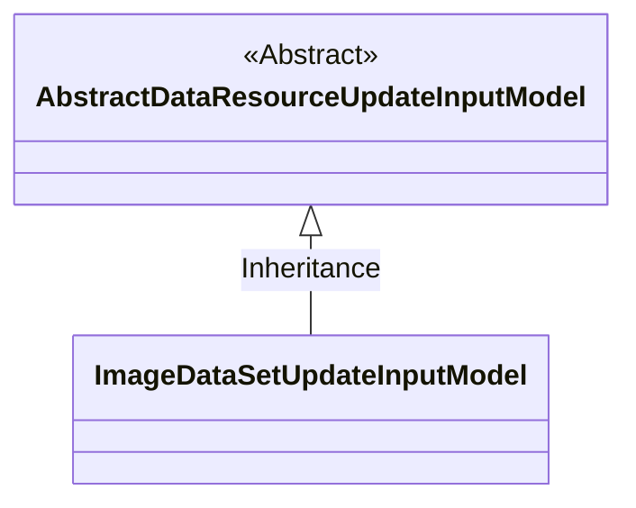
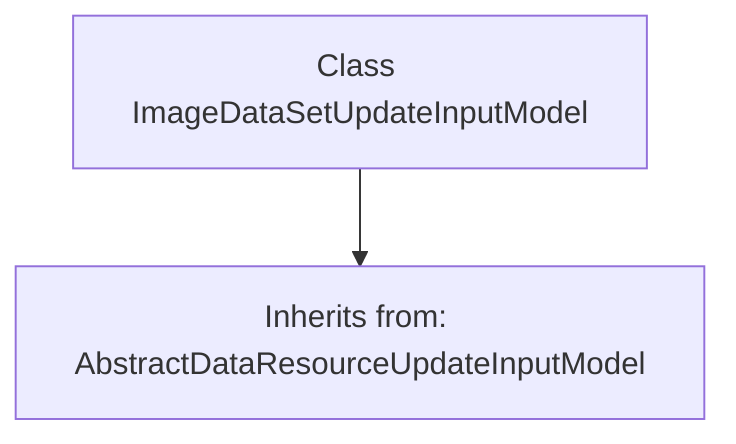

# Basic Information

|      |      |
|------|------|
| Name | ImageDataSetUpdateInputModel |
| Language | .java |
| Code Path | WeFe/board/board-service/src/main/java/com/welab/wefe/board/service/dto/vo/data_resource/ImageDataSetUpdateInputModel.java |
| Package Name | com.welab.wefe.board.service.dto.vo.data_resource |
| Dependencies | [] |
| Brief Description | ImageDataSetUpdateInputModel inherits from AbstractDataResourceUpdateInputModel and is used for image dataset update input. |

# Description

The content defines a Java class named `ImageDataSetUpdateInputModel`, which extends `AbstractDataResourceUpdateInputModel`. This indicates that `ImageDataSetUpdateInputModel` is a model class for updating input data of image datasets, inheriting the basic data resource update functionality from its parent class. The class definition does not include additional attributes or methods, suggesting that its core functionality may rely entirely on the parent class implementation.

# Class Summary

| Name   | Type  | Description |
|-------|------|-------------|
| ImageDataSetUpdateInputModel | class | ImageDataSetUpdateInputModel inherits from AbstractDataResourceUpdateInputModel and is used for the image dataset update input model. |

## Class ImageDataSetUpdateInputModel

|      |      |
|------|------|
| Access Modifier | public |
| Type | class |
| Name | ImageDataSetUpdateInputModel |
| Description | ImageDataSetUpdateInputModel inherits from AbstractDataResourceUpdateInputModel and is used for the image dataset update input model. |

### UML Class Diagram

This class diagram illustrates the hierarchical relationship where ImageDataSetUpdateInputModel inherits from AbstractDataResourceUpdateInputModel. AbstractDataResourceUpdateInputModel is an abstract base class (marked with <<Abstract>>), while ImageDataSetUpdateInputModel is its concrete subclass, with the inheritance relationship represented by a hollow arrow. This structure exemplifies the typical pattern in object-oriented design where code reuse is achieved through inheritance, with the subclass inheriting all attributes and methods from the parent class.

### Internal Method Call Graph

This code defines a class named `ImageDataSetUpdateInputModel`, which inherits from `AbstractDataResourceUpdateInputModel`. The flowchart clearly illustrates the inheritance relationship between the classes, with `ImageDataSetUpdateInputModel` as the child class pointing via an arrow to the parent class `AbstractDataResourceUpdateInputModel`. This design indicates that the child class will reuse the properties and methods of the parent class while allowing for extension or overriding of functionality as needed, suitable for input model scenarios in image dataset update operations.

### Field List

| Name  | Type  | Description |
|-------|-------|------|

### Method List

| Name  | Type  | Description |
|-------|-------|------|

