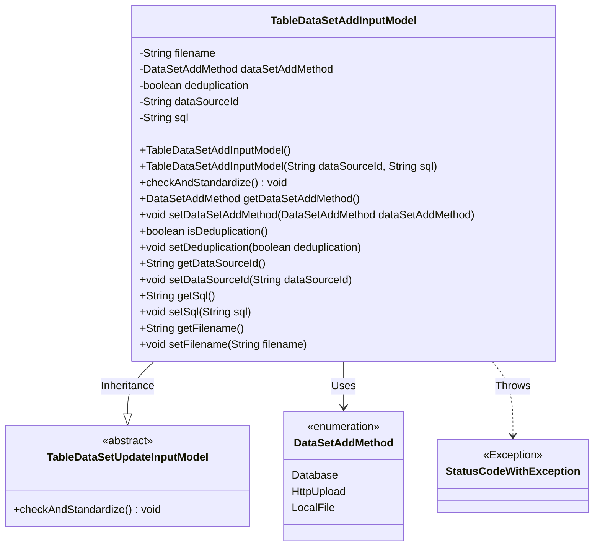
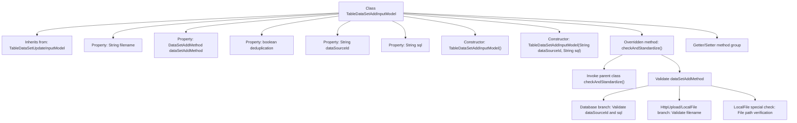

# Basic Information

|      |      |
|------|------|
| Name | TableDataSetAddInputModel |
| Language | .java |
| Code Path | WeFe/board/board-service/src/main/java/com/welab/wefe/board/service/dto/vo/data_resource/TableDataSetAddInputModel.java |
| Package Name | com.welab.wefe.board.service.dto.vo.data_resource |
| Dependencies | ['com.welab.wefe.board.service.base.file_system.WeFeFileSystem', 'com.welab.wefe.board.service.constant.DataSetAddMethod', 'com.welab.wefe.common.StatusCode', 'com.welab.wefe.common.exception.StatusCodeWithException', 'com.welab.wefe.common.fieldvalidate.annotation.Check', 'org.apache.commons.lang3.StringUtils'] |
| Brief Description | The TableDataSetAddInputModel class is used for dataset addition, containing fields such as file name, addition method, deduplication flag, data source ID, and SQL script, with input validation performed. |

# Description

TableDataSetAddInputModel inherits from TableDataSetUpdateInputModel and is used to handle input parameters for dataset addition. It includes required fields filename, dataSetAddMethod, deduplication, and optional fields dataSourceId and sql. Two constructors are provided: a default constructor and a constructor with dataSourceId and sql parameters. The checkAndStandardize method is overridden to perform validation based on the dataSetAddMethod type: Database type requires non-null validation for dataSourceId and sql; HttpUpload and LocalFile types require non-null validation for filename; LocalFile type additionally validates that the file path meets requirements. Getter and setter methods are provided for each field.

# Class Summary

| Name   | Type  | Description |
|-------|------|-------------|
| TableDataSetAddInputModel | class | The TableDataSetAddInputModel class inherits from TableDataSetUpdateInputModel and includes fields such as filename, data addition method, deduplication flag, data source ID, and SQL script. It provides validation logic to ensure parameter validity. |

## Class TableDataSetAddInputModel

|      |      |
|------|------|
| Access Modifier | public |
| Type | class |
| Name | TableDataSetAddInputModel |
| Description | The TableDataSetAddInputModel class inherits from TableDataSetUpdateInputModel and includes fields such as filename, data addition method, deduplication flag, data source ID, and SQL script. It provides validation logic to ensure parameter validity. |

### UML Class Diagram

This class diagram illustrates that the TableDataSetAddInputModel class inherits from the abstract class TableDataSetUpdateInputModel and contains multiple private fields with corresponding getter/setter methods. The class is primarily used to handle input models for dataset addition, specifying different addition methods via the enumeration type DataSetAddMethod, and performing parameter validation in the checkAndStandardize method. A StatusCodeWithException is thrown when validation fails. The diagram clearly depicts inheritance relationships, dependencies, and exception handling mechanisms between the classes.

### Internal Method Call Graph

This code demonstrates a dataset addition input model class that inherits from a base update model class. Key functionalities include: 1) Parameter validation through annotations; 2) Provision of two constructor methods; 3) Overridden validation method implementing multi-branch verification logic; 4) Complete getter/setter methods. The core validation logic performs different parameter checks based on the dataset addition method (Database/HttpUpload/LocalFile), with particularly strict directory restriction validation for local file paths.

### Field List

| Name  | Type  | Description |
|-------|-------|------|
| deduplication | boolean | The class member variable `deduplication`, of boolean type, is used to control whether deduplication is required and is mandatory by default. |
| filename | String | The code snippet defines a private String variable named filename, using the @Check annotation to ensure it is not empty, otherwise prompting "Please specify the dataset file". |
| dataSetAddMethod | DataSetAddMethod | The mandatory validation field dataSetAddMethod cannot be empty. |
| dataSourceId | String | Check the string variable for the data source ID. |
| sql | String | The class member variable `sql` is annotated with `@Check` as "SQL script". |

### Method List

| Name  | Type  | Description |
|-------|-------|------|
| getDataSetAddMethod | DataSetAddMethod | Get the function for adding dataset methods, which returns the value of dataSetAddMethod. |
| checkAndStandardize | void | Method to check dataset addition method: Database requires dataSourceId and sql; HttpUpload and LocalFile require filename; LocalFile also needs the file path to be under the specified directory. |
| isDeduplication | boolean | The method isDeduplication returns a boolean value of deduplication. |
| setSql | void | This is a Java method used to set the SQL statement string to the member variable sql of the class. |
| getDataSourceId | String | Methods to obtain the data source ID, returns the data source ID as a string type. |
| setDataSourceId | void | The method to set the data source ID assigns the input parameter to the class member variable dataSourceId. |
| getSql | String | Methods to Obtain SQL Statements. |
| setDataSetAddMethod | void | Set the dataset addition method by assigning the parameter to the class member variable `dataSetAddMethod`. |
| setDeduplication | void | The method to toggle the deduplication feature, with a boolean parameter. |
| getFilename | String | This is a Java method that returns the value of the string variable `filename`. |
| setFilename | void | Methods for setting the filename, assigning the input parameter to the class member variable filename. |

