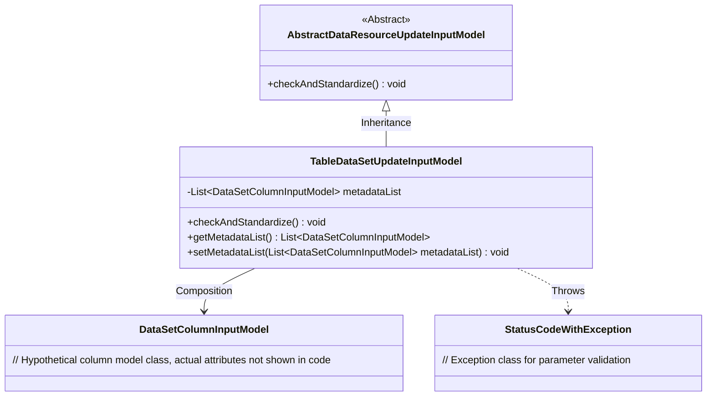
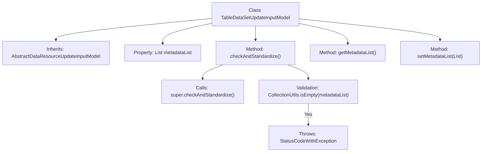

# Basic Information

|      |      |
|------|------|
| Name | TableDataSetUpdateInputModel |
| Language | .java |
| Code Path | WeFe/board/board-service/src/main/java/com/welab/wefe/board/service/dto/vo/data_resource/TableDataSetUpdateInputModel.java |
| Package Name | com.welab.wefe.board.service.dto.vo.data_resource |
| Dependencies | ['com.welab.wefe.board.service.dto.entity.data_set.DataSetColumnInputModel', 'com.welab.wefe.common.StatusCode', 'com.welab.wefe.common.exception.StatusCodeWithException', 'com.welab.wefe.common.fieldvalidate.annotation.Check', 'org.apache.commons.collections4.CollectionUtils', 'java.util.List'] |
| Brief Description | TableDataSetUpdateInputModel extends AbstractDataResourceUpdateInputModel and includes the metadataList field, which is validated to be non-null, with getter/setter methods provided. |

# Description

This is a Java class named TableDataSetUpdateInputModel, which extends AbstractDataResourceUpdateInputModel. It includes a required metadataList property of type List<DataSetColumnInputModel>. The class implements the checkAndStandardize method to validate whether metadataList is empty, throwing an exception prompting to set dataset metadata if it is empty. It also provides getter and setter methods for metadataList.

# Class Summary

| Name   | Type  | Description |
|-------|------|-------------|
| TableDataSetUpdateInputModel | class | TableDataSetUpdateInputModel inherits from AbstractDataResourceUpdateInputModel, containing the metadataList field and validation logic, requiring metadataList to be non-empty. It provides getter/setter methods. |

## Class TableDataSetUpdateInputModel

|      |      |
|------|------|
| Access Modifier | public |
| Type | class |
| Name | TableDataSetUpdateInputModel |
| Description | TableDataSetUpdateInputModel inherits from AbstractDataResourceUpdateInputModel, containing the metadataList field and validation logic, requiring metadataList to be non-empty. It provides getter/setter methods. |

### UML Class Diagram

Class Diagram Description: This diagram illustrates that TableDataSetUpdateInputModel inherits from the abstract class AbstractDataResourceUpdateInputModel and maintains an aggregation relationship with DataSetColumnInputModel. The TableDataSetUpdateInputModel implements parameter validation logic through the checkAndStandardize() method, throwing a StatusCodeWithException when metadataList is empty, demonstrating a robust validation mechanism for dataset metadata.

### Internal Method Call Graph

This code illustrates a TableDataSetUpdateInputModel class that inherits from AbstractDataResourceUpdateInputModel, primarily used for handling dataset update input models. Core functionalities include validation of the metadataList property (non-null check), getter/setter methods, and standardized inspection flow. When metadataList is empty, it throws a StatusCodeWithException. The flowchart clearly presents the class inheritance relationship, property structure, and method call chain, particularly highlighting the exception handling path in the validation logic.

### Field List

| Name  | Type  | Description |
|-------|-------|------|
| metadataList | List<DataSetColumnInputModel> | The private list `metadataList` with mandatory checks, of type `DataSetColumnInputModel`. |

### Method List

| Name  | Type  | Description |
|-------|-------|------|
| checkAndStandardize | void | Check and standardize the dataset, throwing an invalid parameter exception if the metadata is empty. |
| getMetadataList | List<DataSetColumnInputModel> | The method returns the dataset column input model list metadataList. |
| setMetadataList | void | This is a Java method used to set the value of the metadataList property, with the parameter being a list of type DataSetColumnInputModel. |

