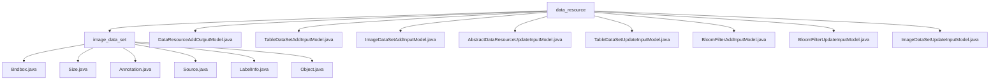

# Basic Information

|      |      |
|------|------|
| Name | data_resource |
| Language | .java |
| Code Path | WeFe/board/board-service/src/main/java/com/welab/wefe/board/service/dto/vo/data_resource |
| Package Name | docs.board.board-service.src.main.java.com.welab.wefe.board.service.dto.vo.data_resource |
| Brief Description | This module manages image dataset annotations, including bounding boxes, dimensions, and object attributes. It supports the entire annotation workflow and relies on XStream serialization. It contains multiple input/output model classes for handling data resource addition, updates, and validation, such as DataResourceAddOutputModel, TableDataSetAddInputModel, etc. |

# Description

## Overview  
The core responsibility of this module is to uniformly manage CRUD operations for multiple types of data resources (images/tables/Bloom filters) using a layered input model design. The interface specification follows an inheritance hierarchy: base fields are defined by `AbstractDataResourceUpdateInputModel`, while subclasses extend specific validation logic (e.g., `ImageDataSetAddInputModel` verifies file existence). Key data structures include resource identifier fields (`id`/`dataResourceId`), metadata lists (`metadataList`), and an enumeration for addition methods (`dataSetAddMethod`). External dependencies are limited to the XStream serialization framework. For example, `TableDataSetAddInputModel` implements database-type resource addition through SQL validation, similar to data source configuration in ETL tools.  

## Primary Business Scenarios  
The module supports full lifecycle management for three types of data resources: image datasets (file validation), tabular data (metadata validation), and Bloom filters (hash configuration). A typical interaction pattern involves `AddInputModel` inheriting from `UpdateInputModel` to implement differentiated validation, such as `BloomFilterAddInputModel` enforcing non-empty `fieldInfoList`. Functionality covers resource addition (parameter initialization), update (`publicLevel` validation), and conversion (`toLabelInfo`), forming a standardized resource management workflow. For example, visibility control is achieved via `publicMemberList`, resembling the RBAC permission model.

### Package Internal Structure View

This flowchart illustrates the hierarchical structure under the data_resource directory, which includes a subdirectory image_data_set and multiple Java files. The image_data_set subdirectory contains seven specific Java class files, while the root data_resource directory comprises eight distinct model class files, covering different operation types (e.g., add, update) and data types (e.g., table data, image data) for data resources.

# File List

| Name   | Type  | Description |
|-------|------|-------------|
| [DataResourceAddOutputModel.java](DataResourceAddOutputModel.md) | file | The DataResourceAddOutputModel class extends AbstractService and includes two string properties, dataResourceId and uploadTaskId, providing both a no-argument constructor and a parameterized constructor. |
| [TableDataSetAddInputModel.java](TableDataSetAddInputModel.md) | file | The TableDataSetAddInputModel class is used for dataset addition, containing fields such as file name, addition method, deduplication flag, data source ID, and SQL script, with input validation performed. |
| [ImageDataSetAddInputModel.java](ImageDataSetAddInputModel.md) | file | Add an input model class for the image dataset, inheriting from the update model, including filename and task type fields, checking file existence, and providing getter/setter methods. |
| [AbstractDataResourceUpdateInputModel.java](AbstractDataResourceUpdateInputModel.md) | file | The dataset update input model includes fields such as name, description, labels, visibility level, and member list, and undergoes validation and standardization processing to ensure data legality and uniqueness. |
| [TableDataSetUpdateInputModel.java](TableDataSetUpdateInputModel.md) | file | TableDataSetUpdateInputModel extends AbstractDataResourceUpdateInputModel, containing the metadataList field with non-null validation, and provides getter/setter methods. |
| [BloomFilterAddInputModel.java](BloomFilterAddInputModel.md) | file | The BloomFilterAddInputModel class inherits from BloomFilterUpdateInputModel and includes attributes such as filename, addition method, deduplication flag, data source ID, SQL script, hash function, and primary key field list, while validating parameter validity. |
| [BloomFilterUpdateInputModel.java](BloomFilterUpdateInputModel.md) | file | The BloomFilterUpdateInputModel class inherits from AbstractDataResourceUpdateInputModel and includes the metadataList property along with its getter/setter methods. |
| [ImageDataSetUpdateInputModel.java](ImageDataSetUpdateInputModel.md) | file | ImageDataSetUpdateInputModel inherits from AbstractDataResourceUpdateInputModel and is used for image dataset update input. |
| [image_data_set](image_data_set/_module.md) | package | The Bndbox class represents a rectangular bounding box, containing coordinates xmin, ymin, xmax, and ymax. The Size class stores three-dimensional dimensions: width, height, and depth. The Annotation class handles annotation data, including file information, a list of objects, and transformation methods. The Source class simply stores database information. The LabelInfo class manages labeling information, including a list of labels and validation methods. The Object class describes object attributes, including name, pose, occlusion flag, and bounding box. |

