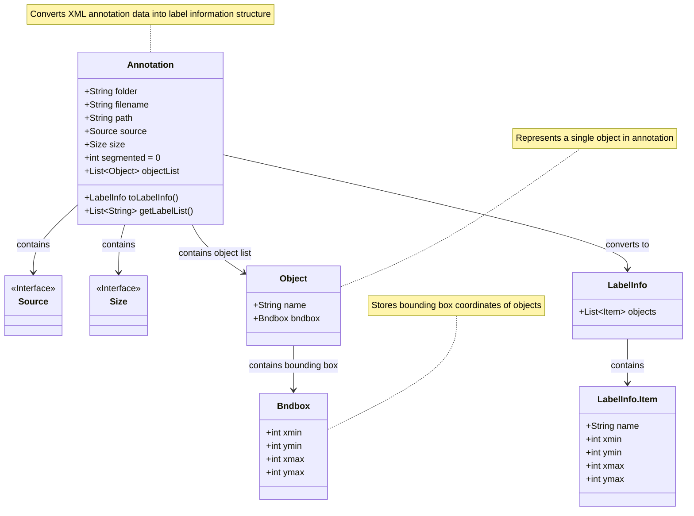
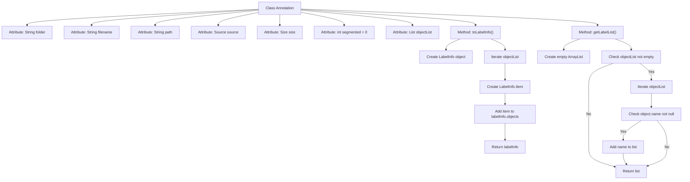

# Basic Information

|      |      |
|------|------|
| Name | Annotation |
| Language | .java |
| Code Path | WeFe/board/board-service/src/main/java/com/welab/wefe/board/service/dto/vo/data_resource/image_data_set/Annotation.java |
| Package Name | com.welab.wefe.board.service.dto.vo.data_resource.image_data_set |
| Dependencies | ['com.thoughtworks.xstream.annotations.XStreamAlias', 'com.thoughtworks.xstream.annotations.XStreamImplicit', 'com.welab.wefe.common.util.StringUtil', 'java.util.ArrayList', 'java.util.List'] |
| Brief Description | The `Annotation` class is used for labeling information, containing attributes such as folder, filename, path, source, dimensions, etc. It can convert a list of objects into `LabelInfo` or extract a list of labels. |

# Description

The code defines a class named Annotation for handling annotation data. The class includes basic fields such as folder, filename, path, as well as source and size objects. The segmented field is currently unused, with a default value of 0. objectList stores a list of objects, which are converted to the LabelInfo format via the toLabelInfo method, including names and bounding box coordinates. The getLabelList method extracts a list of names for all objects. The overall functionality involves the storage and conversion of annotation data.

# Class Summary

| Name   | Type  | Description |
|-------|------|-------------|
| Annotation | class | The Annotation class is used for labeling information, containing attributes such as folder, filename, path, source, dimensions, etc. It can convert a list of objects into LabelInfo or extract a list of labels. |

## Class Annotation

|      |      |
|------|------|
| Access Modifier | @XStreamAlias("annotation");public |
| Type | class |
| Name | Annotation |
| Description | The Annotation class is used for labeling information, containing attributes such as folder, filename, path, source, dimensions, etc. It can convert a list of objects into LabelInfo or extract a list of labels. |

### UML Class Diagram

This code describes an annotation data conversion system. The Annotation class serves as the core data structure for storing XML-formatted annotation information (such as file paths, dimensions, object lists, etc.), and provides the toLabelInfo() method to transform raw data into a structured LabelInfo object while supporting label list extraction. The class diagram clearly illustrates the dependency relationships between Annotation and interfaces like Source and Size, as well as the multi-level object bounding box storage structure implemented through Object and Bndbox classes, ultimately converting into a LabelInfo result containing a collection of Items.

### Internal Method Call Graph

This code defines the Annotation class for processing labeled data, containing file information and an object list. The toLabelInfo() method converts objectList into a LabelInfo object containing each object's name and bounding box coordinates; the getLabelList() method extracts all non-null object names. The flowchart illustrates the attribute structure and method logic, particularly the iterative processing of objectList and conditional judgments.

### Field List

| Name  | Type  | Description |
|-------|-------|------|
| segmented = 0 | int | Defined an integer variable named segmented with an initial value of 0. |
| size | Size | The class member variable size, of type Size. |
| source | Source | Declare a public Source class variable named source. |
| path | String | The public string variable path. |
| objectList | List<Object> | The XStream-annotated objectList is used for implicit handling of object lists. |
| filename | String | Declare a public string variable filename. |
| folder | String | Defined a public string variable named folder. |

### Method List

| Name  | Type  | Description |
|-------|-------|------|
| getLabelList | List<String> | The method `getLabelList` returns a list of strings composed of the `name` property values of all objects in a non-empty object list. If the object list is empty, it returns an empty list. |
| toLabelInfo | LabelInfo | This method converts a list of objects into a LabelInfo object, containing the name and bounding box coordinates of each object. If there is no object list, it returns an empty LabelInfo. |

