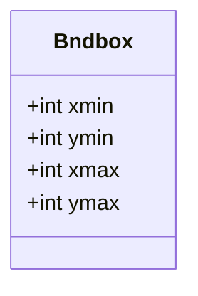
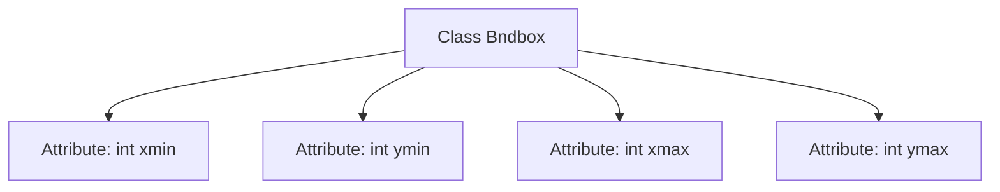

# Basic Information

|      |      |
|------|------|
| Name | Bndbox |
| Language | .java |
| Code Path | WeFe/board/board-service/src/main/java/com/welab/wefe/board/service/dto/vo/data_resource/image_data_set/Bndbox.java |
| Package Name | com.welab.wefe.board.service.dto.vo.data_resource.image_data_set |
| Dependencies | [] |
| Brief Description | The Bndbox class defines a rectangular box, containing the top-left corner coordinates (xmin, ymin) and the bottom-right corner coordinates (xmax, ymax). |

# Description

This is a public class named Bndbox, used to represent a rectangular bounding box. The class contains four public integer fields: xmin and ymin represent the coordinates of the top-left corner of the rectangle, while xmax and ymax represent the coordinates of the bottom-right corner. These fields collectively define the position and size of the rectangle in two-dimensional space.

# Class Summary

| Name   | Type  | Description |
|-------|------|-------------|
| Bndbox | class | The Bndbox class defines four integer variables representing the coordinates of the top-left corner (xmin, ymin) and the bottom-right corner (xmax, ymax) of a rectangular bounding box. |

## Class Bndbox

|      |      |
|------|------|
| Access Modifier | public |
| Type | class |
| Name | Bndbox |
| Description | The Bndbox class defines four integer variables representing the coordinates of the top-left corner (xmin, ymin) and the bottom-right corner (xmax, ymax) of a rectangular bounding box. |

### UML Class Diagram

This code defines a class named Bndbox, which represents a bounding box in two-dimensional space. The class contains four public integer fields: xmin and ymin denote the coordinates of the top-left corner of the bounding box, while xmax and ymax represent the coordinates of the bottom-right corner. This structure is commonly used in computer vision and graphics processing to specify the positional range of objects within an image. Since all fields are public, external entities can directly access and modify these coordinate values, though the lack of encapsulation protection may lead to accidental data modification.

### Internal Method Call Graph

This flowchart illustrates the structure of the Bndbox class, which contains four public integer-type attributes: xmin, ymin, xmax, and ymax. It is a simple data container class used to store coordinate information of 2D bounding boxes, commonly applied in image processing or object detection fields. The diagram clearly shows the hierarchical relationship between the class and its attributes, with each attribute directly linked to the main Bndbox class entity.

### Field List

| Name  | Type  | Description |
|-------|-------|------|
| xmin | int | Declare a public integer variable xmin. |
| ymin | int | Declare a public integer variable ymin. |
| xmax | int | The public integer variable xmax is used to store the maximum value. |
| ymax | int | Common integer variable representing the maximum value of the y-axis. |

### Method List

| Name  | Type  | Description |
|-------|-------|------|

