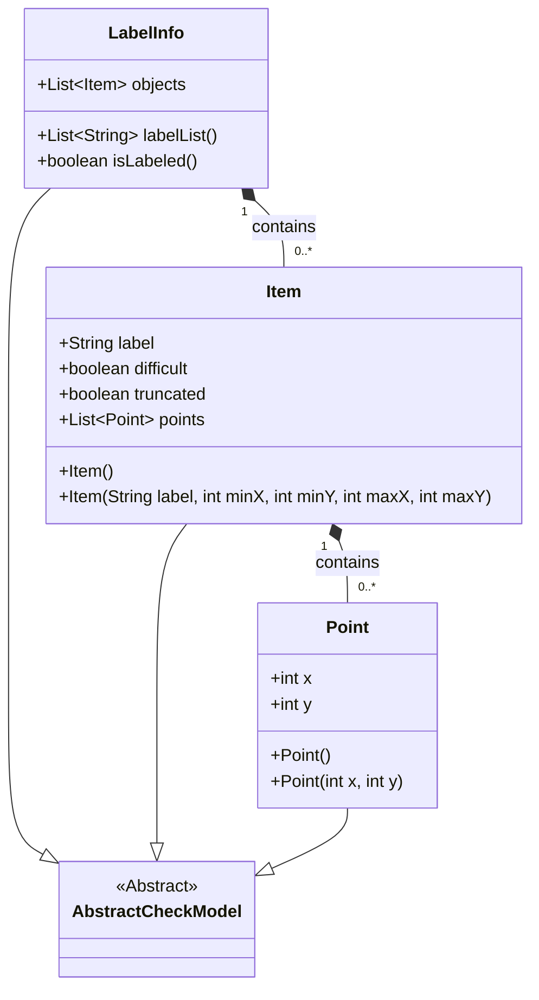
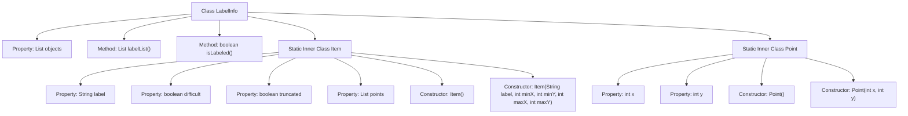
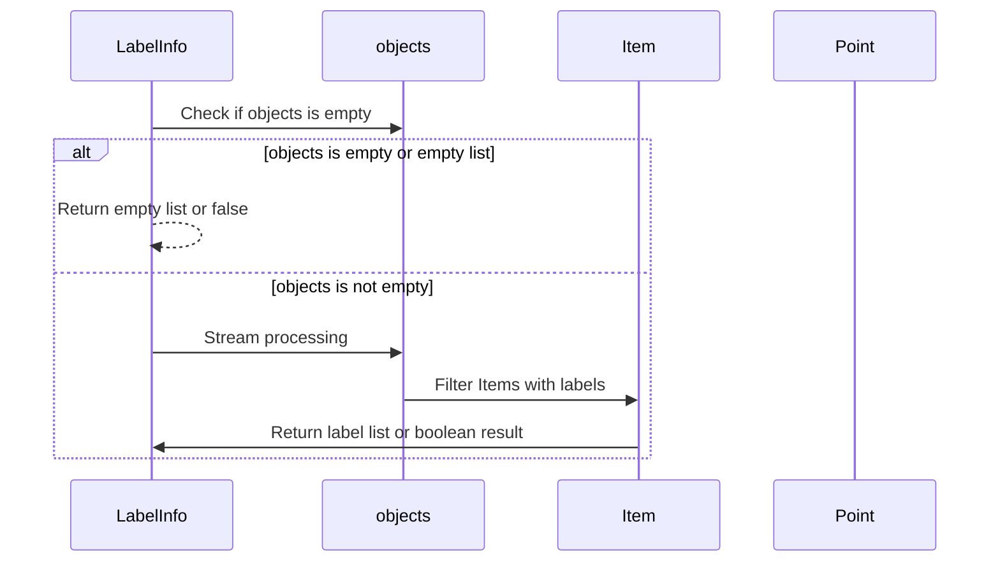

# Basic Information

|      |      |
|------|------|
| Name | LabelInfo |
| Language | .java |
| Code Path | WeFe/board/board-service/src/main/java/com/welab/wefe/board/service/dto/vo/data_resource/image_data_set/LabelInfo.java |
| Package Name | com.welab.wefe.board.service.dto.vo.data_resource.image_data_set |
| Dependencies | ['com.welab.wefe.common.fieldvalidate.AbstractCheckModel', 'com.welab.wefe.common.fieldvalidate.annotation.Check', 'com.welab.wefe.common.util.StringUtil', 'java.util.ArrayList', 'java.util.List', 'java.util.stream.Collectors'] |
| Brief Description | The LabelInfo class manages image annotation information, including a list of objects and label extraction methods. The Item class stores the label, occlusion status, and coordinate points of a single annotation. The Point class defines coordinates. Methods for checking the existence of annotations are provided. |

# Description

The LabelInfo class inherits from AbstractCheckModel and contains an objects list that stores Item objects. It provides a labelList method to return a non-empty label list and an isLabeled method to check for the presence of annotation information. The Item class includes label, difficult, truncated flags, and a points coordinate list, which can be initialized via a constructor with label and coordinate range parameters. The Point class stores x and y coordinate values. Collectively, this implementation manages and queries image annotation information.

# Class Summary

| Name   | Type  | Description |
|-------|------|-------------|
| LabelInfo | class | The LabelInfo class manages image annotation information, including a list of objects and methods for label extraction. The Item class stores the label, difficulty, occlusion status, and coordinate points of a single annotation. The Point class represents coordinates. It provides methods to check the existence of annotations. |

## Class LabelInfo

|      |      |
|------|------|
| Access Modifier | public |
| Type | class |
| Name | LabelInfo |
| Description | The LabelInfo class manages image annotation information, including a list of objects and methods for label extraction. The Item class stores the label, difficulty, occlusion status, and coordinate points of a single annotation. The Point class represents coordinates. It provides methods to check the existence of annotations. |

### UML Class Diagram

This code demonstrates the class structure of an annotation information processing system. LabelInfo, as the main class inheriting from AbstractCheckModel, contains a list of Item objects and two core methods: extracting label lists (labelList) and determining if labeling is complete (isLabeled). The Item class represents a single annotation entry, including labels, difficulty flags, and coordinate point lists. The Point class encapsulates 2D coordinate information. The entire design adopts a composite pattern, where LabelInfo aggregates multiple Items, and each Item aggregates multiple Points, forming a hierarchical data structure.

### Internal Method Call Graph

This code defines a LabelInfo class for managing image annotation information. Key functionalities include: 1) Storing annotation items (Item) via the objects collection; 2) Providing the labelList() method to extract valid label lists; 3) The isLabeled() method checks for valid annotations. The inner class Item represents a single annotation object, containing labels, difficulty flags, and coordinate point lists; The Point class encapsulates 2D coordinates. The flowchart clearly shows the class structure and inheritance relationships, while the sequence diagram describes the execution flow of core methods.

### Field List

| Name  | Type  | Description |
|-------|-------|------|
| objects = new ArrayList<>() | List<Item> | The code defines a public list variable named `objects`, which is used to store labeled objects in images and is validated via the `@Check` annotation. |

### Method List

| Name  | Type  | Description |
|-------|-------|------|
| labelList | List<String> | This method returns a list of labels for non-null objects. If the input is null, it returns an empty list; otherwise, it filters and collects non-null labels. |
| isLabeled | boolean | Check if the list of objects contains non-empty tags, and return false if the list is empty or has no tags. |

