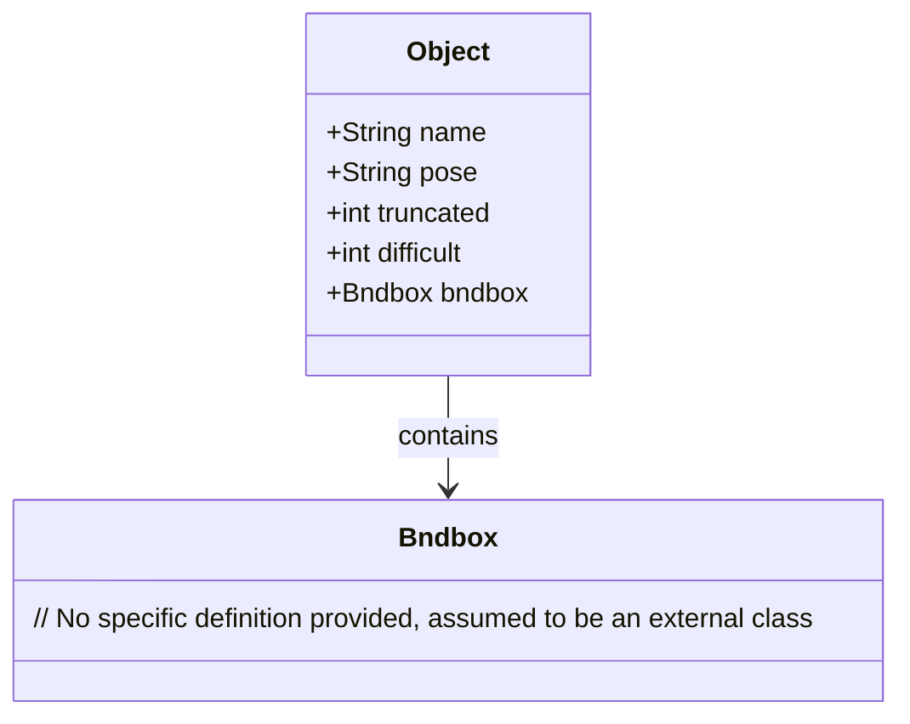
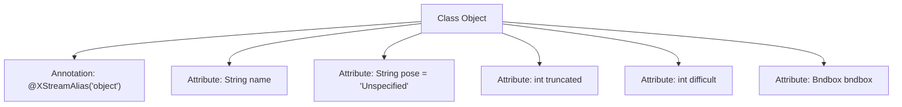

# Basic Information

|      |      |
|------|------|
| Name | Object |
| Language | .java |
| Code Path | WeFe/board/board-service/src/main/java/com/welab/wefe/board/service/dto/vo/data_resource/image_data_set/Object.java |
| Package Name | com.welab.wefe.board.service.dto.vo.data_resource.image_data_set |
| Dependencies | ['com.thoughtworks.xstream.annotations.XStreamAlias'] |
| Brief Description | The Java class Object defines object attributes: name, pose (optional), truncated (optional), difficult (optional), and bounding box bndbox. |

# Description

The code defines a class named Object, annotated with XStreamAlias as "object". The class contains five fields: name (string type, required), pose (string type, default value "Unspecified", an optional field describing the object's pose), truncated (integer type, optional field, used to mark cases where the object is occluded by more than 15-20% and located outside the bounding box), difficult (integer type, optional field, used to mark objects that are difficult to recognize), and bndbox (Bndbox type, required field). All optional fields include comments explaining their purposes.

# Class Summary

| Name   | Type  | Description |
|-------|------|-------------|
| Object | class | The Java class Object defines object attributes: name, pose (optional), occlusion marker truncated (optional), recognition difficulty difficult (optional), and bounding box bndbox. |

## Class Object

|      |      |
|------|------|
| Access Modifier | @XStreamAlias("object");public |
| Type | class |
| Name | Object |
| Description | The Java class Object defines object attributes: name, pose (optional), occlusion marker truncated (optional), recognition difficulty difficult (optional), and bounding box bndbox. |

### UML Class Diagram

This class diagram describes an Object class for annotating object information, containing fields such as name, pose, truncated status (truncated), recognition difficulty (difficult), and associating with the Bndbox class (representing object bounding box) through a composition relationship. The pose, truncated, and difficult fields are all optional, describing the object's posture, occlusion status, and recognition difficulty respectively. The class implements XML serialization alias mapping via the @XStreamAlias annotation, with the overall structure designed for structured storage of object detection data.

### Internal Method Call Graph

This flowchart illustrates the structure of the Object class, which includes 5 attributes and 1 class annotation. The 'name' field is mandatory, while 'pose', 'truncated', and 'difficult' are optional fields with annotations. 'bndbox' represents the associated bounding box object. The annotation @XStreamAlias defines the tag name for XML serialization. All attributes are directly associated with the Object class, with no method invocation relationships.

### Field List

| Name  | Type  | Description |
|-------|-------|------|
| bndbox | Bndbox | The class member variable bndbox, of type Bndbox. |
| difficult | int | A public integer variable named difficult is defined. |
| truncated | int | The integer variable `truncated` indicates the truncation status. |
| pose = "Unspecified" | String | The variable `pose` is of string type, with an initial value of "Unspecified". |
| name | String | public string variable name. |

### Method List

| Name  | Type  | Description |
|-------|-------|------|

