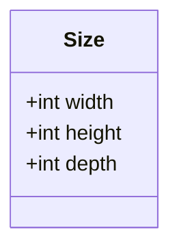
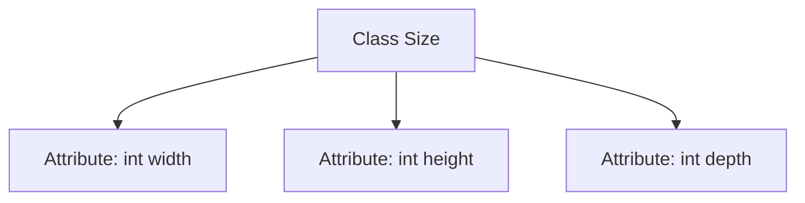

# Basic Information

|      |      |
|------|------|
| Name | Size |
| Language | .java |
| Code Path | WeFe/board/board-service/src/main/java/com/welab/wefe/board/service/dto/vo/data_resource/image_data_set/Size.java |
| Package Name | com.welab.wefe.board.service.dto.vo.data_resource.image_data_set |
| Dependencies | [] |
| Brief Description | The Size class contains three public integer fields: width, height, and depth, representing width, height, and depth respectively. |

# Description

This is a public class named Size, containing three public integer fields: width represents the width, height represents the height, and depth represents the depth. This class is used to store three-dimensional size information, and all fields can be directly accessed and modified.

# Class Summary

| Name   | Type  | Description |
|-------|------|-------------|
| Size | class | The Size class contains three public integer fields: width, height, and depth, which represent the width, height, and depth of a dimension. |

## Class Size

|      |      |
|------|------|
| Access Modifier | public |
| Type | class |
| Name | Size |
| Description | The Size class contains three public integer fields: width, height, and depth, which represent the width, height, and depth of a dimension. |

### UML Class Diagram

This code defines a simple `Size` class for representing three-dimensional measurement information, containing three public integer fields: `width`, `height`, and `depth`. The class does not define any methods and serves solely as a data structure, making it suitable for storing and passing dimensional parameters. Since all fields are public and mutable, users should be aware that direct field modifications may lead to data consistency issues. This design is commonly used in scenarios requiring efficient access but no encapsulation logic, such as simple value object implementations.

### Internal Method Call Graph

This flowchart illustrates the structure of the Size class, which is a simple data class containing three public integer attributes: width, height, and depth. The diagram clearly shows the hierarchical relationship between the class and its attributes, with each attribute directly linked to the Size class without any methods or complex logic. Such a structure is commonly used for storing three-dimensional size information, applicable in scenarios like graphics processing, geometric calculations, or object modeling.

### Field List

| Name  | Type  | Description |
|-------|-------|------|
| depth | int | The variable depth is of integer type, representing depth. |
| height | int | The integer variable `height` is used to store the height value. |
| width | int | Declare a public integer variable width. |

### Method List

| Name  | Type  | Description |
|-------|-------|------|

