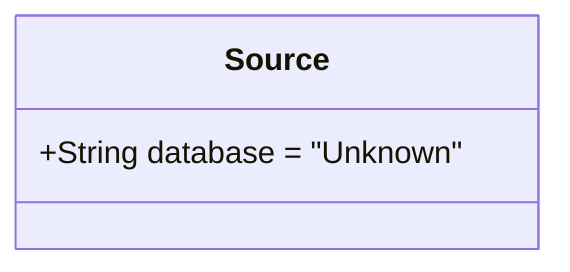
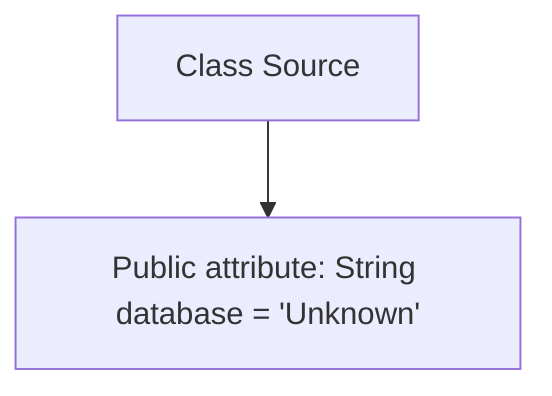

# Basic Information

|      |      |
|------|------|
| Name | Source |
| Language | .java |
| Code Path | WeFe/board/board-service/src/main/java/com/welab/wefe/board/service/dto/vo/data_resource/image_data_set/Source.java |
| Package Name | com.welab.wefe.board.service.dto.vo.data_resource.image_data_set |
| Dependencies | [] |
| Brief Description | The class Source contains a string field named database, with a default value of "Unknown". |

# Description

This is a Java class definition named Source, containing a public string-type member variable named database, which is initialized with a default value of "Unknown". This variable is used to store database information, with its current status being unknown. The class structure is simple, consisting only of a field declaration without any defined methods.

# Class Summary

| Name   | Type  | Description |
|-------|------|-------------|
| Source | class | The class Source contains a string field named database, with a default value of "Unknown". |

## Class Source

|      |      |
|------|------|
| Access Modifier | public |
| Type | class |
| Name | Source |
| Description | The class Source contains a string field named database, with a default value of "Unknown". |

### UML Class Diagram

This code defines a simple `Source` class containing a public string field `database` with an initial value of "Unknown". The class does not define any methods and is solely used for storing data source information. The class diagram clearly displays the class's only member variable along with its visibility and default value. Such a structure is typically employed for basic data containers or configuration classes.

### Internal Method Call Graph

This code defines a simple class named Source, which contains only one public string attribute "database" with a default value of "Unknown". The flowchart clearly illustrates the dependency relationship between the class and its sole attribute, without any methods or other complex structures. The entire class structure is extremely simple, designed solely for storing a string value representing a database name, making it suitable for use as a basic data container.

### Field List

| Name  | Type  | Description |
|-------|-------|------|
| database = "Unknown" | String | Declare a public string variable named database with an initial value of "Unknown". |

### Method List

| Name  | Type  | Description |
|-------|-------|------|

