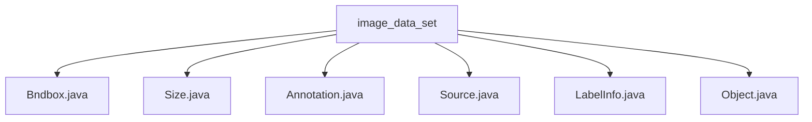

# Basic Information

|      |      |
|------|------|
| Name | image_data_set |
| Language | .java |
| Code Path | WeFe/board/board-service/src/main/java/com/welab/wefe/board/service/dto/vo/data_resource/image_data_set |
| Package Name | docs.board.board-service.src.main.java.com.welab.wefe.board.service.dto.vo.data_resource.image_data_set |
| Brief Description | The Bndbox class represents a rectangular bounding box, containing coordinates xmin, ymin, xmax, and ymax. The Size class stores three-dimensional dimensions: width, height, and depth. The Annotation class handles annotation data, including file information, a list of objects, and transformation methods. The Source class simply stores database information. The LabelInfo class manages labeling information, including a list of labels and validation methods. The Object class describes object attributes, including name, pose, occlusion flag, and bounding box. |

# Description

## Overview  
The core responsibility of this module is to manage annotation information for image datasets, including bounding box definitions, dimension descriptions, and object attribute storage. The interface specification uniformly adopts a direct field access pattern, such as the coordinate fields of Bndbox and the dimension fields of Size. Key data structures include Bndbox (rectangle coordinates), Size (three-dimensional dimensions), Annotation (annotation metadata), and Object (object attributes). External dependencies only involve the XStream serialization framework. For example, LabelInfo manages annotation point coordinates through Item objects, similar to feature storage in GIS systems.  

## Primary Business Scenarios  
The module supports a complete image annotation workflow: hierarchical processing from raw data (Source) to geometric definitions (Bndbox/Size) and then to object annotation (Object). The typical interaction pattern involves the Annotation class aggregating size and objectList, converting data formats via the toLabelInfo method. For instance, the Object class uses XStreamAlias to implement XML mapping, similar to JAXB's serialization approach. Functionality covers annotation creation (Item), validation (isLabeled), and querying (labelList), forming end-to-end annotation management capabilities.

### Package Internal Structure View

This flowchart illustrates the file structure relationship under the image_data_set directory, which includes six Java class files: Bndbox.java, Size.java, Annotation.java, Source.java, LabelInfo.java, and Object.java. All files are directly subordinate to the image_data_set directory without deeper subdirectory levels, forming a simple flat file organization structure.

# File List

| Name   | Type  | Description |
|-------|------|-------------|
| [Bndbox.java](Bndbox.md) | file | The Bndbox class defines a rectangular box, containing the coordinates of the top-left corner (xmin, ymin) and the bottom-right corner (xmax, ymax). |
| [Size.java](Size.md) | file | The Size class contains three public integer fields: width, height, and depth, representing width, height, and depth respectively. |
| [Annotation.java](Annotation.md) | file | The Annotation class is used for labeling information, containing attributes such as folder, filename, path, source, dimensions, etc. It can convert a list of objects into LabelInfo or extract a list of labels. |
| [Source.java](Source.md) | file | The class Source contains a string field named database, with a default value of "Unknown". |
| [LabelInfo.java](LabelInfo.md) | file | The LabelInfo class manages image annotation information, including a list of objects and methods for label extraction. The Item class stores the label, occlusion status, and coordinate points of a single annotation. The Point class defines coordinates. Methods are provided to check for the presence of annotations. |
| [Object.java](Object.md) | file | The Java class Object defines object attributes: name, pose (optional), truncated (optional), difficult (optional), and bounding box bndbox. |

