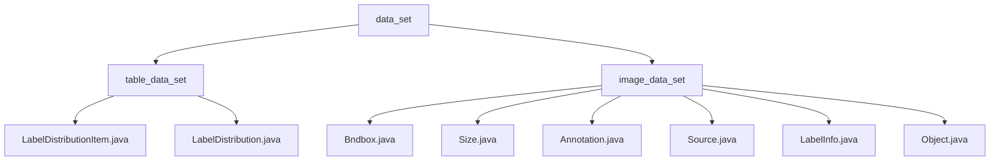

# Basic Information

|      |      |
|------|------|
| Name | data_set |
| Language | .java |
| Code Path | WeFe/board/board-service/src/main/java/com/welab/wefe/board/service/dto/vo/data_set |
| Package Name | docs.board.board-service.src.main.java.com.welab.wefe.board.service.dto.vo.data_set |
| Brief Description | The label management module encapsulates label data statistics and JSON serialization functions, supporting sorting and format conversion. The image annotation module handles bounding boxes, dimensions, and object attributes, supporting the Pascal VOC format annotation workflow. |

# Description

## Overview  
The core responsibility of this module is to uniformly manage annotation information for structured tabular data and image data, providing functionalities such as data encapsulation, statistical analysis, and format conversion. The interface specification adopts Java class encapsulation and includes two core structures: the tabular side (LabelDistributionItem/Distribution) handles label frequency statistics, while the image side (Bndbox/Annotation) manages spatial annotations. The key data structures form a complementary system—the tabular side consists of label-value key-value pairs, and the image side includes coordinates, dimensions, and object attributes. External dependencies include JSON serialization libraries and XStream annotation libraries. For example, LabelDistribution outputs statistical reports, while Annotation handles Pascal VOC format conversion.  

## Key Business Scenarios  
The module supports two typical scenarios: tabular label distribution statistics (similar to data pivoting) and image annotation management (similar to an annotation system hub). Both business processes follow the "initialize-process-output" pattern. The tabular side implements sorting and JSON serialization, while the image side completes annotation construction and format conversion. The interaction mode employs object encapsulation for both, but the tabular side emphasizes aggregation calculations (e.g., toJson), whereas the image side focuses on structural composition (e.g., Object nesting Bndbox). Typical applications include generating label quality reports (tabular) and handling occlusion annotations (image). The API covers constructors, state checks, and data conversion. For example, the `difficult` flag marks hard cases, and `truncated` indicates occlusion.

### Package Internal Structure View

This flowchart illustrates the hierarchical structure of the `data_set` module in the WeFe project, which includes two submodules: `table_data_set` and `image_data_set`. The `table_data_set` contains Java class files related to label distribution, while the `image_data_set` comprises multiple Java class files for image annotation, fully presenting the file organization structure of the dataset management module.

# File List

| Name   | Type  | Description |
|-------|------|-------------|
| [image_data_set](image_data_set/_module.md) | package | The Bndbox class defines 2D bounding box coordinates. The Size class stores 3D dimensions. The Annotation class manages annotation information. The Source class stores database information. The LabelInfo class handles image labeling. The Object class describes object attributes. |
| [table_data_set](table_data_set/_module.md) | package | The LabelDistributionItem class stores label names and quantities, providing a constructor method. The LabelDistribution class manages label data, including the number of categories, label lists, and sorting functionality, with support for JSON conversion. |

