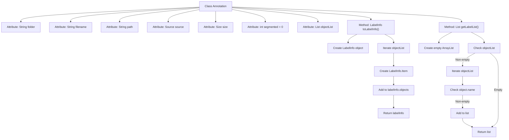

# Basic Information

|      |      |
|------|------|
| Name | Annotation |
| Language | .java |
| Code Path | WeFe/board/board-service/src/main/java/com/welab/wefe/board/service/dto/vo/data_set/image_data_set/Annotation.java |
| Package Name | com.welab.wefe.board.service.dto.vo.data_set.image_data_set |
| Dependencies | ['com.thoughtworks.xstream.annotations.XStreamAlias', 'com.thoughtworks.xstream.annotations.XStreamImplicit', 'com.welab.wefe.common.util.StringUtil', 'java.util.ArrayList', 'java.util.List'] |
| Brief Description | The Java class Annotation is used for labeling data, containing information such as folders, filenames, paths, sources, dimensions, etc. It supports conversion to the LabelInfo format and can retrieve a list of labels. |

# Description

This is a Java class named Annotation, used for storing annotation information. The class includes fields such as folder, filename, and path, where the value of folder is restricted to either train or test. The segmented field is currently unused and has a default value of 0. objectList stores a list of objects, annotated with XStreamImplicit. The class provides a toLabelInfo method to convert annotation information into a LabelInfo object, and a getLabelList method to retrieve a list of names for all objects. Internally, these methods check if objectList is empty and handle cases where object names are non-null.

# Class Summary

| Name   | Type  | Description |
|-------|------|-------------|
| Annotation | class | The Java class Annotation is used to annotate data, including information such as folders, filenames, paths, sources, dimensions, etc. It supports conversion to the LabelInfo format and extraction of a list of labels. |


## Class Annotation

|      |      |
|------|------|
| Access Modifier | @XStreamAlias("annotation");public |
| Type | class |
| Name | Annotation |
| Description | The Java class Annotation is used to annotate data, including information such as folders, filenames, paths, sources, dimensions, etc. It supports conversion to the LabelInfo format and extraction of a list of labels. |


### UML Class Diagram

```mermaid
classDiagram
    class Annotation {
        +String folder
        +String filename
        +String path
        +Source source
        +Size size
        +int segmented
        +List~Object~ objectList
        +LabelInfo toLabelInfo()
        +List~String~ getLabelList()
    }

    class Source {
        <<Interface>>
    }

    class Size {
        <<Interface>>
    }

    class Object {
        +String name
        +Bndbox bndbox
    }

    class Bndbox {
        +int xmin
        +int ymin
        +int xmax
        +int ymax
    }

    class LabelInfo {
        +List~Item~ objects
        +class Item {
            +String name
            +int xmin
            +int ymin
            +int xmax
            +int ymax
        }
    }

    Annotation --> Source : Dependency
    Annotation --> Size : Dependency
    Annotation --> Object : Contains
    Object --> Bndbox : Contains
    Annotation --> LabelInfo : Converts to
```

This class diagram illustrates the structure of the Annotation class and its relationships. As the core class, Annotation contains basic attributes such as folder and filename, and manages multiple Object instances through objectList. Each Object includes a name and Bndbox bounding box information. The class provides the toLabelInfo() method to convert data into the LabelInfo format, and getLabelList() to extract label lists. Source and Size exist as interfaces, Bndbox stores coordinate information, and the inner class Item in LabelInfo is used to store converted annotation items. The overall structure clearly demonstrates the organization and conversion logic of annotation data.


### Internal Method Call Graph



This flowchart illustrates the structure of the Annotation class and its core method logic. The class contains 7 attributes and 2 key methods: toLabelInfo() converts objectList into a LabelInfo object by iterating through the list to create Items and populate data; getLabelList() extracts all non-null object.name values to form a list. The process clearly demonstrates the branching logic for object conversion and list processing, particularly highlighting the null-checking of objectList and element filtering procedures.

### Field List

| Name  | Type  | Description |
|-------|-------|------|
| size | Size | A public Size type variable named size is defined. |
| objectList | List<Object> | The `objectList` annotated with XStream is used for implicitly handling lists of objects. |
| segmented = 0 | int | Define an integer variable named segmented with an initial value of 0. |
| source | Source | Declare a public variable named source of type Source. |
| path | String | Common string variable path |
| filename | String | Declare a public string variable filename. |
| folder | String | A public string variable `folder` is defined. |

### Method List

| Name  | Type  | Description |
|-------|-------|------|
| toLabelInfo | LabelInfo | Convert a list of objects into LabelInfo, including the name and bounding box coordinates of each object. If the object list is not empty, iterate through and add the information before returning. |
| getLabelList | List<String> | The method getLabelList returns a list of non-empty object names, or an empty list if objectList is empty. |


