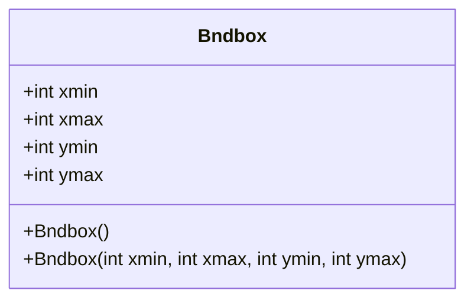
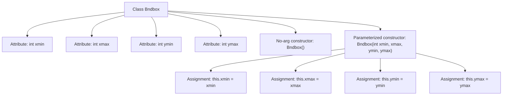

# Basic Information

|      |      |
|------|------|
| Name | Bndbox |
| Language | .java |
| Code Path | WeFe/board/board-service/src/main/java/com/welab/wefe/board/service/dto/vo/data_set/image_data_set/Bndbox.java |
| Package Name | com.welab.wefe.board.service.dto.vo.data_set.image_data_set |
| Dependencies | [] |
| Brief Description | The Bndbox class defines a bounding box, containing four integer attributes: xmin, xmax, ymin, ymax, and provides both parameterless and parameterized constructors. |

# Description

The Bndbox class defines a data structure representing a 2D bounding box, containing four integer member variables: xmin, xmax, ymin, and ymax, which respectively represent the minimum and maximum coordinate values of the bounding box along the x-axis and y-axis. This class provides two constructors: a parameterless constructor that performs no initialization, and a parameterized constructor that accepts four integer parameters to initialize the coordinate values of the bounding box.

# Class Summary

| Name   | Type  | Description |
|-------|------|-------------|
| Bndbox | class | The Bndbox class defines a bounding box, containing four integer attributes: xmin, xmax, ymin, ymax, and provides both parameterless and parameterized constructors. |

## Class Bndbox

|      |      |
|------|------|
| Access Modifier | public |
| Type | class |
| Name | Bndbox |
| Description | The Bndbox class defines a bounding box, containing four integer attributes: xmin, xmax, ymin, ymax, and provides both parameterless and parameterized constructors. |

### UML Class Diagram

This code defines a class named Bndbox, which represents a 2D bounding box. The class contains four public integer fields: xmin, xmax, ymin, and ymax, representing the minimum and maximum coordinate values of the bounding box on the x and y axes. It provides two constructors: a parameterless constructor and a four-parameter constructor for initializing the coordinate values of the bounding box. This class is commonly used in computer vision and graphics processing to represent rectangular regions in object detection or image processing tasks.

### Internal Method Call Graph

This flowchart illustrates the structure of the Bndbox class, which includes four integer attributes (xmin/xmax/ymin/ymax) and two constructors. The no-argument constructor performs no operations, while the parameterized constructor takes four arguments and assigns them to the corresponding attributes. The arrows clearly indicate the hierarchical relationship between the class and its members, as well as the parameter assignment flow within the constructor.

### Field List

| Name  | Type  | Description |
|-------|-------|------|
| xmax | int | Declare a public integer variable xmax. |
| xmin | int | Declare a public integer variable xmin. |
| ymin | int | Declare a public integer variable ymin. |
| ymax | int | A public integer variable ymax is defined. |

### Method List

| Name  | Type  | Description |
|-------|-------|------|

