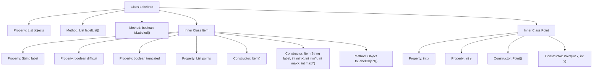

# Basic Information

|      |      |
|------|------|
| Name | LabelInfo |
| Language | .java |
| Code Path | WeFe/board/board-service/src/main/java/com/welab/wefe/board/service/dto/vo/data_set/image_data_set/LabelInfo.java |
| Package Name | com.welab.wefe.board.service.dto.vo.data_set.image_data_set |
| Dependencies | ['com.welab.wefe.common.fieldvalidate.AbstractCheckModel', 'com.welab.wefe.common.fieldvalidate.annotation.Check', 'com.welab.wefe.common.util.StringUtil', 'java.util.ArrayList', 'java.util.List', 'java.util.stream.Collectors'] |
| Brief Description | The LabelInfo class is used to manage image annotation information, including a list of objects and methods for label extraction. The Item class stores the label, position, and attributes of a single annotation. The Point class represents coordinate points. It supports checking whether annotations are present and converting them into label objects. |

# Description

The `LabelInfo` class inherits from `AbstractCheckModel` and contains an `objects` list to store `Item` objects. It provides a `labelList` method to extract a non-empty label list and an `isLabeled` method to check if annotation information exists. The `Item` class includes `label`, `difficult`, `truncated` attributes and a `points` list, offering a constructor and a `toLabelObject` conversion method. The `Point` class represents coordinate points with `x` and `y` attributes. The overall structure is designed for managing image annotation information and related operations.

# Class Summary

| Name   | Type  | Description |
|-------|------|-------------|
| LabelInfo | class | The LabelInfo class is used to manage image annotation information, including a list of objects and label extraction methods. The Item class stores the label, position, and attributes of a single annotation. It supports determining whether an item has been annotated and converting it into a label object. |


## Class LabelInfo

|      |      |
|------|------|
| Access Modifier | public |
| Type | class |
| Name | LabelInfo |
| Description | The LabelInfo class is used to manage image annotation information, including a list of objects and label extraction methods. The Item class stores the label, position, and attributes of a single annotation. It supports determining whether an item has been annotated and converting it into a label object. |


### UML Class Diagram

```mermaid
classDiagram
    class AbstractCheckModel {
        <<Abstract>>
    }

    class LabelInfo {
        +List~Item~ objects
        +List~String~ labelList()
        +boolean isLabeled()
    }
    LabelInfo --|> AbstractCheckModel

    class Item {
        +String label
        +boolean difficult
        +boolean truncated
        +List~Point~ points
        +Item()
        +Item(String label, int minX, int minY, int maxX, int maxY)
        +Object toLabelObject()
    }
    Item --|> AbstractCheckModel

    class Point {
        +int x
        +int y
        +Point()
        +Point(int x, int y)
    }
    Point --|> AbstractCheckModel

    class Object {
        +Bndbox bndbox
        +String name
        +int difficult
        +int truncated
    }

    class Bndbox {
        +int xmin
        +int ymin
        +int xmax
        +int ymax
    }

    // LabelInfo contains a list of Item objects
    LabelInfo "1" *-- "0..*" Item : contains
    // Item contains a list of Point objects
    Item "1" *-- "0..*" Point : contains
    // Item's toLabelObject method creates Object instance
    Item ..> Object : creates
    // Object depends on Bndbox
    Object ..> Bndbox : depends
```

This code describes a labeling information management system. The core class LabelInfo inherits from AbstractCheckModel and contains a list of Item objects along with label processing methods. The Item class represents a single labeled item, containing tags, difficulty flags, and coordinate point collections, and can be converted to a standard Object format. The Point class represents 2D coordinate points. The entire structure adopts a composite pattern where LabelInfo aggregates multiple Items, and each Item aggregates multiple Points, forming hierarchical data relationships for storing and processing image labeling information.


### Internal Method Call Graph



This code defines a `LabelInfo` class for managing image annotation information. Key functionalities include: retrieving all valid labels via the `labelList()` method, and checking for valid annotations using `isLabeled()`. It contains two inner classes: `Item` represents annotation items (with labels, coordinate points, and status attributes), while `Point` represents 2D coordinate points. The flowchart clearly illustrates the class structure, properties, and hierarchical relationships between methods, reflecting the core logic of annotation data processing.

### Field List

| Name  | Type  | Description |
|-------|-------|------|
| objects = new ArrayList<>() | List<Item> | The code defines a public list called `objects` to store marked objects in the image, with names annotated via the `@Check` annotation. |

### Method List

| Name  | Type  | Description |
|-------|-------|------|
| labelList | List<String> | The method `labelList` checks if the object list `objects` is empty, returning an empty list if true. Otherwise, it filters out non-empty labels and collects them into a new list to return. |
| isLabeled | boolean | Check if the list of objects contains non-empty labels. Return false if the list is empty or has no labels; otherwise, return true. |


