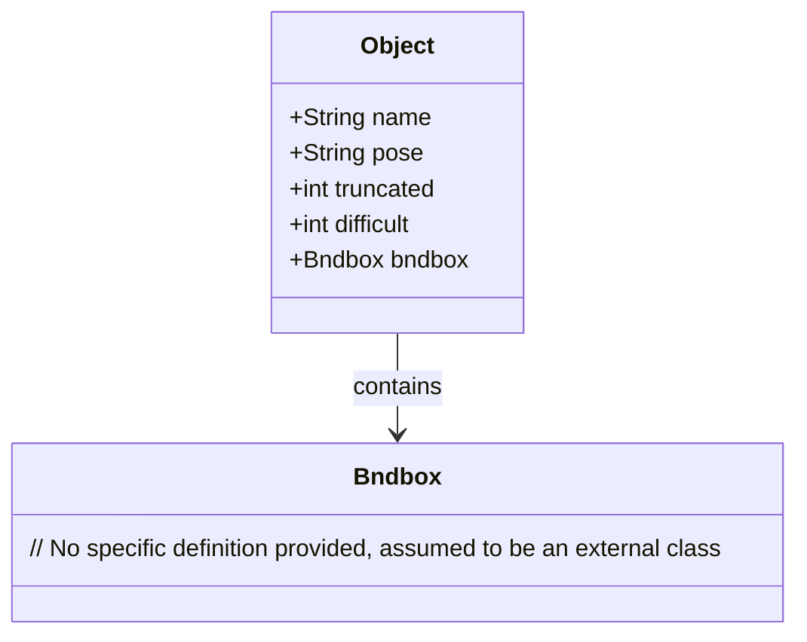
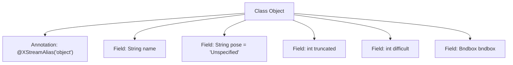

# Basic Information

|      |      |
|------|------|
| Name | Object |
| Language | .java |
| Code Path | WeFe/board/board-service/src/main/java/com/welab/wefe/board/service/dto/vo/data_set/image_data_set/Object.java |
| Package Name | com.welab.wefe.board.service.dto.vo.data_set.image_data_set |
| Dependencies | ['com.thoughtworks.xstream.annotations.XStreamAlias'] |
| Brief Description | A Java class `Object` defines object attributes: name, pose (unspecified by default), occlusion flag, recognition difficulty flag, and bounding box. Non-mandatory fields have default values. |

# Description

The code defines a class named Object, annotated with XStreamAlias as "object". The class contains five fields: name (string type, required), pose (string type, default value "Unspecified", an optional field describing the object's pose), truncated (integer type, optional field for marking object occlusion), difficult (integer type, optional field for marking hard-to-recognize objects), and bndbox (Bndbox type, required field). The comments provide detailed explanations of the usage conditions for each optional field.

# Class Summary

| Name   | Type  | Description |
|-------|------|-------------|
| Object | class | The Object class includes attributes such as name, pose, occlusion flag, recognition difficulty flag, and bounding box, with the latter three being optional fields. |

## Class Object

|      |      |
|------|------|
| Access Modifier | @XStreamAlias("object");public |
| Type | class |
| Name | Object |
| Description | The Object class includes attributes such as name, pose, occlusion flag, recognition difficulty flag, and bounding box, with the latter three being optional fields. |

### UML Class Diagram

This class diagram illustrates the Object class and its relationship with the Bndbox class. The Object class contains five public fields: name (identifier), pose (posture description), truncated (occlusion flag), difficult (recognition difficulty flag), and bndbox (bounding box object). Among these, pose, truncated, and difficult are optional fields with default values or comment annotations. The Object class holds an instance of the Bndbox class through composition to represent the object's bounding box information. All fields are publicly visible, with no methods defined.

### Internal Method Call Graph

This code defines a class named Object, representing an object with a bounding box. The class contains five fields: name indicates the object's name, pose describes the object's pose (default value "Unspecified"), truncated marks whether the object is truncated, difficult marks whether the object is hard to recognize, and bndbox stores the object's bounding box information. The class uses the @XStreamAlias annotation to specify the alias "object" during XML serialization. All non-mandatory fields include detailed comment descriptions.

### Field List

| Name  | Type  | Description |
|-------|-------|------|
| truncated | int | The integer variable `truncated` is used to store the truncated value. |
| difficult | int | Declare a public integer variable difficult. |
| name | String | Public string variable name. |
| bndbox | Bndbox | The class member variable bndbox is of type Bndbox. |
| pose = "Unspecified" | String | The variable `pose` is of string type, with an initial value of "Unspecified". |

### Method List

| Name  | Type  | Description |
|-------|-------|------|

