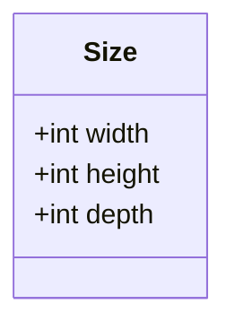
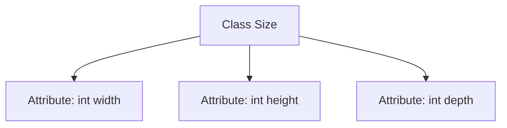

# Basic Information

|      |      |
|------|------|
| Name | Size |
| Language | .java |
| Code Path | WeFe/board/board-service/src/main/java/com/welab/wefe/board/service/dto/vo/data_set/image_data_set/Size.java |
| Package Name | com.welab.wefe.board.service.dto.vo.data_set.image_data_set |
| Dependencies | [] |
| Brief Description | The Size class contains three public integer fields: width, height, and depth, representing width, height, and depth respectively. |

# Description

This is a public class named Size, containing three public integer fields: width represents the width, height represents the height, and depth represents the depth. This class is used to store three-dimensional size data.

# Class Summary

| Name   | Type  | Description |
|-------|------|-------------|
| Size | class | The Size class contains three public integer fields: width, height, and depth. |

## Class Size

|      |      |
|------|------|
| Access Modifier | public |
| Type | class |
| Name | Size |
| Description | The Size class contains three public integer fields: width, height, and depth. |

### UML Class Diagram

This code defines a simple class named `Size` for representing three-dimensional dimension information. The class contains three public integer fields: `width`, `height`, and `depth`, with no methods defined. It is a typical data carrier class, commonly used for storing and transmitting dimension-related data, potentially applicable in scenarios such as graphics processing, 3D modeling, or object measurement. Since all fields are public, they can be accessed directly without requiring getter/setter methods.

### Internal Method Call Graph

This code defines a simple class named Size with three public integer attributes: width, height, and depth. The class contains no methods and is solely used for storing three-dimensional size data. Such structures are commonly employed in scenarios like graphics processing, game development, or object measurement, serving as basic data containers. Since all fields are public, external code can directly access and modify these attribute values.

### Field List

| Name  | Type  | Description |
|-------|-------|------|
| width | int | Defined a public integer variable width. |
| height | int | A public integer variable height is defined. |
| depth | int | The variable depth is of integer type, representing depth. |

### Method List

| Name  | Type  | Description |
|-------|-------|------|

