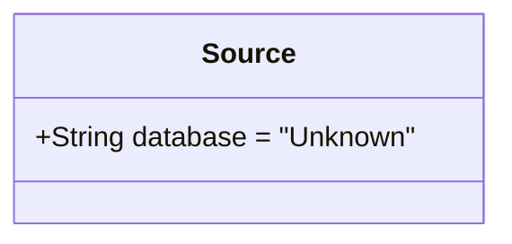
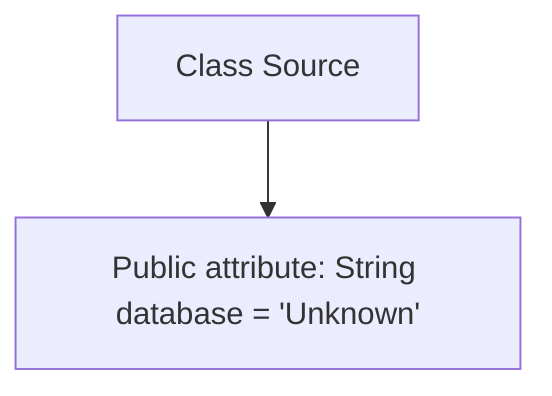

# Basic Information

|      |      |
|------|------|
| Name | Source |
| Language | .java |
| Code Path | WeFe/board/board-service/src/main/java/com/welab/wefe/board/service/dto/vo/data_set/image_data_set/Source.java |
| Package Name | com.welab.wefe.board.service.dto.vo.data_set.image_data_set |
| Dependencies | [] |
| Brief Description | The class Source contains a public string field named database, with a default value of "Unknown". |

# Description

This is a Java class definition named Source, which contains a public string-type member variable named "database" initialized with a default value of "Unknown". This variable is used to store database information, with no specific database type currently specified. The class structure is simple, consisting solely of a field declaration without any defined methods. This design is typically used as a base class or placeholder, where functionality can later be extended through inheritance or direct modification of the field value. The entire class definition demonstrates the fundamental use of data encapsulation in object-oriented programming.

# Class Summary

| Name   | Type  | Description |
|-------|------|-------------|
| Source | class | The class Source contains a string variable named database, with a default value of "Unknown". |

## Class Source

|      |      |
|------|------|
| Access Modifier | public |
| Type | class |
| Name | Source |
| Description | The class Source contains a string variable named database, with a default value of "Unknown". |

### UML Class Diagram

This code defines a simple class named Source, which contains a public string field 'database' with a default value of "Unknown". The class does not define any methods and is solely used for storing data source information. The class diagram clearly displays the class's only public field, a structure typically employed for basic data containers or configuration classes. With no methods or additional attributes, this class has a singular functionality, making it suitable as a simple component within a larger system.

### Internal Method Call Graph

This code defines a simple class named Source, which contains a public string-type attribute 'database' with a default value of "Unknown". The flowchart clearly illustrates the dependency relationship between the class and its sole attribute, without any methods or other complex structures. The entire class structure is extremely simple, designed solely for storing a database identifier string, making it suitable for use as a basic data container.

### Field List

| Name  | Type  | Description |
|-------|-------|------|
| database = "Unknown" | String | Declare a public string variable database with an initial value of "Unknown". |

### Method List

| Name  | Type  | Description |
|-------|-------|------|

