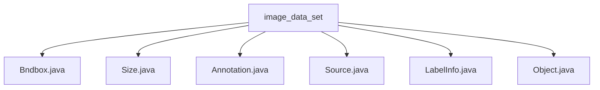

# Basic Information

|      |      |
|------|------|
| Name | image_data_set |
| Language | .java |
| Code Path | WeFe/board/board-service/src/main/java/com/welab/wefe/board/service/dto/vo/data_set/image_data_set |
| Package Name | docs.board.board-service.src.main.java.com.welab.wefe.board.service.dto.vo.data_set.image_data_set |
| Brief Description | The Bndbox class defines 2D bounding box coordinates. The Size class stores 3D dimensions. The Annotation class manages annotation information. The Source class stores database information. The LabelInfo class handles image labeling. The Object class describes object attributes. |

# Description

## Overview  
The core responsibility of this module is to manage annotation information for image datasets, including bounding box definitions, dimension descriptions, and labeled object attributes. The interface specifications uniformly adopt Java class encapsulation for data structures, such as Bndbox defining 2D bounding boxes, Size storing 3D dimensions, and Annotation integrating annotation metadata. Key data structures include Bndbox (coordinate ranges), Size (width, height, depth), Object (labeled object), and LabelInfo (label management). External dependencies only involve the XStream annotation library for object serialization. For example, the Object class uses XStreamAlias to mark fields, while Annotation handles object lists via XStreamImplicit.  

## Key Business Scenarios  
The module supports the entire image annotation workflow, similar to the data layer of annotation systems. Business processes include: initializing annotation information (e.g., setting the Annotation folder to train/test), constructing labeled objects (e.g., binding Object with Bndbox), and converting label formats (e.g., the toLabelInfo method). The interaction model is based on object composition, such as LabelInfo aggregating Item and Point for label management. A typical application is Pascal VOC format annotation processing, with API types covering data conversion (getLabelList) and status checks (isLabeled). For example, the difficult flag marks challenging cases, while truncated indicates occlusion scenarios.

### Package Internal Structure View

This flowchart illustrates the file structure relationships within the `image_data_set` directory, which includes six Java class files: `Bndbox.java`, `Size.java`, `Annotation.java`, `Source.java`, `LabelInfo.java`, and `Object.java`. All files are directly subordinate to the `image_data_set` directory with no deeper subdirectory hierarchy, presenting a simple star-shaped topological relationship.

# File List

| Name   | Type  | Description |
|-------|------|-------------|
| [Bndbox.java](Bndbox.md) | file | The Bndbox class defines a bounding box, containing four integer attributes: xmin, xmax, ymin, ymax, and provides both parameterless and parameterized constructors. |
| [Size.java](Size.md) | file | The Size class contains three public integer fields: width, height, and depth, representing width, height, and depth respectively. |
| [Annotation.java](Annotation.md) | file | The Java class Annotation is used for labeling data, containing information such as folders, filenames, paths, sources, dimensions, etc. It supports conversion to the LabelInfo format and retrieving a list of labels. |
| [Source.java](Source.md) | file | The class Source contains a public string field named database, with a default value of "Unknown". |
| [LabelInfo.java](LabelInfo.md) | file | The LabelInfo class is used to manage image annotation information, including a list of objects and label extraction methods. The Item class stores the label, position, and attributes of a single annotation. The Point class represents coordinate points. It supports checking whether annotations are present and converting them into label objects. |
| [Object.java](Object.md) | file | A Java class Object defines object attributes: name, pose (unspecified by default), occlusion flag, recognition difficulty flag, and bounding box. Non-mandatory fields have default values. |

