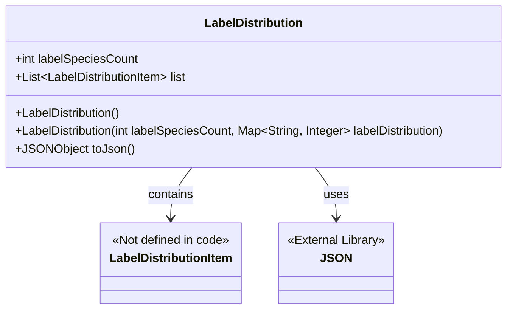
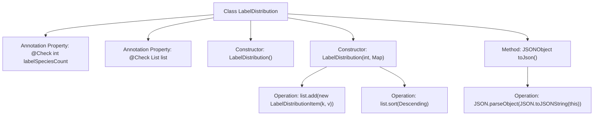

# Basic Information

|      |      |
|------|------|
| Name | LabelDistribution |
| Language | .java |
| Code Path | WeFe/board/board-service/src/main/java/com/welab/wefe/board/service/dto/vo/data_set/table_data_set/LabelDistribution.java |
| Package Name | com.welab.wefe.board.service.dto.vo.data_set.table_data_set |
| Dependencies | ['com.alibaba.fastjson.JSON', 'com.alibaba.fastjson.JSONObject', 'com.welab.wefe.common.fieldvalidate.annotation.Check', 'java.util.ArrayList', 'java.util.List', 'java.util.Map'] |
| Brief Description | The LabelDistribution class is designed to manage label distributions, including the number of label categories and the label list. It supports initialization from a Map and sorting by count, while also providing JSON conversion functionality. |

# Description

The LabelDistribution class is used to manage label distribution data, including the number of label categories (labelSpeciesCount) and a label list (list). The list stores LabelDistributionItem objects. The constructor can initialize the label count and distribution map, convert map entries into list items, and sort them in descending order by count. It provides a toJson method to convert the object into JSON format. All fields are annotated with @Check to indicate their purposes.

# Class Summary

| Name   | Type  | Description |
|-------|------|-------------|
| LabelDistribution | class | The LabelDistribution class is used to manage label distributions, including the number of label categories (labelSpeciesCount) and the label list (list). The constructor supports initialization and sorting of labels, and provides a toJson method to convert them into JSON format. |

## Class LabelDistribution

|      |      |
|------|------|
| Access Modifier | public |
| Type | class |
| Name | LabelDistribution |
| Description | The LabelDistribution class is used to manage label distributions, including the number of label categories (labelSpeciesCount) and the label list (list). The constructor supports initialization and sorting of labels, and provides a toJson method to convert them into JSON format. |

### UML Class Diagram

This code demonstrates a LabelDistribution class for managing label category count (labelSpeciesCount) and label distribution list (list). The class provides two constructors: a default constructor and one initialized via Map data, which automatically converts Map data into sorted LabelDistributionItem objects. It includes a toJson() method to convert objects into JSON format. The class diagram shows containment with LabelDistributionItem and dependency on the JSON library.

### Internal Method Call Graph

This flowchart illustrates the structure of the LabelDistribution class and its method invocation relationships. The class contains two properties annotated with @Check and two constructors, where the parameterized constructor iterates through the input Map to generate a LabelDistributionItem list and sorts it. The toJson method serializes the object into a JSONObject using the FastJSON library. The flow clearly demonstrates the complete chain of property initialization, list operations, and JSON conversion, highlighting the collection processing and sorting logic within the constructor.

### Field List

| Name  | Type  | Description |
|-------|-------|------|
| list = new ArrayList<>() | List<LabelDistributionItem> | Java code: Define a public list variable named list to store LabelDistributionItem objects, marked with the @Check annotation as "label list". |
| labelSpeciesCount | int | The public integer variable `labelSpeciesCount` is used to check the number of label categories, annotated with the name "Number of Label Categories". |

### Method List

| Name  | Type  | Description |
|-------|-------|------|
| toJson | JSONObject | The method converts the current object into a JSON string and then parses it into a JSONObject, achieving the conversion from object to JSON. |

