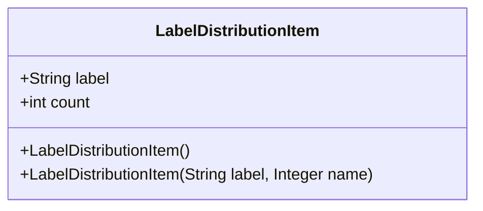
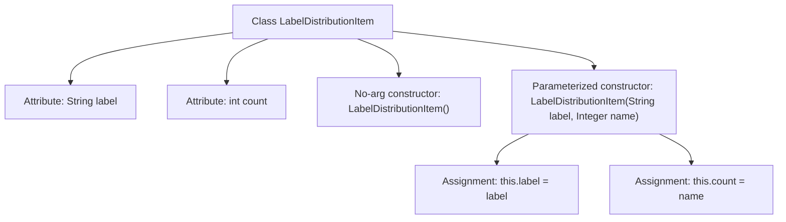

# Basic Information

|      |      |
|------|------|
| Name | LabelDistributionItem |
| Language | .java |
| Code Path | WeFe/board/board-service/src/main/java/com/welab/wefe/board/service/dto/vo/data_set/table_data_set/LabelDistributionItem.java |
| Package Name | com.welab.wefe.board.service.dto.vo.data_set.table_data_set |
| Dependencies | [] |
| Brief Description | The Java class `LabelDistributionItem` contains a `label` string and a `count` integer attribute, providing both a no-argument constructor and a parameterized constructor. |

# Description

This is a Java class named LabelDistributionItem, used to store data of labels and their corresponding counts. The class contains two member variables: label (String type, representing the label name) and count (integer type, representing the label count). The class provides two constructors: a no-argument constructor and another constructor that accepts label and count parameters for object initialization. The class has a simple structure and is primarily used for encapsulating label distribution data.

# Class Summary

| Name   | Type  | Description |
|-------|------|-------------|
| LabelDistributionItem | class | Java class LabelDistributionItem, containing string attribute label and integer attribute count, providing both no-argument and parameterized constructors. |

## Class LabelDistributionItem

|      |      |
|------|------|
| Access Modifier | public |
| Type | class |
| Name | LabelDistributionItem |
| Description | Java class LabelDistributionItem, containing string attribute label and integer attribute count, providing both no-argument and parameterized constructors. |

### UML Class Diagram

This code defines a class named LabelDistributionItem, which is used to store labels and their corresponding count information. The class contains two public fields: label (string type) and count (integer type), along with two constructors: a no-argument constructor and a parameterized constructor (accepting a label string and a count value). This class may be utilized for statistical or recording purposes related to label distribution, making it suitable for data analysis and statistical scenarios.

### Internal Method Call Graph

This code defines a class named LabelDistributionItem, containing two attributes (label and count) and two constructors. The no-argument constructor performs no operations, while the parameterized constructor accepts label and name parameters, assigning them to the class's label and count attributes respectively. The flowchart clearly illustrates the class structure, parameter passing in constructors, and the assignment process, reflecting the complete logical path of object initialization.

### Field List

| Name  | Type  | Description |
|-------|-------|------|
| label | String | Declare a public string variable named label. |
| count | int | Public integer variable count. |

### Method List

| Name  | Type  | Description |
|-------|-------|------|

