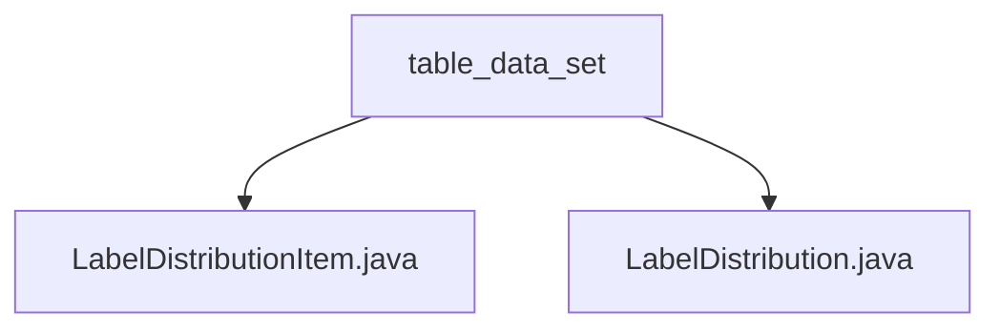

# Basic Information

|      |      |
|------|------|
| Name | table_data_set |
| Language | .java |
| Code Path | WeFe/board/board-service/src/main/java/com/welab/wefe/board/service/dto/vo/data_set/table_data_set |
| Package Name | docs.board.board-service.src.main.java.com.welab.wefe.board.service.dto.vo.data_set.table_data_set |
| Brief Description | The LabelDistributionItem class stores label names and quantities, providing a constructor method. The LabelDistribution class manages label data, including the number of categories, label lists, and sorting functionality, with support for JSON conversion. |

# Description

## Overview  
The core responsibility of this module is to encapsulate and manage label distribution data, providing label count statistics and JSON serialization functionality. The interface specifications include constructor initialization, field access, and data conversion methods. For example, LabelDistributionItem stores the label name and count, while LabelDistribution manages label collections and provides sorting and JSON output.  

Key data structures include LabelDistributionItem (label-count key-value pair) and LabelDistribution (label classification collection). The only external dependency is the JSON serialization library. For instance, LabelDistribution outputs structured data via the toJson method.  

## Primary Business Scenarios  
The module is used to handle the aggregation and display of label data, similar to a data pivoting scenario. Business processes include: initializing label distribution (e.g., constructed from mappings), sorting by count in descending order, and converting to JSON format. The interaction pattern is implemented through object encapsulation, such as LabelDistributionItem serving as a data carrier and LabelDistribution integrating sorting logic.  

A typical application mode is to statistically analyze label distributions in datasets, such as generating label frequency reports in tabular data analysis. API types include constructor initialization (e.g., LabelDistributionItem(label, count)) and utility methods (e.g., toJson). Integration examples can be seen in the quality report generation during the data preprocessing stage.

### Package Internal Structure View

This flowchart illustrates two Java files under the table_data_set directory: LabelDistributionItem.java and LabelDistribution.java. Both files are directly subordinate to the table_data_set directory without any deeper nested structure. The diagram clearly presents this simple hierarchical relationship, conforming to the given path information requirements.

# File List

| Name   | Type  | Description |
|-------|------|-------------|
| [LabelDistributionItem.java](LabelDistributionItem.md) | file | Java class LabelDistributionItem, containing the string attribute label and integer attribute count, providing both a no-argument constructor and a parameterized constructor. |
| [LabelDistribution.java](LabelDistribution.md) | file | The LabelDistribution class is used to manage label distributions, including the number of label categories and the label list. It supports initialization from a Map and sorting by count, while providing JSON conversion functionality. |

