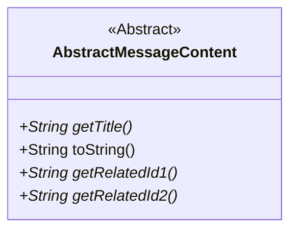
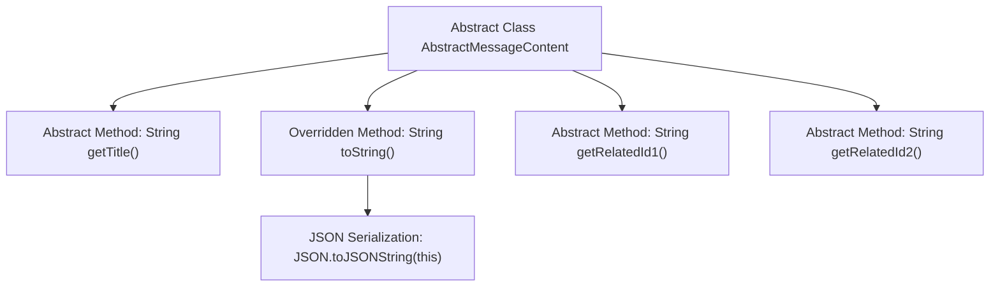

# Basic Information

|      |      |
|------|------|
| Name | AbstractMessageContent |
| Language | .java |
| Code Path | WeFe/board/board-service/src/main/java/com/welab/wefe/board/service/dto/vo/message/AbstractMessageContent.java |
| Package Name | com.welab.wefe.board.service.dto.vo.message |
| Dependencies | ['com.alibaba.fastjson.JSON'] |
| Brief Description | The abstract class AbstractMessageContent defines the structure of message content, including abstract methods for retrieving the title, associated ID1 and ID2, with the toString method returning a JSON string. |

# Description

The content describes an abstract class named `AbstractMessageContent`, which defines a common structure for message content. The class includes three core abstract methods: `getTitle` for retrieving the title, and `getRelatedId1` and `getRelatedId2` for obtaining the IDs of associated objects in the body (such as project IDs). The class also overrides the `toString` method to output the object's content in JSON format. This abstract class serves as a foundational template for concrete message content implementations, emphasizing the importance of associated IDs in business scenarios (e.g., project member invitations).

# Class Summary

| Name   | Type  | Description |
|-------|------|-------------|
| AbstractMessageContent | class | The abstract class AbstractMessageContent defines the structure of message content, including abstract methods for retrieving the title, associated ID1 and ID2, and overrides the toString method to output the object in JSON format. |

## Class AbstractMessageContent

|      |      |
|------|------|
| Access Modifier | public abstract |
| Type | class |
| Name | AbstractMessageContent |
| Description | The abstract class AbstractMessageContent defines the structure of message content, including abstract methods for retrieving the title, associated ID1 and ID2, and overrides the toString method to output the object in JSON format. |

### UML Class Diagram

This class diagram illustrates an abstract class AbstractMessageContent, which defines the basic structure of message content. The class contains 4 methods: 1 concrete method toString() for JSON serialization, and 3 abstract methods getTitle(), getRelatedId1(), and getRelatedId2() that require subclass implementation. The getRelatedId methods are used to retrieve IDs of business objects associated with the message, such as project IDs. Serving as the base class for message content, it enforces subclasses to implement critical business logic through abstract methods while providing generic JSON serialization capabilities.

### Internal Method Call Graph

This flowchart illustrates the structure of the abstract class AbstractMessageContent, which contains four core methods: getTitle() for retrieving titles, toString() for JSON serialization of objects, and getRelatedId1()/getRelatedId2() for obtaining associated IDs. All methods are abstract (except toString()) and require concrete implementation by subclasses. The toString() method internally utilizes JSON utility class for object serialization, demonstrating characteristics of the Template Method design pattern.

### Field List

| Name  | Type  | Description |
|-------|-------|------|

### Method List

| Name  | Type  | Description |
|-------|-------|------|
| toString | String | Override the toString method to return the JSON string representation of the current object. |
| getTitle | String | Abstract method `getTitle`, which returns a string-type title. |
| getRelatedId1 | String | Abstract method, returns a string associated with ID1. |
| getRelatedId2 | String | Abstract method, returns the string of associated ID2. |

