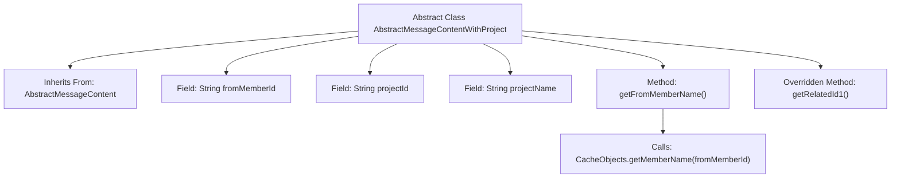

# Basic Information

|      |      |
|------|------|
| Name | AbstractMessageContentWithProject |
| Language | .java |
| Code Path | WeFe/board/board-service/src/main/java/com/welab/wefe/board/service/dto/vo/message/AbstractMessageContentWithProject.java |
| Package Name | com.welab.wefe.board.service.dto.vo.message |
| Dependencies | ['com.welab.wefe.board.service.service.CacheObjects'] |
| Brief Description | The abstract class AbstractMessageContentWithProject inherits from AbstractMessageContent, containing member ID, project ID, and name fields, and provides methods to retrieve member names and project IDs. |

# Description

This is an abstract class named AbstractMessageContentWithProject, which inherits from AbstractMessageContent. The class contains three member variables: fromMemberId represents the sender member ID, projectId represents the project ID, and projectName represents the project name. It provides the getFromMemberName method to retrieve the member name via CacheObjects and overrides the getRelatedId1 method to return projectId.

# Class Summary

| Name   | Type  | Description |
|-------|------|-------------|
| AbstractMessageContentWithProject | class | The abstract class `AbstractMessageContentWithProject` extends `AbstractMessageContent` and includes member ID, project ID, and name fields, providing methods to retrieve the member name and project ID. |


## Class AbstractMessageContentWithProject

|      |      |
|------|------|
| Access Modifier | public abstract |
| Type | class |
| Name | AbstractMessageContentWithProject |
| Description | The abstract class `AbstractMessageContentWithProject` extends `AbstractMessageContent` and includes member ID, project ID, and name fields, providing methods to retrieve the member name and project ID. |


### UML Class Diagram

```mermaid
classDiagram
    class AbstractMessageContent {
        <<Abstract>>
        +String getRelatedId1()*
    }
    
    class AbstractMessageContentWithProject {
        <<Abstract>>
        -String fromMemberId
        -String projectId
        -String projectName
        +String getFromMemberName()
        +String getRelatedId1()
    }
    
    AbstractMessageContent <|-- AbstractMessageContentWithProject : Inheritance
    AbstractMessageContentWithProject ..> CacheObjects : Dependency: Calls static methods
```

This class diagram illustrates the inheritance relationship where the abstract class `AbstractMessageContentWithProject` extends `AbstractMessageContent`. The subclass introduces three string attributes and a method to retrieve member names, while overriding the parent class's abstract method `getRelatedId1`. The diagram also shows the subclass's dependency on static method calls from the utility class `CacheObjects`. This design associates message content with project information, extending the functionality of basic message content through inheritance.


### Internal Method Call Graph



This flowchart illustrates the structure of the AbstractMessageContentWithProject class, which is an abstract class inheriting from AbstractMessageContent. The class contains three string fields: fromMemberId, projectId, and projectName. It defines two methods: the getFromMemberName() method calls CacheObjects.getMemberName() to retrieve the member name, while the overridden getRelatedId1() method directly returns the projectId field. The flowchart clearly presents the class inheritance, field definitions, and method invocation logic.

### Field List

| Name  | Type  | Description |
|-------|-------|------|
| fromMemberId | String | Member ID source field, of type string. |
| projectName | String | Declare a public string variable projectName. |
| projectId | String | Declare a public string variable projectId. |

### Method List

| Name  | Type  | Description |
|-------|-------|------|
| getFromMemberName | String | The method retrieves and returns the corresponding member name based on fromMemberId by invoking CacheObjects.getMemberName. |
| getRelatedId1 | String | The method getRelatedId1 returns the value of projectId. |


