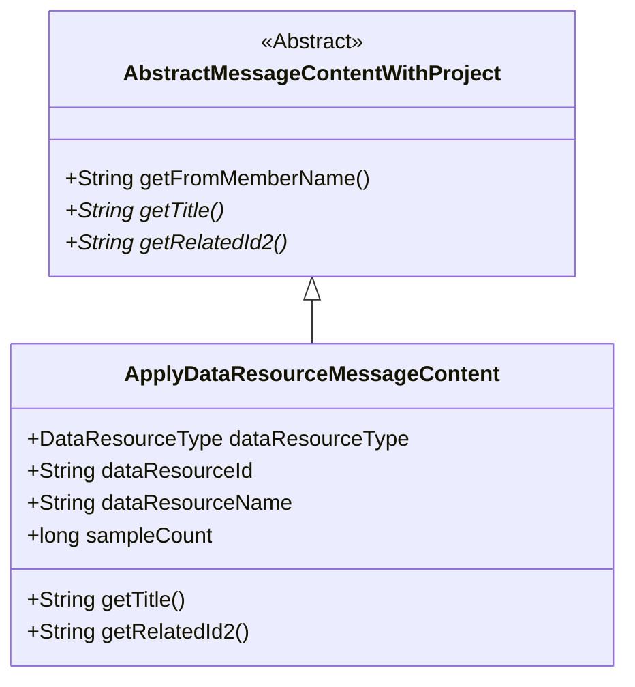
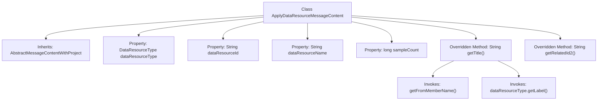

# Basic Information

|      |      |
|------|------|
| Name | ApplyDataResourceMessageContent |
| Language | .java |
| Code Path | WeFe/board/board-service/src/main/java/com/welab/wefe/board/service/dto/vo/message/ApplyDataResourceMessageContent.java |
| Package Name | com.welab.wefe.board.service.dto.vo.message |
| Dependencies | ['com.welab.wefe.common.wefe.enums.DataResourceType'] |
| Brief Description | The `ApplyDataResourceMessageContent` class inherits from `AbstractMessageContentWithProject`, containing resource type, ID, name, and sample count. It overrides the `getTitle` and `getRelatedId2` methods to generate titles and retrieve resource IDs. |

# Description

This is a Java class named ApplyDataResourceMessageContent, which extends AbstractMessageContentWithProject. The class contains four member variables: dataResourceType represents the data type, dataResourceId and dataResourceName store the ID and name of the data resource respectively, and sampleCount records the number of samples. It overrides the getTitle method to generate a title string containing the member name, data type label, resource name, and sample count. It also overrides the getRelatedId2 method to return the data resource ID.

# Class Summary

| Name   | Type  | Description |
|-------|------|-------------|
| ApplyDataResourceMessageContent | class | The `ApplyDataResourceMessageContent` class inherits from `AbstractMessageContentWithProject`, containing resource type, ID, name, and sample count, and overrides the `getTitle` and `getRelatedId2` methods. |

## Class ApplyDataResourceMessageContent

|      |      |
|------|------|
| Access Modifier | public |
| Type | class |
| Name | ApplyDataResourceMessageContent |
| Description | The `ApplyDataResourceMessageContent` class inherits from `AbstractMessageContentWithProject`, containing resource type, ID, name, and sample count, and overrides the `getTitle` and `getRelatedId2` methods. |

### UML Class Diagram

This class diagram illustrates the inheritance relationship where ApplyDataResourceMessageContent extends the abstract class AbstractMessageContentWithProject. The abstract class defines three methods, two of which are abstract (getTitle and getRelatedId2) to be implemented by subclasses. The ApplyDataResourceMessageContent class contains four public fields and two method implementations for retrieving the title and associated ID. The diagram clearly reflects the inheritance hierarchy and class member structure, with a total of approximately 120 characters.

### Internal Method Call Graph

This code describes an ApplyDataResourceMessageContent class that inherits from AbstractMessageContentWithProject, primarily used for handling data resource application message content. The class contains four properties: dataResourceType indicates the resource type, dataResourceId and dataResourceName represent the resource ID and name respectively, while sampleCount denotes the sample quantity. It overrides the getTitle() method to generate a title containing the applicant member, resource type, name, and sample count, as well as the getRelatedId2() method which returns the resource ID. The flowchart clearly illustrates the class inheritance relationship, property composition, and method invocation chain.

### Field List

| Name  | Type  | Description |
|-------|-------|------|
| dataResourceId | String | Common string variable, storing data resource IDs. |
| sampleCount | long | The variable sampleCount is used to store the sample count, with a data type of long integer. |
| dataResourceType | DataResourceType | Declare a public variable named dataResourceType of type DataResourceType. |
| dataResourceName | String | Declare a public string variable dataResourceName to store the data resource name. |

### Method List

| Name  | Type  | Description |
|-------|-------|------|
| getTitle | String | The method getTitle returns a string in the format: Member [Member Name] applies to use resource type: Resource Name (sample count). |
| getRelatedId2 | String | The method getRelatedId2 returns the value of dataResourceId. |

