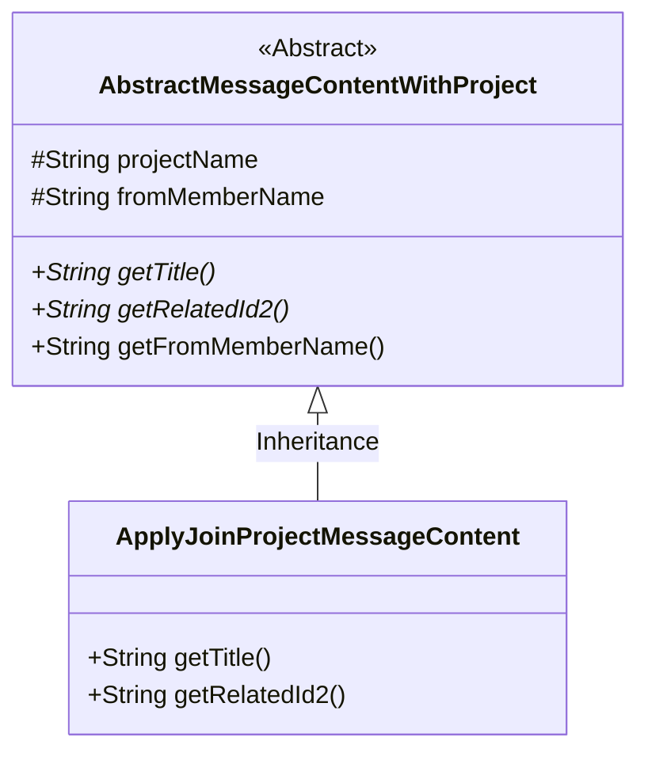
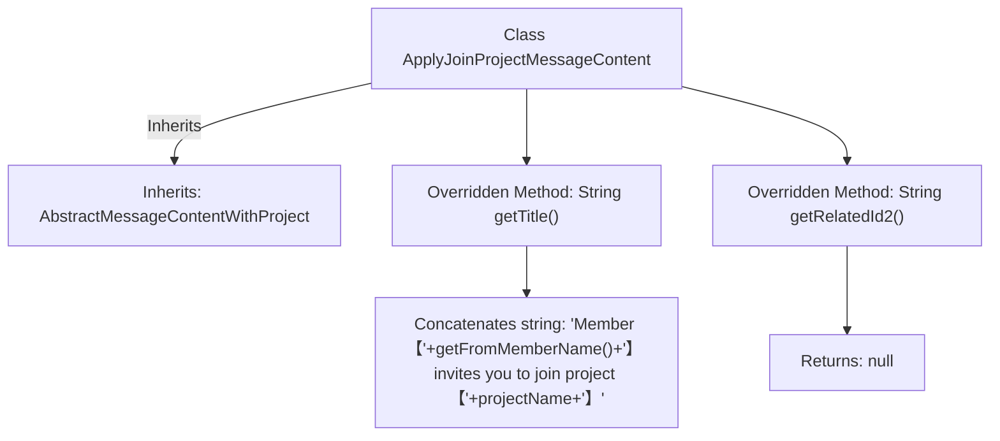

# Basic Information

|      |      |
|------|------|
| Name | ApplyJoinProjectMessageContent |
| Language | .java |
| Code Path | WeFe/board/board-service/src/main/java/com/welab/wefe/board/service/dto/vo/message/ApplyJoinProjectMessageContent.java |
| Package Name | com.welab.wefe.board.service.dto.vo.message |
| Dependencies | [] |
| Brief Description | The `ApplyJoinProjectMessageContent` class inherits from `AbstractMessageContentWithProject`, generates a title for inviting someone to join a project, and returns `null` for `relatedId2`. |

# Description

This is a class named `ApplyJoinProjectMessageContent`, which inherits from `AbstractMessageContentWithProject`. It overrides two methods: the `getTitle` method returns a string containing the inviter's name and the project name in the format "Member [Inviter Name] invites you to join the project [Project Name]"; the `getRelatedId2` method returns `null`. This class is used to handle the message content for project join invitations.

# Class Summary

| Name   | Type  | Description |
|-------|------|-------------|
| ApplyJoinProjectMessageContent | class | The `ApplyJoinProjectMessageContent` class inherits from `AbstractMessageContentWithProject`, providing a method to retrieve the title that displays member invitation information for joining the project, while `getRelatedId2` returns null. |

## Class ApplyJoinProjectMessageContent

|      |      |
|------|------|
| Access Modifier | public |
| Type | class |
| Name | ApplyJoinProjectMessageContent |
| Description | The `ApplyJoinProjectMessageContent` class inherits from `AbstractMessageContentWithProject`, providing a method to retrieve the title that displays member invitation information for joining the project, while `getRelatedId2` returns null. |

### UML Class Diagram

This class diagram illustrates the inheritance relationship where ApplyJoinProjectMessageContent extends the abstract class AbstractMessageContentWithProject. The abstract class defines protected attributes such as project name and initiating member name, along with abstract methods for retrieving titles and related IDs. The subclass implements specific title generation logic and returns an empty related ID2. This structure is designed to handle message content for project join invitations, achieving unified management and extensibility of message content through inheritance.

### Internal Method Call Graph

This flowchart illustrates the structure of the ApplyJoinProjectMessageContent class, which inherits from the AbstractMessageContentWithProject class and overrides two methods: the getTitle() method concatenates member and project names to generate an invitation title string, while the getRelatedId2() method directly returns null. The arrows clearly indicate the class inheritance relationship and method invocation logic, with the hierarchical structure accurately reflecting the actual organization of the code.

### Field List

| Name  | Type  | Description |
|-------|-------|------|

### Method List

| Name  | Type  | Description |
|-------|-------|------|
| getRelatedId2 | String | The method getRelatedId2 returns null after being overridden. |
| getTitle | String | Invite Members to Join Project |

