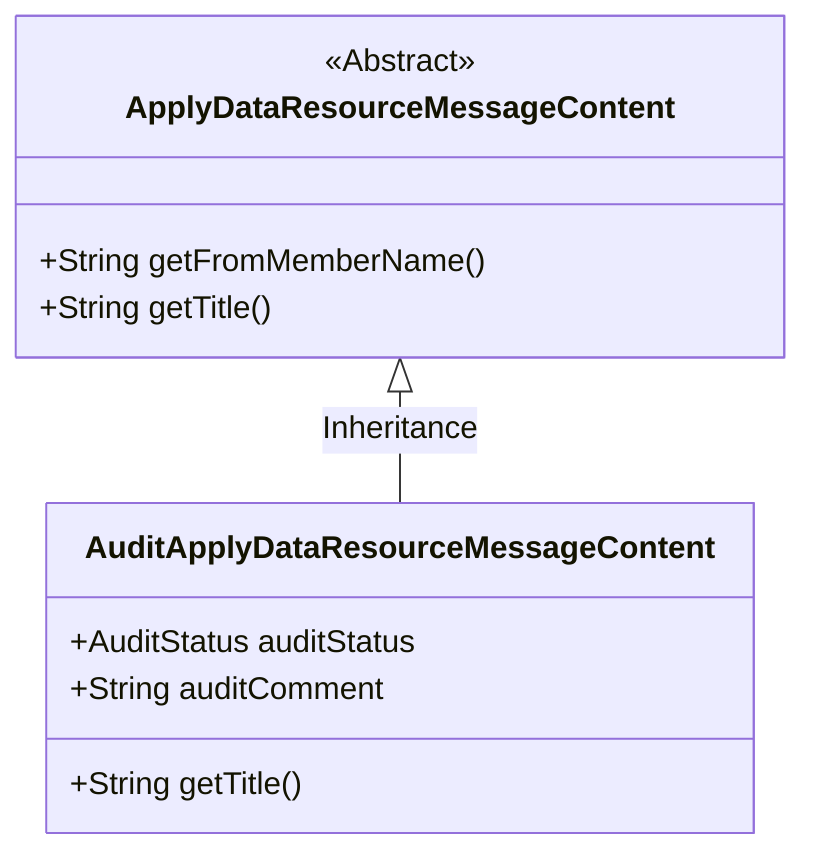
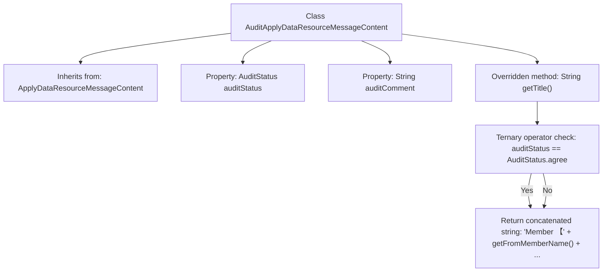

# Basic Information

|      |      |
|------|------|
| Name | AuditApplyDataResourceMessageContent |
| Language | .java |
| Code Path | WeFe/board/board-service/src/main/java/com/welab/wefe/board/service/dto/vo/message/AuditApplyDataResourceMessageContent.java |
| Package Name | com.welab.wefe.board.service.dto.vo.message |
| Dependencies | ['com.welab.wefe.common.wefe.enums.AuditStatus'] |
| Brief Description | The `AuditApplyDataResourceMessageContent` class inherits from `ApplyDataResourceMessageContent`, including the audit status and comments. It overrides the `getTitle` method to generate an audit result title, displaying the member name, audit status, resource type, name, sample count, and project name. |

# Description

This is a class named `AuditApplyDataResourceMessageContent`, which inherits from `ApplyDataResourceMessageContent`. It contains two member variables: `auditStatus` represents the audit status, and `auditComment` stores the audit comments. The `getTitle` method is overridden to generate a title string based on the audit status. The title content includes the member name, audit result, data type label, data resource name, sample count, and project name. When the audit status is "approved," it displays "Passed"; otherwise, it displays "Rejected."

# Class Summary

| Name   | Type  | Description |
|-------|------|-------------|
| AuditApplyDataResourceMessageContent | class | The `AuditApplyDataResourceMessageContent` class inherits from `ApplyDataResourceMessageContent`, includes audit status and comments, and overrides the `getTitle` method to generate an audit result title. |

## Class AuditApplyDataResourceMessageContent

|      |      |
|------|------|
| Access Modifier | public |
| Type | class |
| Name | AuditApplyDataResourceMessageContent |
| Description | The `AuditApplyDataResourceMessageContent` class inherits from `ApplyDataResourceMessageContent`, includes audit status and comments, and overrides the `getTitle` method to generate an audit result title. |

### UML Class Diagram

This class diagram illustrates the structure of the audit application data resource message content. The `AuditApplyDataResourceMessageContent` inherits from the abstract class `ApplyDataResourceMessageContent`, adding two new fields: `auditStatus` and `auditComment`. It also overrides the `getTitle()` method to generate title text that includes the audit status. The class relationship clearly demonstrates the inheritance hierarchy, where the child class extends the functionality of the parent class, specifically implementing customized title generation logic tailored for data resource audit scenarios.

### Internal Method Call Graph

This code demonstrates an audit application data resource message content class that inherits from a base message class, containing audit status and comment properties. The core functionality lies in overriding the getTitle() method, which dynamically generates a composite title string including member name, resource type, resource name, sample count, and project name by evaluating the auditStatus value (agree/reject). The flowchart clearly presents the class inheritance relationship, property definitions, and the main method's logical branching.

### Field List

| Name  | Type  | Description |
|-------|-------|------|
| auditStatus | AuditStatus | The audit status field is used to record or identify the review status of an object. |
| auditComment | String | The public string variable auditComment defined in the class is used to store audit comments. |

### Method List

| Name  | Type  | Description |
|-------|-------|------|
| getTitle | String | The method returns the member review result title, formatted as: Member [Name] approved/rejected the request to add the resource type "Resource Name (Sample Count)" to the project: Project Name. |

