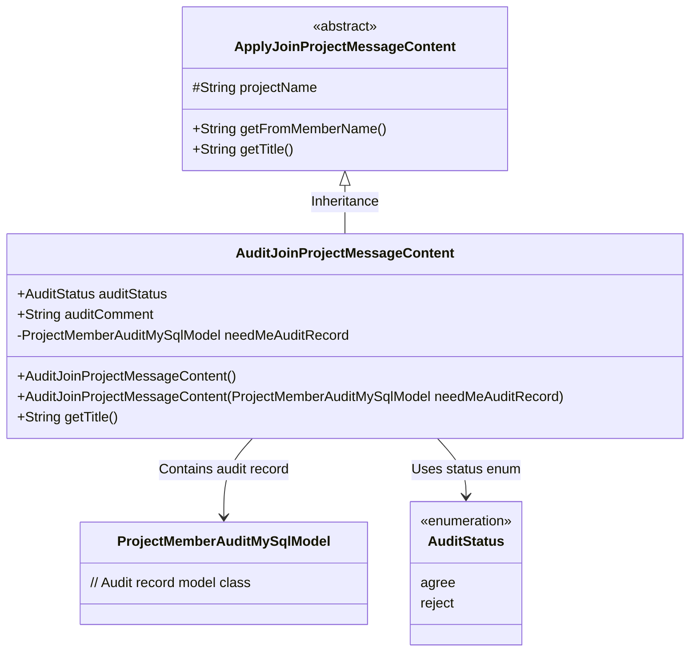
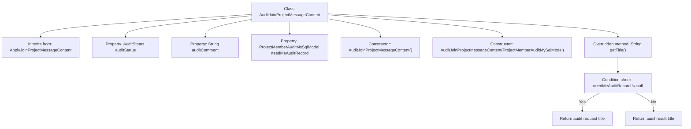

# Basic Information

|      |      |
|------|------|
| Name | AuditJoinProjectMessageContent |
| Language | .java |
| Code Path | WeFe/board/board-service/src/main/java/com/welab/wefe/board/service/dto/vo/message/AuditJoinProjectMessageContent.java |
| Package Name | com.welab.wefe.board.service.dto.vo.message |
| Dependencies | ['com.welab.wefe.board.service.database.entity.job.ProjectMemberAuditMySqlModel', 'com.welab.wefe.common.wefe.enums.AuditStatus'] |
| Brief Description | The `AuditJoinProjectMessageContent` class inherits from `ApplyJoinProjectMessageContent` and includes the audit status, audit comments, and records requiring review. It displays different titles based on the audit status, prompting either a pending review or a processed result. |

# Description

The `AuditJoinProjectMessageContent` class inherits from `ApplyJoinProjectMessageContent` and is used to handle the audit message content for project member join requests. This class includes the audit status `auditStatus`, audit comments `auditComment`, and the record `needMeAuditRecord` that requires review by the current user. The constructor supports initializing audit records. The `getTitle` method generates different titles based on the audit status and whether secondary review is required: if review is needed, it prompts the user to review the request; otherwise, it displays the result of whether the member has been approved or rejected to join the project. Founding members have no audit records, while subsequent members require approval by existing formal members.

# Class Summary

| Name   | Type  | Description |
|-------|------|-------------|
| AuditJoinProjectMessageContent | class | The `AuditJoinProjectMessageContent` class inherits from `ApplyJoinProjectMessageContent` and includes audit status, remarks, and records requiring review. It generates different titles based on the audit status and records to prompt for review or display results. |

## Class AuditJoinProjectMessageContent

|      |      |
|------|------|
| Access Modifier | public |
| Type | class |
| Name | AuditJoinProjectMessageContent |
| Description | The `AuditJoinProjectMessageContent` class inherits from `ApplyJoinProjectMessageContent` and includes audit status, remarks, and records requiring review. It generates different titles based on the audit status and records to prompt for review or display results. |

### UML Class Diagram

This class diagram illustrates the structural design of audit join project message content. AuditJoinProjectMessageContent inherits from the abstract base class ApplyJoinProjectMessageContent, containing an audit status enum, audit comment field, and a private audit record object. The core method getTitle() dynamically generates different title texts based on audit status and record existence, reflecting the business logic for processing member join project approval workflows. The inter-class relationships clearly demonstrate typical scenarios of inheritance, composition, and enum usage.

### Internal Method Call Graph

This flowchart illustrates the structure and core logic of the AuditJoinProjectMessageContent class. The class inherits from ApplyJoinProjectMessageContent and contains three main properties along with two constructors. It highlights the logic flow of the overridden getTitle() method: first checking if needMeAuditRecord is null, then returning different title strings based on the check result. If the record exists, it returns an audit request title; otherwise, it returns a title containing the audit status. The entire process clearly reflects the class's primary responsibility: generating audit message content for project member join requests.

### Field List

| Name  | Type  | Description |
|-------|-------|------|
| auditStatus | AuditStatus | Audit the status variable auditStatus. |
| auditComment | String | Common string variable used to store review comments. |
| needMeAuditRecord | ProjectMemberAuditMySqlModel | The private member variable `needMeAuditRecord`, of type `ProjectMemberAuditMySqlModel`, is used to store records requiring approval by the current user. |

### Method List

| Name  | Type  | Description |
|-------|-------|------|
| getTitle | String | The method `getTitle` returns different titles based on the review status: it prompts a review request if a secondary review is needed, otherwise it displays the member join result. |

