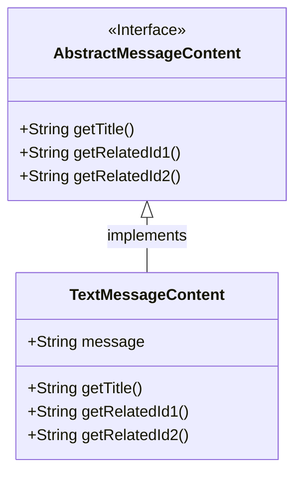
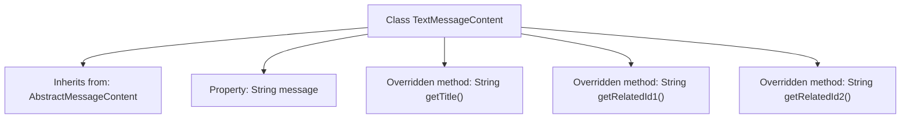

# Basic Information

|      |      |
|------|------|
| Name | TextMessageContent |
| Language | .java |
| Code Path | WeFe/board/board-service/src/main/java/com/welab/wefe/board/service/dto/vo/message/TextMessageContent.java |
| Package Name | com.welab.wefe.board.service.dto.vo.message |
| Dependencies | [] |
| Brief Description | The TextMessageContent class inherits from AbstractMessageContent, contains a message string attribute, and overrides the getTitle, getRelatedId1, and getRelatedId2 methods to all return null. |

# Description

The code defines a class named `TextMessageContent`, which inherits from `AbstractMessageContent`. The class includes a public string-type field `message` for storing text message content. It overrides three parent class methods: `getTitle`, `getRelatedId1`, and `getRelatedId2`, all of which return null values, indicating that no specific functionality is currently implemented. The overall class structure is simple and focused on handling plain text message content.

# Class Summary

| Name   | Type  | Description |
|-------|------|-------------|
| TextMessageContent | class | The TextMessageContent class inherits from AbstractMessageContent, contains a message string attribute, and overrides the getTitle, getRelatedId1, and getRelatedId2 methods but returns null. |

## Class TextMessageContent

|      |      |
|------|------|
| Access Modifier | public |
| Type | class |
| Name | TextMessageContent |
| Description | The TextMessageContent class inherits from AbstractMessageContent, contains a message string attribute, and overrides the getTitle, getRelatedId1, and getRelatedId2 methods but returns null. |

### UML Class Diagram

This class diagram illustrates the structural relationship where the TextMessageContent class inherits and implements the AbstractMessageContent interface. AbstractMessageContent, as an interface, defines three abstract methods: getTitle(), getRelatedId1(), and getRelatedId2(). TextMessageContent, as the concrete implementation class, includes a public field 'message' and overrides all interface methods (currently returning null). The diagram uses a hollow triangular arrowhead to explicitly denote the inheritance relationship between the interface and the implementing class, conforming to standard UML class diagram conventions.

### Internal Method Call Graph

This flowchart illustrates the structure of the TextMessageContent class, which inherits from the base class AbstractMessageContent. It contains a String property 'message' and three overridden methods (getTitle/getRelatedId1/getRelatedId2). All overridden methods return null, indicating this is a base implementation class requiring concrete logic from subclasses. The clear class structure demonstrates both the inheritance relationship and the design pattern of empty method implementations.

### Field List

| Name  | Type  | Description |
|-------|-------|------|
| message | String | The public string variable message. |

### Method List

| Name  | Type  | Description |
|-------|-------|------|
| getTitle | String | Java method override, returning null title. |
| getRelatedId2 | String | The method getRelatedId2 overrides the parent class method and returns null. |
| getRelatedId1 | String | The method getRelatedId1 is overridden to return null. |

