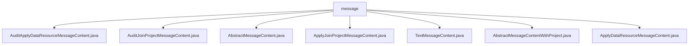

# Basic Information

|      |      |
|------|------|
| Name | message |
| Language | .java |
| Code Path | WeFe/board/board-service/src/main/java/com/welab/wefe/board/service/dto/vo/message |
| Package Name | docs.board.board-service.src.main.java.com.welab.wefe.board.service.dto.vo.message |
| Brief Description | Message class structure: AbstractMessageContent serves as the base class, defining methods for title and associated ID. Its subclasses include AuditApplyDataResourceMessageContent for handling data review, AuditJoinProjectMessageContent for project member review, ApplyJoinProjectMessageContent for project invitations, and TextMessageContent for plain text. AbstractMessageContentWithProject extends the base class by adding project-related fields. ApplyDataResourceMessageContent handles data resource application messages. |

# Description

## Overview  
The core responsibility of this module is to handle message content generation and management across various business scenarios, including data resource approval and project member join requests. It adopts a layered design, with abstract base classes defining common structures and concrete subclasses implementing differentiated logic.  

The interface specification follows the Template Method pattern, where AbstractMessageContent requires subclasses to implement core methods such as getTitle, getRelatedId1/2, etc. Key data structures include auditStatus, auditComment, projectId, etc., resembling message carriers in an event bus.  

External dependencies are limited to CacheObjects for member name queries. For example, AbstractMessageContentWithProject uses it to retrieve fromMemberName. Concrete implementation examples include AuditApplyDataResourceMessageContent, which generates different titles based on audit status, and TextMessageContent, which handles plain text messages.  

## Key Business Scenarios  
The main workflows fall into two categories: data resource approval processes (e.g., AuditApplyDataResourceMessageContent) and project member join processes (e.g., AuditJoinProjectMessageContent). The former dynamically generates titles based on audit status, while the latter distinguishes between founding members and members requiring approval.  

The interaction pattern uniformly assembles message content through the getTitle method. For example, ApplyJoinProjectMessageContent generates invitation text like "Member A invites you to join Project B." Functional completeness is reflected in supporting various message types, including plain text, project-contextual messages, and approval-result notifications.  

Typical application patterns include: 1) Data resource sharing requests and result notifications, 2) Project member invitations and approvals, and 3) Simple text notifications. API types cover audit-related (Audit*), application-related (Apply*), and foundational (Abstract*) classes. Integration examples include associating messages with specific business entities via projectId.

### Package Internal Structure View

This flowchart illustrates the structural relationships of 7 Java files under the message directory. All files are directly subordinate to the message directory with no deeper nesting levels. These files include audit-type message contents, application-type message contents, and abstract base classes, forming a file structure for message content processing.

# File List

| Name   | Type  | Description |
|-------|------|-------------|
| [AuditApplyDataResourceMessageContent.java](AuditApplyDataResourceMessageContent.md) | file | The `AuditApplyDataResourceMessageContent` class inherits from `ApplyDataResourceMessageContent`, includes audit status and comments, and overrides the `getTitle` method to generate an audit result title, displaying member name, audit status, resource type, name, sample count, and project name. |
| [AuditJoinProjectMessageContent.java](AuditJoinProjectMessageContent.md) | file | The `AuditJoinProjectMessageContent` class inherits from `ApplyJoinProjectMessageContent` and includes the audit status, audit comments, and records requiring review. It displays different titles based on the audit status to indicate whether it is pending review or has been processed. |
| [AbstractMessageContent.java](AbstractMessageContent.md) | file | The abstract class AbstractMessageContent defines the structure of message content, including abstract methods for retrieving the title, associated ID1 and ID2, with the toString method returning a JSON string. |
| [ApplyJoinProjectMessageContent.java](ApplyJoinProjectMessageContent.md) | file | The `ApplyJoinProjectMessageContent` class inherits from `AbstractMessageContentWithProject`, generates a title for inviting someone to join a project, and returns `null` for `relatedId2`. |
| [TextMessageContent.java](TextMessageContent.md) | file | The TextMessageContent class inherits from AbstractMessageContent, contains a message string attribute, and overrides the getTitle, getRelatedId1, and getRelatedId2 methods to all return null. |
| [AbstractMessageContentWithProject.java](AbstractMessageContentWithProject.md) | file | The abstract class `AbstractMessageContentWithProject` extends `AbstractMessageContent`, containing member ID, project ID, and name fields, and provides methods to retrieve member names and project IDs. |
| [ApplyDataResourceMessageContent.java](ApplyDataResourceMessageContent.md) | file | The `ApplyDataResourceMessageContent` class inherits from `AbstractMessageContentWithProject`, containing resource type, ID, name, and sample count. It overrides the `getTitle` and `getRelatedId2` methods for generating titles and retrieving resource IDs. |

