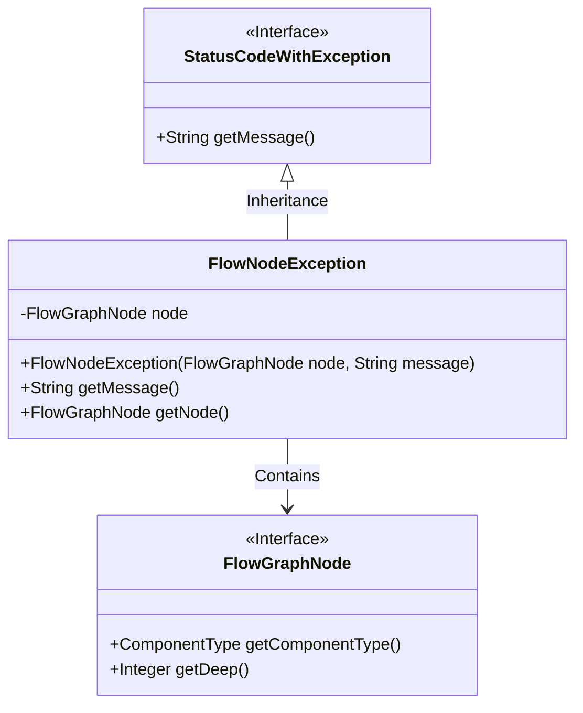
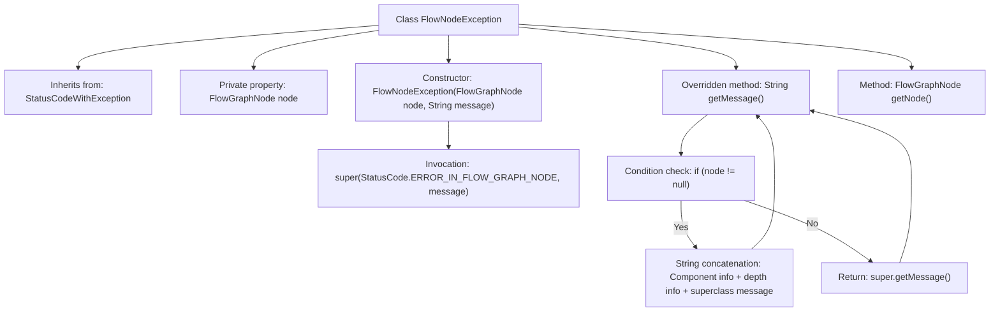

# Basic Information

|      |      |
|------|------|
| Name | FlowNodeException |
| Language | .java |
| Code Path | WeFe/board/board-service/src/main/java/com/welab/wefe/board/service/exception/FlowNodeException.java |
| Package Name | com.welab.wefe.board.service.exception |
| Dependencies | ['com.welab.wefe.board.service.model.FlowGraphNode', 'com.welab.wefe.common.StatusCode', 'com.welab.wefe.common.exception.StatusCodeWithException'] |
| Brief Description | FlowNodeException inherits from StatusCodeWithException and contains FlowGraphNode node information. The exception message displays the component type, depth, and original message. If no node is present, it returns the original message. Methods for retrieving the node are provided. |

# Description

FlowNodeException inherits from StatusCodeWithException and is used to represent exceptions occurring at nodes in a flowchart. It contains a private field `node` of type FlowGraphNode, which is initialized via the constructor along with the exception message. The `getMessage` method is overridden to return a formatted message including the component type, depth, and original information when the node is non-null; otherwise, it returns the parent class message. A `getNode` method is provided to retrieve the associated node.

# Class Summary

| Name   | Type  | Description |
|-------|------|-------------|
| FlowNodeException | class | FlowNodeException inherits from StatusCodeWithException and contains FlowGraphNode node information. The exception message will display the component type and depth information. |

## Class FlowNodeException

|      |      |
|------|------|
| Access Modifier | public |
| Type | class |
| Name | FlowNodeException |
| Description | FlowNodeException inherits from StatusCodeWithException and contains FlowGraphNode node information. The exception message will display the component type and depth information. |

### UML Class Diagram

This code demonstrates an exception handling class `FlowNodeException`, which inherits from the `StatusCodeWithException` interface and contains a `FlowGraphNode` node object. Its primary function is to encapsulate exception information occurring in flowchart nodes, providing detailed error descriptions with contextual information such as node type and depth by overriding the `getMessage()` method. When a node exists, the exception message includes component type labels and depth information; otherwise, it returns the original message from the parent class. The class diagram clearly reflects the inheritance relationship and object composition relationship.

### Internal Method Call Graph

This code defines a FlowNodeException class that inherits from StatusCodeWithException. Its primary function is to encapsulate exception information occurring in flowchart nodes, including the node object and status code. When the node is non-null, getMessage() generates detailed error information containing component type, depth, and original message; otherwise, it returns the basic information from the parent class. The flowchart illustrates the class inheritance relationship, constructor call chain, and conditional branching logic for message generation.

### Field List

| Name  | Type  | Description |
|-------|-------|------|
| node | FlowGraphNode | Privately immutable flow graph node object. |

### Method List

| Name  | Type  | Description |
|-------|-------|------|
| getMessage | String | The method `getMessage` returns the exception message, including the component type and depth if the node is not null; otherwise, it returns the superclass information. |
| getNode | FlowGraphNode | Methods to obtain node objects, returning an instance of type FlowGraphNode. |

