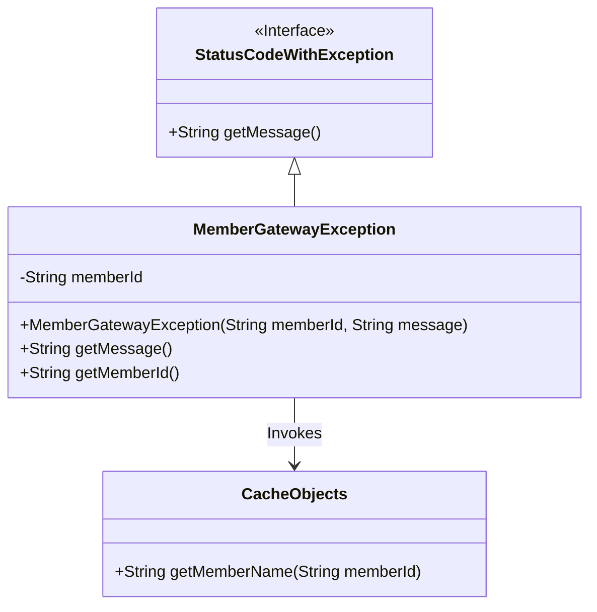
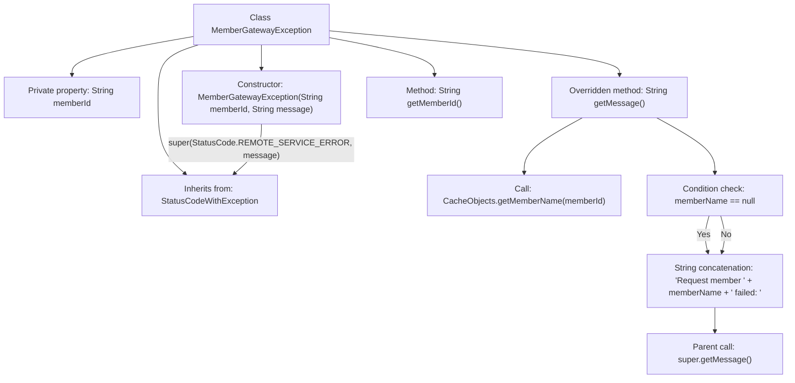

# Basic Information

|      |      |
|------|------|
| Name | MemberGatewayException |
| Language | .java |
| Code Path | WeFe/board/board-service/src/main/java/com/welab/wefe/board/service/exception/MemberGatewayException.java |
| Package Name | com.welab.wefe.board.service.exception |
| Dependencies | ['com.welab.wefe.board.service.service.CacheObjects', 'com.welab.wefe.common.StatusCode', 'com.welab.wefe.common.exception.StatusCodeWithException'] |
| Brief Description | MemberGatewayException inherits from StatusCodeWithException, containing a member ID and error message. It overrides the getMessage method to return formatted error information and provides a method to retrieve the member ID. |

# Description

MemberGatewayException is a custom exception class that inherits from StatusCodeWithException, designed to handle member gateway-related errors. This class includes a memberId field, initializes the member ID and error message through its constructor, and sets the default status code to REMOTE_SERVICE_ERROR. The overridden getMessage method retrieves the member name, falling back to the member ID if the name is unavailable, and returns a formatted error message. It also provides a getMemberId method to retrieve the member ID.

# Class Summary

| Name   | Type  | Description |
|-------|------|-------------|
| MemberGatewayException | class | MemberGatewayException inherits from StatusCodeWithException, includes member ID and error message, overrides the getMessage method to return an error message containing the member name, and provides a method to retrieve the member ID. |

## Class MemberGatewayException

|      |      |
|------|------|
| Access Modifier | public |
| Type | class |
| Name | MemberGatewayException |
| Description | MemberGatewayException inherits from StatusCodeWithException, includes member ID and error message, overrides the getMessage method to return an error message containing the member name, and provides a method to retrieve the member ID. |

### UML Class Diagram

Class Diagram Description: MemberGatewayException inherits from the StatusCodeWithException interface, containing a private member `memberId` and a constructor. It overrides the `getMessage()` method to retrieve the member name and format error messages. This class invokes the `getMemberName()` method of CacheObjects to obtain the member name, using `memberId` as a fallback if not found. The overall structure demonstrates the collaboration between exception handling and cached objects.

### Internal Method Call Graph

This flowchart illustrates the structure of the MemberGatewayException class, a custom exception class inheriting from StatusCodeWithException. It primarily contains the memberId property and three key methods: the constructor initializes member ID and error message, the getMessage() method retrieves member name from cache and formats the error message, while getMemberId() provides access to the member ID. The flowchart specifically highlights the logical flow within getMessage() involving member name retrieval, null check, and message concatenation, as well as the constructor's relationship with the parent class constructor.

### Field List

| Name  | Type  | Description |
|-------|-------|------|
| memberId | String | Private immutable string member variable memberId. |

### Method List

| Name  | Type  | Description |
|-------|-------|------|
| getMessage | String | Rewrite the getMessage method to return the member name or ID along with the error message. Use the ID if the member name is empty. |
| getMemberId | String | This is a Java method that returns a member ID string. The method is named getMemberId, takes no parameters, and directly returns the value of the member variable memberId. |

