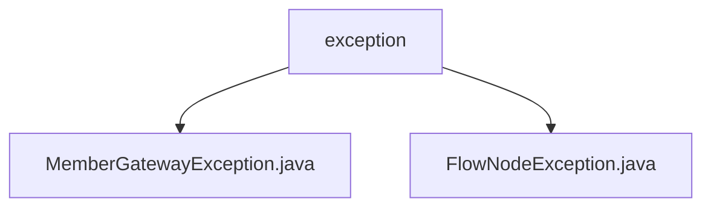

# Basic Information

|      |      |
|------|------|
| Name | exception |
| Language | .java |
| Code Path | WeFe/board/board-service/src/main/java/com/welab/wefe/board/service/exception |
| Package Name | docs.board.board-service.src.main.java.com.welab.wefe.board.service.exception |
| Brief Description | The `MemberGatewayException` is an exception class for handling member gateway errors, containing a member ID field. Its constructor initializes the ID and error message, with a default status code of `REMOTE_SERVICE_ERROR`. It overrides `getMessage` to return formatted information. The `FlowNodeException` represents a flowchart node exception, containing a `FlowGraphNode` field. Its constructor initializes the node and exception message, overrides `getMessage` to return a formatted message, and provides a `getNode` method. |

# Description

## Overview  
The core responsibility of this module is to provide a custom exception handling mechanism, encapsulating errors for two scenarios: member gateways and flowchart nodes. The interface specifications uniformly inherit from StatusCodeWithException, both containing domain-specific objects (member ID/flow node) and the capability to format error messages. Key data structures include the memberId field in MemberGatewayException and the FlowGraphNode object in FlowNodeException. The only external dependency is the base class StatusCodeWithException. For example, MemberGatewayException formats error messages with member names, while FlowNodeException assembles contextual data such as node depth.  

## Primary Business Scenarios  
Primarily used to handle exception scenarios in distributed member communication (similar to RPC call validation) and flowchart execution flows. The interaction pattern involves catching exceptions and extracting domain objects for diagnostics, such as locating problematic members via getMemberId() or retrieving faulty nodes via getNode(). Typical applications include throwing member exceptions when gateway service calls fail or triggering node exceptions when the flowchart engine encounters logic errors in node execution. The API types are all checked exceptions, with integration examples found in remote service call interceptors and the node processors of the workflow engine.

### Package Internal Structure View

This flowchart illustrates the hierarchy of the exception handling module in the WeFe project. The root node "exception" contains two child nodes, representing two specific exception classes: MemberGatewayException and FlowNodeException. Both exception classes reside under the exception package of the board-service module and are used to handle different business exception scenarios. The entire structure is clear and concise, reflecting the basic composition of the exception handling module.

# File List

| Name   | Type  | Description |
|-------|------|-------------|
| [MemberGatewayException.java](MemberGatewayException.md) | file | MemberGatewayException inherits from StatusCodeWithException, includes member ID and error message, overrides the getMessage method to return formatted error information, and provides a method to retrieve the member ID. |
| [FlowNodeException.java](FlowNodeException.md) | file | FlowNodeException inherits from StatusCodeWithException and contains FlowGraphNode node information. The exception message displays the component type, depth, and original message. If no node exists, it returns the original message. Methods for retrieving the node are provided. |

