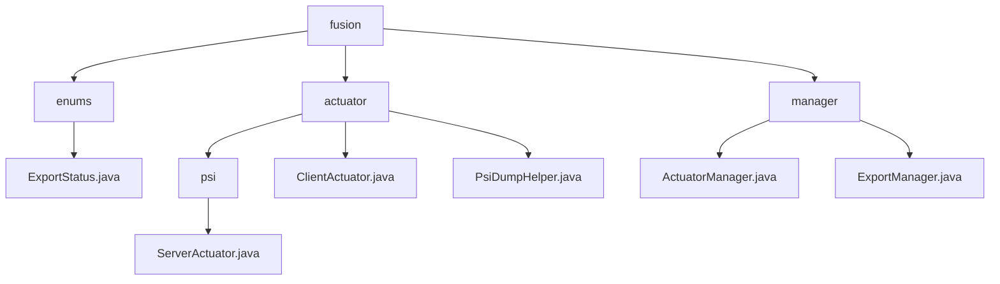

# Basic Information

|      |      |
|------|------|
| Name | fusion |
| Language | .java |
| Code Path | WeFe/board/board-service/src/main/java/com/welab/wefe/board/service/fusion |
| Package Name | docs.board.board-service.src.main.java.com.welab.wefe.board.service.fusion |
| Brief Description | Enumeration defines export states: Failed, Successful, In Progress. The module implements PSI task processing, including data dumping, state synchronization, and thread safety, relying on multiple services. It manages executor states and export progress, adopts a cache-first strategy, and supports task deduplication and progress queries. |

# Description

## Overview  
The core responsibility of this module is to enable collaborative processing and state management for Private Set Intersection (PSI) tasks, including data sharding computation, state synchronization, and task export functionality. The interface specification adopts a layered design: cross-node communication (e.g., ServerCloseApi) employs an asynchronous event model, while local management (e.g., ActuatorManager) provides cache-first JObject queries. Key data structures include sharded data blocks, JObject state records, and ConcurrentHashMap progress mappings. External dependencies involve three types of service components such as GatewayService, as well as databases and logging systems. For instance, ClientActuator ensures thread safety via ReentrantLock, and ExportManager utilizes memory mapping to prevent task duplication.  

## Key Business Scenarios  
A typical application involves multi-stage PSI task flows: clients process data shards, servers dump and synchronize states, and a dual-layer validation mechanism ultimately manages exports. The complete workflow encompasses data hash transformation (e.g., PsiDumpHelper’s optimized two-dimensional lists), exception handling, and maintenance of three termination states. The interaction model combines bidirectional synchronization (server-side database updates) with the observer pattern (actuator state tracking), exemplified by getTaskInfo’s cache-database cascading queries. Functional integrity is reflected in end-to-end control, featuring eight progress metrics monitoring and deduplication design, applied to data fusion dashboards and batch export scenarios.

### Package Internal Structure View

This flowchart illustrates the code structure of the fusion module in the WeFe project. The root node 'fusion' contains three submodules: enums, actuator, and manager. The enums module includes the ExportStatus enumeration class, while the actuator module comprises a psi subdirectory and two direct files, with ServerActuator implementation class under psi. The manager module contains two manager class files. The overall structure clearly demonstrates the hierarchical relationships between modules.

# File List

| Name   | Type  | Description |
|-------|------|-------------|
| [enums](enums/_module.md) | package | Export status enumeration: failure, success, exporting. |
| [manager](manager/_module.md) | package | The ActuatorManager class inherits from ActuatorCache, retrieves actuator information via businessId, and returns a JObject after caching or database query. The ExportManager class manages export task progress, utilizes ConcurrentHashMap for caching, provides CRUD methods, and implements database persistence through ExportProgressService. |
| [actuator](actuator/_module.md) | package | The ServerActuator class handles data dumping and task termination. The ClientActuator class manages PSI task execution, supporting shard processing and status tracking. The PsiDumpHelper class is responsible for data dumping, including header validation and data persistence. |

