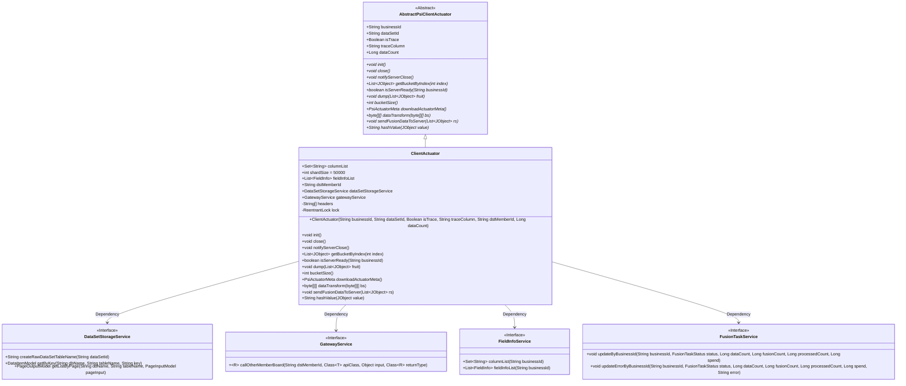

# Basic Information

|      |      |
|------|------|
| Name | ClientActuator |
| Language | .java |
| Code Path | WeFe/board/board-service/src/main/java/com/welab/wefe/board/service/fusion/actuator/ClientActuator.java |
| Package Name | com.welab.wefe.board.service.fusion.actuator |
| Dependencies | ['java.util.List', 'java.util.Set', 'java.util.concurrent.locks.ReentrantLock', 'java.util.stream.Collectors', 'com.alibaba.fastjson.JSONObject', 'com.google.common.collect.Lists', 'com.welab.wefe.board.service.api.project.fusion.actuator.psi.DownloadBFApi', 'com.welab.wefe.board.service.api.project.fusion.actuator.psi.PsiCryptoApi', 'com.welab.wefe.board.service.api.project.fusion.actuator.psi.ReceiveResultApi', 'com.welab.wefe.board.service.api.project.fusion.actuator.psi.ServerCloseApi', 'com.welab.wefe.board.service.api.project.fusion.actuator.psi.ServerSynStatusApi', 'com.welab.wefe.board.service.dto.fusion.PsiMeta', 'com.welab.wefe.board.service.service.DataSetStorageService', 'com.welab.wefe.board.service.service.GatewayService', 'com.welab.wefe.board.service.service.fusion.FieldInfoService', 'com.welab.wefe.board.service.service.fusion.FusionTaskService', 'com.welab.wefe.board.service.util.primarykey.FieldInfo', 'com.welab.wefe.board.service.util.primarykey.PrimaryKeyUtils', 'com.welab.wefe.common.data.storage.common.Constant', 'com.welab.wefe.common.data.storage.model.DataItemModel', 'com.welab.wefe.common.data.storage.model.PageInputModel', 'com.welab.wefe.common.data.storage.model.PageOutputModel', 'com.welab.wefe.common.exception.StatusCodeWithException', 'com.welab.wefe.common.util.Base64Util', 'com.welab.wefe.common.util.JObject', 'com.welab.wefe.common.web.Launcher', 'com.welab.wefe.fusion.core.actuator.psi.AbstractPsiClientActuator', 'com.welab.wefe.fusion.core.dto.PsiActuatorMeta', 'com.welab.wefe.fusion.core.enums.FusionTaskStatus', 'com.welab.wefe.fusion.core.enums.PSIActuatorStatus'] |
| Brief Description | The ClientActuator class implements PSI client logic, encompassing data sharding processing, field management, service communication, and task status update functionalities. It ensures thread safety through a locking mechanism and supports data transformation, transmission, and result notification. |

# Description

The `ClientActuator` class is an executor designed to handle PSI (Private Set Intersection) tasks, inheriting from `AbstractPsiClientActuator`. It includes attributes such as a field list, shard size, and target member ID, and communicates with other members via `GatewayService`. Key functionalities encompass dataset initialization, shard-based data processing, status updates, data transformation, and result transmission. The class employs `ReentrantLock` to ensure thread safety and interacts with the server through multiple API interfaces, such as `ServerCloseApi` and `ServerSynStatusApi`. Additionally, it provides methods for data hashing, shard computation, and result dumping, supporting task status tracking and error handling.

# Class Summary

| Name   | Type  | Description |
|-------|------|-------------|
| ClientActuator | class | The `ClientActuator` class implements PSI client logic, containing attributes such as field lists, shard size, and data storage services. It provides functionalities including initialization, shutdown, paginated data retrieval, metadata download, data conversion, and result transmission, supporting multi-threaded safe operations. |

## Class ClientActuator

|      |      |
|------|------|
| Access Modifier | @SuppressWarnings("SynchronizeOnNonFinalField");public |
| Type | class |
| Name | ClientActuator |
| Description | The `ClientActuator` class implements PSI client logic, containing attributes such as field lists, shard size, and data storage services. It provides functionalities including initialization, shutdown, paginated data retrieval, metadata download, data conversion, and result transmission, supporting multi-threaded safe operations. |

### UML Class Diagram

Class Diagram Description: This diagram illustrates that the ClientActuator class inherits from the AbstractPsiClientActuator abstract class and implements multiple core methods. ClientActuator relies on interfaces such as DataSetStorageService, GatewayService, FieldInfoService, and FusionTaskService to accomplish functions like data sharding processing, remote invocation, field information retrieval, and task status updates. The class structure reflects the typical layered design of a PSI (Private Set Intersection) protocol executor, encompassing key operations such as initialization, data acquisition, state synchronization, and result transmission.

### Internal Method Call Graph

```mermaid
graph TD
    A["Class ClientActuator"]
    B["Attribute: Set<String> columnList"]
    C["Attribute: int shardSize"]
    D["Attribute: List<FieldInfo> fieldInfoList"]
    E["Attribute: String dstMemberId"]
    F["Attribute: DataSetStorageService dataSetStorageService"]
    G["Attribute: GatewayService gatewayService"]
    H["Attribute: String[] headers"]
    I["Attribute: ReentrantLock lock"]
    J["Constructor: ClientActuator(String businessId, String dataSetId, Boolean isTrace, String traceColumn, String dstMemberId, Long dataCount)"]
    K["Method: void init()"]
    L["Method: void close()"]
    M["Method: void notifyServerClose()"]
    N["Method: List<JObject> getBucketByIndex(int index)"]
    O["Method: boolean isServerReady(String businessId)"]
    P["Method: void dump(List<JObject> fruit)"]
    Q["Method: int bucketSize()"]
    R["Method: PsiActuatorMeta downloadActuatorMeta()"]
    S["Method: byte[][] dataTransform(byte[][] bs)"]
    T["Method: void sendFusionDataToServer(List<JObject> rs)"]
    U["Method: String hashValue(JObject value)"]

    A --> B
    A --> C
    A --> D
    A --> E
    A --> F
    A --> G
    A --> H
    A --> I
    A --> J
    A --> K
    A --> L
    A --> M
    A --> N
    A --> O
    A --> P
    A --> Q
    A --> R
    A --> S
    A --> T
    A --> U
```

This flowchart illustrates the complete structure of the ClientActuator class, containing 11 attributes and 10 core methods. Inheriting from AbstractPsiClientActuator, this class primarily handles PSI (Private Set Intersection) protocol-related operations such as dataset initialization, sharding processing, state synchronization, and data transformation. Key methods include initializing field lists (init), paginated data retrieval (getBucketByIndex), data dumping (dump), and multiple gateway interaction methods with remote services. All operations are thread-safe through ReentrantLock.

### Field List

| Name  | Type  | Description |
|-------|-------|------|
| columnList | Set<String> | This is a public string collection variable used to store a list of column names. |
| headers | String[] | Declare a private string array variable named headers. |
| lock = new ReentrantLock(true) | ReentrantLock | Using the reentrant lock ReentrantLock, which supports a fair locking mechanism. |
| gatewayService = Launcher.getBean(GatewayService.class) | GatewayService | Obtain the GatewayService instance: Retrieve an instance of the GatewayService class via the getBean method of Launcher. |
| dataSetStorageService | DataSetStorageService | Dataset storage service instance variables. |
| shardSize = 50000 | int | The shard size is set to 50,000. |
| fieldInfoList | List<FieldInfo> | Field information list, a collection storing FieldInfo objects. |
| dstMemberId | String | Declare a public string variable dstMemberId. |

### Method List

| Name  | Type  | Description |
|-------|-------|------|
| notifyServerClose | void | The method `notifyServerClose` notifies the server that the task has ended, calls the `callOtherMemberBoard` method of `gatewayService`, and handles exceptions. |
| close | void | The method updates database records based on task status: it calls updateByBusinessId upon success, and updateErrorByBusinessId in case of failure or interruption, passing parameters such as business ID, status, data volume, and time consumed. |
| isServerReady | boolean | Check if the service is ready: Call the partner's interface to query the business ID status. Return the `ready` field upon success, or log the exception and return `false` upon failure. |
| dump | void | The method `dump` receives a list of fruits, logs the start, calls `PsiDumpHelper.dump` to process the data, catches exceptions and logs error messages, and finally logs the completion. |
| getBucketByIndex | List<JObject> | The method `getBucketByIndex` retrieves paginated data by index, processes it into a list of `JObject`, records the time taken, and returns the result. In case of an exception, it returns `null` while ensuring the lock is released. |
| init | void | Initialization method: Obtain the field list, calculate the shard size, supplement tracking fields, query primary key fields, and initialize the dataset header information. |
| bucketSize | int | Calculate bucket size: If the data volume is divisible by the number of shards, take the quotient; otherwise, take the quotient plus 1. Record the data volume, number of shards, and result. |
| downloadActuatorMeta | PsiActuatorMeta | The method downloads PSI executor metadata by invoking a remote interface through the gateway service, processes the result, and returns it. It includes logging and JSON conversion. |
| dataTransform | byte[][] | This method converts the byte array into a list of Base64 strings, calls the remote service to process the data, and then converts the result back into a byte array for return. |
| sendFusionDataToServer | void | The method converts a list of JObjects into a Base64 string, invokes a remote interface via gatewayService to send the data, and logs error messages in case of exceptions. |
| hashValue | String | This method overrides the hashValue function, using PrimaryKeyUtils to generate a hash value based on the JObject and field information list. |

