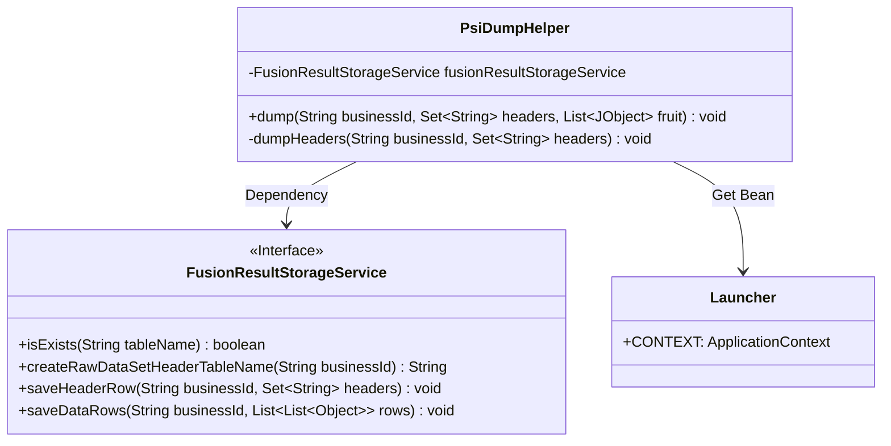
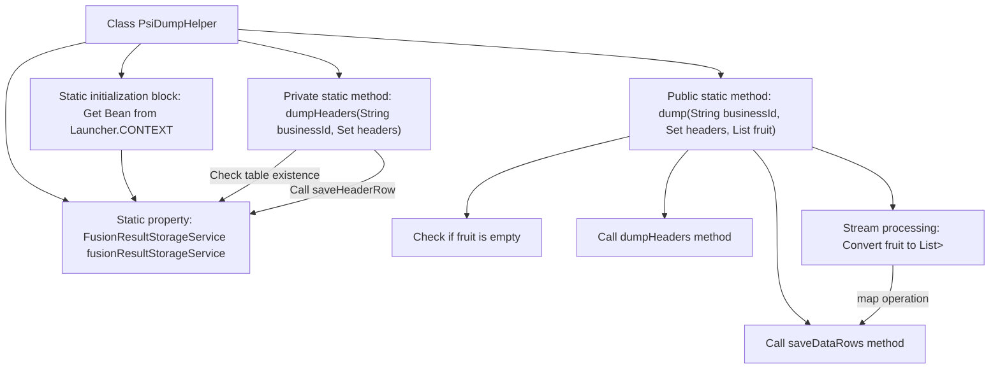

# Basic Information

|      |      |
|------|------|
| Name | PsiDumpHelper |
| Language | .java |
| Code Path | WeFe/board/board-service/src/main/java/com/welab/wefe/board/service/fusion/actuator/PsiDumpHelper.java |
| Package Name | com.welab.wefe.board.service.fusion.actuator |
| Dependencies | ['java.util.List', 'java.util.Map', 'java.util.Set', 'java.util.stream.Collectors', 'com.google.common.collect.Lists', 'com.welab.wefe.board.service.service.fusion.FusionResultStorageService', 'com.welab.wefe.common.util.JObject', 'com.welab.wefe.common.web.Launcher'] |
| Brief Description | The PsiDumpHelper class is used to store data and includes the dumpHeaders and dump methods. dumpHeaders checks and saves table headers, while dump processes and saves data rows. It utilizes the FusionResultStorageService for storage operations. |

# Description

The PsiDumpHelper class is a utility class for handling data dumping, containing static methods dumpHeaders and dump. The dumpHeaders method checks and saves header information, skipping if it already exists. The dump method processes data dumping by first checking if the data is empty, then calling dumpHeaders to save headers, converting the input JObject list into a two-dimensional list format, and finally saving data rows via fusionResultStorageService. This class relies on FusionResultStorageService for actual storage operations.

# Class Summary

| Name   | Type  | Description |
|-------|------|-------------|
| PsiDumpHelper | class | The PsiDumpHelper class is used for handling data storage, including the dumpHeaders method to check and save table headers, and the dump method to format data and save it. It utilizes FusionResultStorageService for storage operations. |

## Class PsiDumpHelper

|      |      |
|------|------|
| Access Modifier | public |
| Type | class |
| Name | PsiDumpHelper |
| Description | The PsiDumpHelper class is used for handling data storage, including the dumpHeaders method to check and save table headers, and the dump method to format data and save it. It utilizes FusionResultStorageService for storage operations. |

### UML Class Diagram

This code demonstrates a utility class named `PsiDumpHelper`, primarily designed for handling data dumping operations. The class obtains a `FusionResultStorageService` instance from the Spring context via a static initialization block and provides two core methods: `dumpHeaders` for saving header information and `dump` for standardizing and storing fruit data. The code relies on the `FusionResultStorageService` interface to perform actual storage operations, reflecting a well-designed separation of responsibilities. The process involves data validation, format conversion, and storage operations, making it suitable for batch data processing scenarios.

### Internal Method Call Graph

Flowchart description: This flowchart illustrates the structure and workflow of the PsiDumpHelper class. The class contains a static property fusionResultStorageService, which is initialized via a static block by obtaining the Bean from Launcher.CONTEXT. The dump method first checks if the input data 'fruit' is empty, then calls the dumpHeaders method to process column headers, followed by stream operations to transform the fruit data structure, and finally invokes saveDataRows to persist data. The dumpHeaders method verifies table existence and saves header rows.

### Field List

| Name  | Type  | Description |
|-------|-------|------|
| fusionResultStorageService | FusionResultStorageService | Private static constant fused result storage service instance. |

### Method List

| Name  | Type  | Description |
|-------|-------|------|
| dumpHeaders | void | The method `dumpHeaders` checks whether the header corresponding to the business ID exists, and if not, it saves the header data. |
| dump | void | Static method `dump` processes business data: After checking that `fruit` is not empty, it calls `dumpHeaders` to write the table headers, converts the `JObject` list into a value list, and finally stores the data via `saveDataRows`. Exceptions are thrown. |

