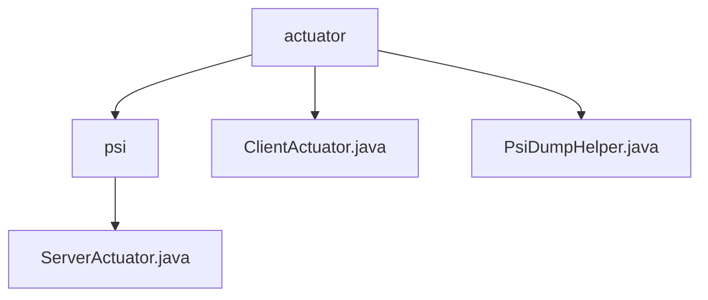

# Basic Information

|      |      |
|------|------|
| Name | actuator |
| Language | .java |
| Code Path | WeFe/board/board-service/src/main/java/com/welab/wefe/board/service/fusion/actuator |
| Package Name | docs.board.board-service.src.main.java.com.welab.wefe.board.service.fusion.actuator |
| Brief Description | The ServerActuator class handles data dumping and task termination. The ClientActuator class manages PSI task execution, supporting shard processing and status tracking. The PsiDumpHelper class is responsible for data dumping, including header validation and data persistence. |

# Description

## Overview  
The core responsibility of this module is to facilitate client-server collaboration for Private Set Intersection (PSI) tasks, encompassing data dumping, status synchronization, and thread-safe control. The interface specifications involve cross-node communication APIs such as ServerCloseApi and ServerSynStatusApi, adopting an asynchronous interaction model similar to an event bus. Key data structures include JObject lists, sharded data blocks, and task status records. External dependencies include GatewayService, FusionResultStorageService, and FusionTaskService. For example, ClientActuator ensures thread safety during shard computation through ReentrantLock.  

## Primary Business Scenarios  
The typical application pattern is a multi-node PSI task pipeline: the client initializes the dataset and performs shard processing, while the server dumps data and synchronizes status. The complete workflow includes data hashing, shard transmission, exception handling, and result persistence. For instance, PsiDumpHelper achieves efficient storage through two-dimensional list conversion. The interaction model employs a bidirectional status synchronization mechanism, such as ServerActuator updating task termination status via database. Functional completeness is reflected in end-to-end error handling, including log recording, exception capture, and management of three termination states.

### Package Internal Structure View

This flowchart illustrates the hierarchical structure of the actuator directory under the fusion module in the board-service project. The actuator serves as the root node, containing a psi subdirectory and two Java files (ClientActuator.java/PsiDumpHelper.java). The psi directory further includes the ServerActuator.java file. The entire structure clearly reflects the code organization of PSI (Private Set Intersection) related actuators.

# File List

| Name   | Type  | Description |
|-------|------|-------------|
| [ClientActuator.java](ClientActuator.md) | file | The `ClientActuator` class implements PSI client logic, encompassing data sharding processing, field management, service communication, and task status update functionalities. It ensures thread safety through a locking mechanism and supports data conversion, transmission, and result notification. |
| [PsiDumpHelper.java](PsiDumpHelper.md) | file | The PsiDumpHelper class is used to store data and includes the dumpHeaders and dump methods. dumpHeaders checks and saves table headers, while dump processes and saves data rows. It utilizes the FusionResultStorageService for storage operations. |
| [psi](psi/_module.md) | package | The `ServerActuator` class inherits from `AbstractPsiServerActuator` and implements the `dump` and `close` methods. The `dump` method processes `JObject` list data and invokes `PsiDumpHelper.dump`. The `close` method updates the task status based on its state: it calls `updateByBusinessId` upon success, or `updateErrorByBusinessId` in case of failure or interruption. |

