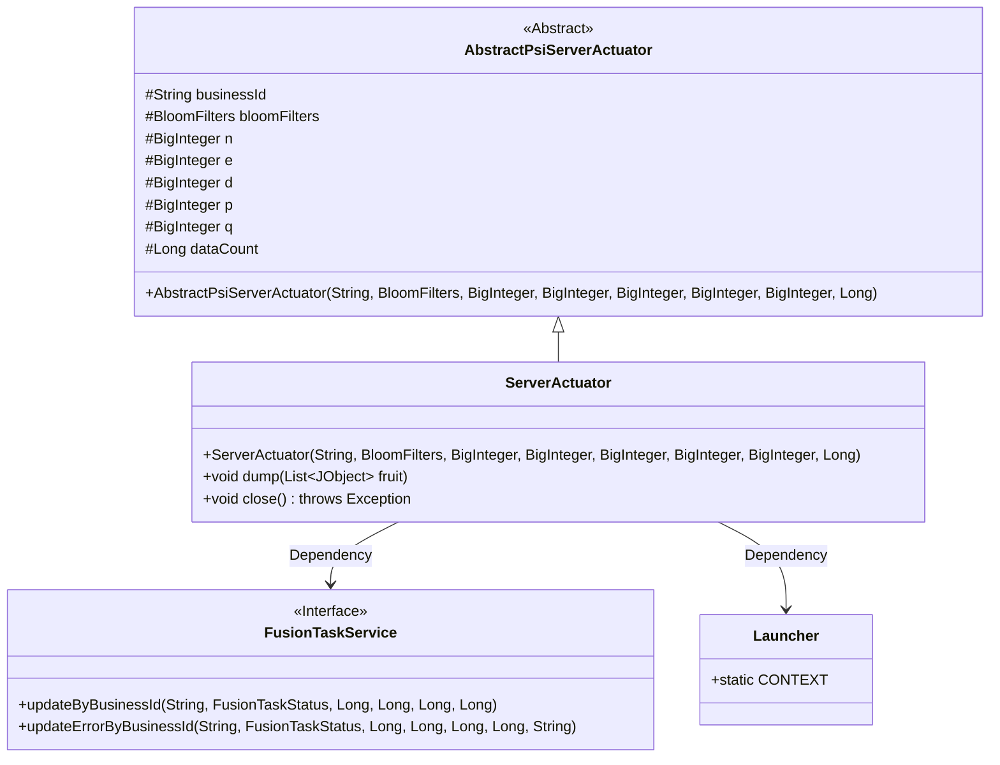
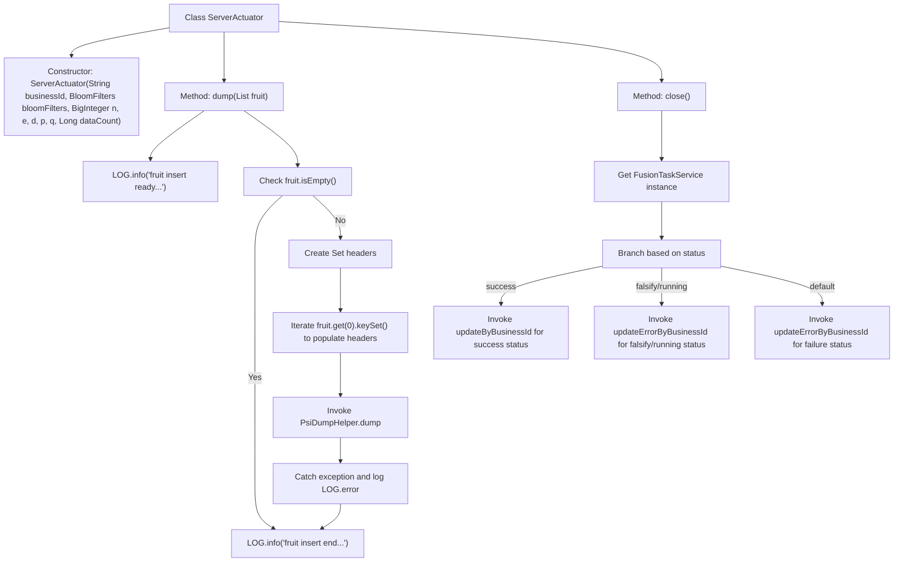

# Basic Information

|      |      |
|------|------|
| Name | ServerActuator |
| Language | .java |
| Code Path | WeFe/board/board-service/src/main/java/com/welab/wefe/board/service/fusion/actuator/psi/ServerActuator.java |
| Package Name | com.welab.wefe.board.service.fusion.actuator.psi |
| Dependencies | ['java.math.BigInteger', 'java.util.HashSet', 'java.util.List', 'java.util.Set', 'com.alibaba.fastjson.JSON', 'com.welab.wefe.board.service.fusion.actuator.PsiDumpHelper', 'com.welab.wefe.board.service.fusion.manager.ActuatorManager', 'com.welab.wefe.board.service.service.fusion.FusionTaskService', 'com.welab.wefe.common.util.JObject', 'com.welab.wefe.common.web.Launcher', 'com.welab.wefe.fusion.core.actuator.psi.AbstractPsiServerActuator', 'com.welab.wefe.fusion.core.enums.FusionTaskStatus', 'com.welab.wefe.fusion.core.utils.bf.BloomFilters'] |
| Brief Description | The ServerActuator class inherits from AbstractPsiServerActuator and implements the dump and close methods. The dump method processes JObject list data and invokes PsiDumpHelper.dump. The close method updates the task status based on its state, calling updateByBusinessId for success cases, and updateErrorByBusinessId for failures or interruptions. |

# Description

The `ServerActuator` class inherits from `AbstractPsiServerActuator` and includes a constructor along with two main methods. The `dump` method processes `JObject` list data, logs information, and invokes `PsiDumpHelper` for data dumping, while catching and logging exceptions. The `close` method updates the task status based on its state, modifies the database via `FusionTaskService`, and handles three scenarios: success, interruption, and failure, recording metrics such as data count, processing count, and time.

# Class Summary

| Name   | Type  | Description |
|-------|------|-------------|
| ServerActuator | class | The `ServerActuator` class inherits from `AbstractPsiServerActuator` and implements the `dump` and `close` methods. The `dump` method handles data insertion, while `close` updates the task status. |

## Class ServerActuator

|      |      |
|------|------|
| Access Modifier | public |
| Type | class |
| Name | ServerActuator |
| Description | The `ServerActuator` class inherits from `AbstractPsiServerActuator` and implements the `dump` and `close` methods. The `dump` method handles data insertion, while `close` updates the task status. |

### UML Class Diagram

Class Diagram Description: This diagram illustrates that ServerActuator inherits from AbstractPsiServerActuator and implements the dump and close methods. ServerActuator obtains the FusionTaskService instance through Launcher and invokes different update methods based on status in the close method. FusionTaskService, as an interface, provides task status update functionality, while Launcher serves as the context for bean retrieval. The overall structure reflects the implementation pattern of a PSI (Private Set Intersection) server actuator.

### Internal Method Call Graph

This flowchart illustrates the core logic structure of the ServerActuator class. The dump method handles data writing flow, including logging, empty check, header collection, and exception handling. The close method invokes different service update methods based on task status, featuring three status branches. Both main methods inherit from an abstract parent class, demonstrating a complete workflow of state management and data persistence.

### Field List

| Name  | Type  | Description |
|-------|-------|------|

### Method List

| Name  | Type  | Description |
|-------|-------|------|
| close | void | The `close` method updates the database based on the task status: it calls `updateByBusinessId` upon success and `updateErrorByBusinessId` in case of failure or interruption, recording information such as data volume and time consumed. |
| dump | void | The method `dump` receives a list of fruits and logs the start. If the list is empty, it returns. It extracts the key set of the first element as the table header, calls `PsiDumpHelper.dump` to write the data, catches exceptions to log errors, and finally logs the end. |

