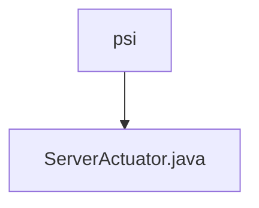

# Basic Information

|      |      |
|------|------|
| Name | psi |
| Language | .java |
| Code Path | WeFe/board/board-service/src/main/java/com/welab/wefe/board/service/fusion/actuator/psi |
| Package Name | docs.board.board-service.src.main.java.com.welab.wefe.board.service.fusion.actuator.psi |
| Brief Description | The `ServerActuator` class inherits from `AbstractPsiServerActuator` and implements the `dump` and `close` methods. The `dump` method processes `JObject` list data and invokes `PsiDumpHelper.dump`. The `close` method updates the task status based on its state: it calls `updateByBusinessId` upon success, or `updateErrorByBusinessId` in case of failure or interruption. |

# Description

The `ServerActuator` class inherits from `AbstractPsiServerActuator` and includes a constructor along with two main methods. The `dump` method processes `JObject` list data, logs information, and invokes `PsiDumpHelper` for data dumping, while catching and logging exceptions. The `close` method updates the task status based on its state, modifies the database via `FusionTaskService`, and handles three scenarios: success, interruption, and failure, logging details such as data count, processing count, and time.

### Package Internal Structure View

This flowchart illustrates the hierarchical structure of the PSI actuator module, where `psi` serves as the parent directory containing a specific Java implementation file `ServerActuator.java`. Such a structure is commonly seen in the functional module division of microservice architectures, embodying the Single Responsibility Principle by encapsulating server-side execution logic related to the PSI protocol within an independent file. The entire structure is concise and clear, facilitating maintenance and extensibility.

# File List

| Name   | Type  | Description |
|-------|------|-------------|
| [ServerActuator.java](ServerActuator.md) | file | The ServerActuator class inherits from AbstractPsiServerActuator and implements the dump and close methods. The dump method processes JObject list data and invokes PsiDumpHelper.dump. The close method updates the task status based on state, calling updateByBusinessId for success cases and updateErrorByBusinessId for failures or interruptions. |

