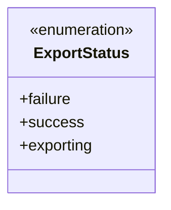
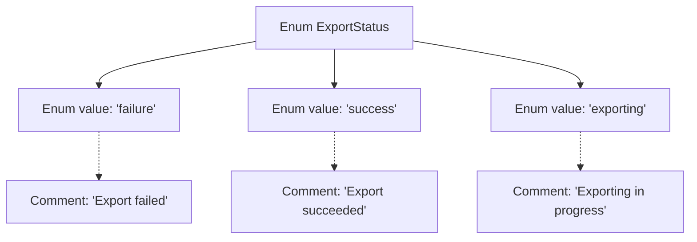

# Basic Information

|      |      |
|------|------|
| Name | ExportStatus |
| Language | .java |
| Code Path | WeFe/board/board-service/src/main/java/com/welab/wefe/board/service/fusion/enums/ExportStatus.java |
| Package Name | com.welab.wefe.board.service.fusion.enums |
| Dependencies | [] |
| Brief Description | Export status enumeration: failure, success, exporting. |

# Description

This enumeration type defines three export states: failure indicates export failure, success indicates export success, and exporting indicates that export is in progress. Each state has corresponding comments explaining its meaning.

# Class Summary

| Name   | Type  | Description |
|-------|------|-------------|
| ExportStatus | enum | Export status enumeration: Failed, Success, In Progress. |

## Class ExportStatus

|      |      |
|------|------|
| Access Modifier | public |
| Type | enum |
| Name | ExportStatus |
| Description | Export status enumeration: Failed, Success, In Progress. |

### UML Class Diagram

This enumeration class defines three export states: failure, success, and exporting. As a status identifier, it is commonly used for process control in export operations, distinguishing different stages or outcomes through explicit enumeration values. The enumeration type provides a type-safe way to represent states, which is more reliable than directly using string or numeric constants.

### Internal Method Call Graph

This flowchart illustrates the structure of the ExportStatus enum, which contains three enum values: failure (export failed), success (export succeeded), and exporting (exporting in progress). Each enum value is associated with corresponding English comments explaining its business meaning, clearly expressing the three possible states of an export operation. As a fixed set of states, the enum is used here to standardize status identification in export processes, facilitating system state judgment and log recording.

### Field List

| Name  | Type  | Description |
|-------|-------|------|

### Method List

| Name  | Type  | Description |
|-------|-------|------|

